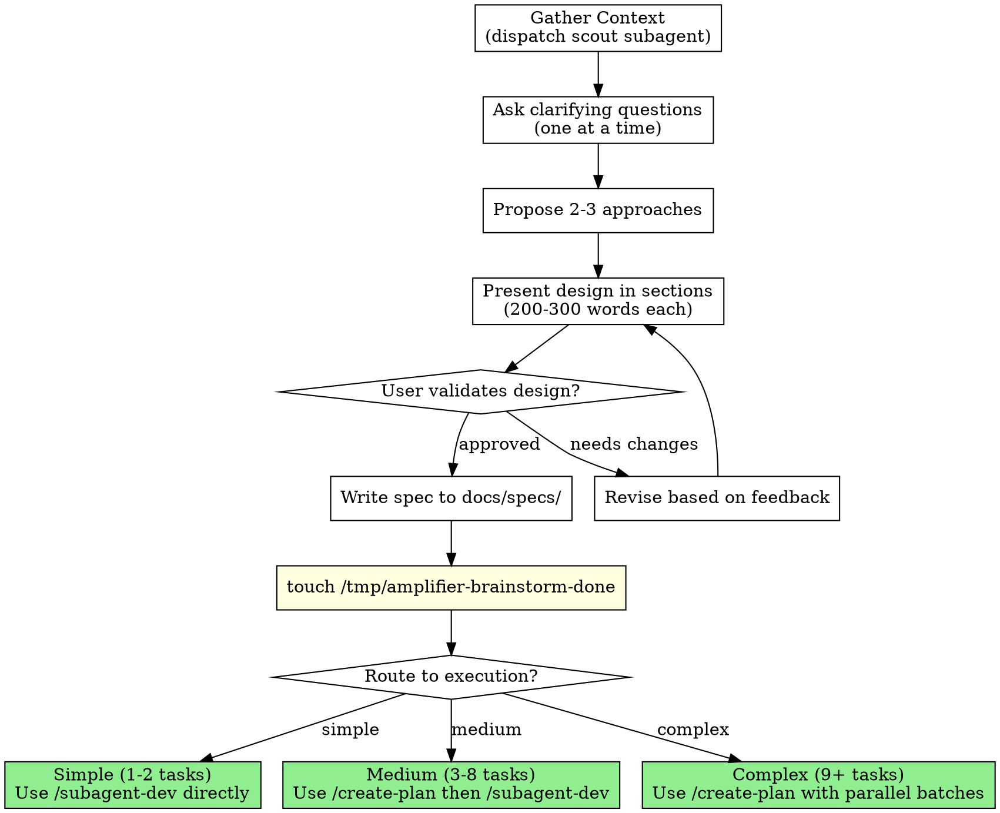

# Brainstorming Ideas Into Designs

## Overview

Help turn ideas into fully formed designs and specs through natural collaborative dialogue. This is the central starting point for most sessions — it gathers context, explores the problem, designs the solution, identifies which Amplifier agents will handle each phase, and routes to the right execution workflow.

Start by understanding the current project context, then ask questions one at a time to refine the idea. Once you understand what you're building, present the design in small sections (200-300 words), checking after each section whether it looks right so far.

## Process Graph (Authoritative)

> When this graph conflicts with prose, follow the graph.



## Step 0: Triage Gate (before anything else)

Before dispatching scouts or starting interviews, classify the request:

### Quick Mode — skip to execution routing

When ALL of the following are true:
- < 25 words (excluding code blocks and file paths)
- Exactly 1 action verb from: add, fix, remove, rename, move, delete, update, create
- Single named target (specific file, function, component, or identifier — NOT a broad-scope noun)
- No conjunctions (and, or, plus, also)
- No vague modifiers (better, improved, some, maybe, kind of)

→ Skip scout, skip interview, skip design.
→ Respond: "Quick task detected. Recommended: [agent] on [target]. Proceed, or need to discuss first?"
→ If user confirms, route directly to execution (single agent dispatch or `/tdd`).

### Force Full Brainstorm — when ANY signal present

| Signal | Examples |
|--------|----------|
| Broad-scope nouns | system, platform, pipeline, dashboard, module, suite, management |
| Compound tasks | 2+ independent clauses, comma-separated actions, "and"/"also"/"as well as" |
| Integration verbs | integrate, merge, connect, combine, sync |
| Vague scope | "it", "this", "that" without clear referent in same sentence |
| Comprehensiveness | comprehensive, complete, full, end-to-end, overall |
| Multi-domain | 2+ distinct domains detected (frontend+backend, API+DB, etc.) |
| Ownership/state | our, existing, the current, fresh, updated |

→ Force full brainstorm with explicit note: "This has [signal] — running full brainstorm to scope it properly."

### Normal — everything else

Proceed through standard brainstorm flow below.

---

## Session Start

Before diving into the idea, gather context by dispatching a **context scout subagent**. This runs all context gathering in a separate context window, returning only a concise summary to the main session.

1. **Determine topic** from the user's message or ask what they want to work on.
2. **Dispatch context scout:**

```
Task(subagent_type="general-purpose", model="haiku", max_turns=8, description="Gather session context for [topic]", prompt="
  **READ-ONLY MODE: Use ONLY Read, Glob, Grep, LS, and search tools. Do NOT use Edit, Write, Bash, or any tool that modifies files.**

  Gather project context for a brainstorming session about [topic].

  Run these steps and compile a summary:
  1. Run: git status --short && git log --oneline -5
  2. Search episodic memory for conversations about [topic] using mcp__plugin_episodic-memory_episodic-memory__search
  3. Check for existing specs: ls docs/specs/ (if directory exists)
  4. Read .claude/AGENTS_CATALOG.md for available agents
  5. Read llms.txt for a quick overview of all project documentation
  6. If the topic involves existing code, search ctags for relevant symbols:
     Run: grep -i '[keyword]' tags | head -20
     (The tags file at repo root has pre-indexed class/function/method definitions)
  7. If the topic involves existing code, use Grep to find related files:
     Grep pattern='[keyword]' output_mode='files_with_matches' head_limit=15

  If any step fails, skip it and continue.

  Return a structured summary (MAX 500 words, this is critical):
  ## Project State
  [branch, uncommitted changes, recent commits — 2-3 lines]

  ## Related Past Decisions
  [any ADRs or patterns relevant to topic — bullet list or 'None found']

  ## Relevant Code
  [key files and symbols related to topic from ctags/grep — bullet list or 'Greenfield (no existing code)']

  ## Relevant Agents
  [which Amplifier agents are likely needed — match from AGENTS_CATALOG.md]

  ## Existing Specs
  [any related design docs — list or 'None found']

  ## Past Outcomes (Strategy Learning)
  Search recall for 'Outcome:' entries matching the domain keywords.
  [If found: list date, agent, model tier, score, retries, lesson — bullet list]
  [If not found: 'No prior outcomes for this domain']
  Use these to inform agent and model tier recommendations.
")
```

3. **Present summary** to user and proceed to The Process.

**Context scale check:** If the scout found 15+ relevant files or the topic spans 3+ subsystems, note to the user:

> Large codebase scope detected ([N] files). Fast mode (`/fast`) provides 1M context at 2.5x cost. Enable?

Advisory only — do not enable without explicit user confirmation.

4. **If the topic involves understanding existing code**, dispatch `agentic-search` before designing:
```
Task(subagent_type="agentic-search", model="haiku", max_turns=12, description="Explore [topic] in codebase", prompt="
  **READ-ONLY MODE: Use ONLY Read, Glob, Grep, LS, and search tools. Do NOT use Edit, Write, Bash, or any tool that modifies files.**

  [specific question about how the existing code works]
")
```
This gives you precise file:line references to ground your design in reality, not assumptions.

## The Process

**Understanding the idea:**
- Check out the current project state first (files, docs, recent commits)
- Before asking detailed questions, assess scope: if the request describes multiple independent subsystems (e.g., "build a platform with chat, file storage, billing, and analytics"), flag this immediately. Don't spend questions refining details of a project that needs to be decomposed first.
- If the project is too large for a single spec, help the user decompose into sub-projects: what are the independent pieces, how do they relate, what order should they be built? Then brainstorm the first sub-project through the normal design flow. Each sub-project gets its own spec → plan → implementation cycle.
- For appropriately-scoped projects, ask questions one at a time to refine the idea
- Prefer multiple choice questions when possible, but open-ended is fine too
- Only one question per message - if a topic needs more exploration, break it into multiple questions
- Focus on understanding: purpose, constraints, success criteria
- Before proposing a design, search episodic memory for existing architectural constraints and decisions.

**Exploring approaches:**
- When the topic touches existing code, use `agentic-search` results to ground your proposals in actual architecture — don't propose changes to code you haven't examined
- Propose 2-3 different approaches with trade-offs
- Present options conversationally with your recommendation and reasoning
- Lead with your recommended option and explain why
- For each approach, specify which Amplifier agents would handle each phase (use AGENTS_CATALOG.md as reference)

**Presenting the design:**
- Once you believe you understand what you're building, present the design
- Break it into sections of 200-300 words
- Ask after each section whether it looks right so far
- Cover: architecture, components, data flow, error handling, testing
- Be ready to go back and clarify if something doesn't make sense

**Design for isolation and clarity:**
- Break the system into smaller units that each have one clear purpose, communicate through well-defined interfaces, and can be understood and tested independently
- For each unit, you should be able to answer: what does it do, how do you use it, and what does it depend on?
- Can someone understand what a unit does without reading its internals? Can you change the internals without breaking consumers? If not, the boundaries need work.
- Smaller, well-bounded units are also easier for you to work with - you reason better about code you can hold in context at once, and your edits are more reliable when files are focused. When a file grows large, that's often a signal that it's doing too much.

**Working in existing codebases:**
- Explore the current structure before proposing changes. Follow existing patterns.
- Where existing code has problems that affect the work (e.g., a file that's grown too large, unclear boundaries, tangled responsibilities), include targeted improvements as part of the design - the way a good developer improves code they're working in.
- Don't propose unrelated refactoring. Stay focused on what serves the current goal.

## Agent Allocation Section

Every design MUST include an Agent Allocation section before handoff. This tells `/create-plan` which agents to assign to each task.

```markdown
## Agent Allocation

| Phase | Agent | Responsibility |
|-------|-------|---------------|
| Codebase Research | agentic-search | Understand existing code before changes |
| Architecture | zen-architect | System design, module boundaries |
| API Design | api-contract-designer | Endpoint contracts and specs |
| Database | database-architect | Schema design, migrations |
| Implementation | modular-builder | Build from specs |
| Testing | test-coverage | Test strategy and coverage |
| Security | security-guardian | Pre-deploy review |
| Cleanup | post-task-cleanup | Final hygiene pass |
```

Adjust the table based on what the design actually needs. Not every project needs every agent — pick from the full catalog in `.claude/AGENTS_CATALOG.md`. Common patterns:
- **New feature in existing codebase:** agentic-search → zen-architect → modular-builder → test-coverage → post-task-cleanup
- **API work:** agentic-search → api-contract-designer → modular-builder → test-coverage → security-guardian
- **Bug investigation:** agentic-search → bug-hunter → test-coverage
- **UI/frontend:** component-designer → modular-builder → test-coverage
- **Performance:** agentic-search → performance-optimizer → test-coverage

## After the Design

**Documentation:**
- Delegate spec writing and review to a subagent, keeping only the result in main context:

```
Task(subagent_type="general-purpose", model="sonnet", max_turns=10, description="Write and validate design spec", prompt="
  Write a design spec document from the following validated design.

  ## Validated Design
  [paste the complete design text including Agent Allocation table]

  ## Instructions
  1. Write the spec to: docs/specs/YYYY-MM-DD-<topic>-design.md
  2. Include all sections: Problem, Goal, Changes, Impact, Files Changed, Agent Allocation, Test Plan
  3. Self-review against this checklist:
     - All requirements from the design are captured
     - Agent allocation table is included
     - File paths are concrete (not placeholder)
     - No ambiguous language ('should', 'could', 'might' replaced with specifics)
     - Acceptance criteria are testable
  4. Fix any issues found during self-review
  5. Commit the spec: git add <file> && git commit -m 'docs: add <topic> design spec'
  6. Return: file path, git commit hash, review status (pass/fail), any concerns (MAX 100 words)
")
```

- (User preferences for spec location override the default path)

### Write Brainstorm Marker

After the user confirms the design is ready to proceed, write the brainstorm marker file to unlock Plan Mode:

```bash
touch /tmp/amplifier-brainstorm-done
```

This marker file enables EnterPlanMode for this terminal session. It is session-scoped: a new terminal session will require a new /brainstorm run.

**Session Naming:** After the design is validated and spec written, rename this session:

/rename design: <topic>

Example: `/rename design: dns-zone-editor`

If `/rename` is unavailable, skip this step.

**Workflow routing — recommend the right execution path:**
- **Simple task** (1-2 files, clear requirements) → implement directly with the appropriate Amplifier agent
- **Medium task** (3-10 files, multiple steps) → `/create-plan` → `/subagent-dev`
- **Complex task** (10+ files, independent subsystems) → `/create-plan` → `/parallel-agents` for independent pieces
- **Investigation** (bugs, failures, unknowns) → `agentic-search` first, then `bug-hunter` or `/parallel-agents`
- **Performance** → `agentic-search` to understand hotpath, then `performance-optimizer`
- **Optimization/refactor** → `agentic-search` to map dependencies, then `/create-plan` → `/subagent-dev`

**Implementation (if continuing):**
- Ask: "Ready to set up for implementation?"
- Use `/worktree` to create isolated workspace
- **REQUIRED:** Use `/create-plan` to create detailed implementation plan (it will use the Agent Allocation to assign agents per task)
  - Do NOT use platform planning features (e.g., EnterPlanMode, plan mode)
  - Do NOT start implementing directly - `/create-plan` comes first

## Key Principles

- **One question at a time** - Don't overwhelm with multiple questions
- **Multiple choice preferred** - Easier to answer than open-ended when possible
- **YAGNI ruthlessly** - Remove unnecessary features from all designs
- **Explore alternatives** - Always propose 2-3 approaches before settling
- **Incremental validation** - Present design in sections, validate each
- **Be flexible** - Go back and clarify when something doesn't make sense
- **Agent-aware design** - Know which specialists are available and plan for their use

## Available Amplifier Commands Reference

When routing to execution, these are the key commands:

| Command | Use When |
|---------|----------|
| `/create-plan` | Multi-step task needs structured plan with agent assignments |
| `/subagent-dev` | Executing a plan task-by-task with fresh agents |
| `/parallel-agents` | 2+ independent tasks that can run simultaneously |
| `/debug` | Bug investigation with hypothesis-driven approach |
| `/tdd` | Test-driven development for any feature or bugfix |
| `/verify` | Verification before claiming work is complete |
| `/worktree` | Isolated git workspace for feature development |
| `/finish-branch` | Cleanup and merge/PR when implementation is done |
| `/request-review` | Formal code review before merging |
| `/evaluate` | Score agent output against quality rubrics |
| `/self-eval brainstorm` | Evaluate this brainstorm's design quality |
