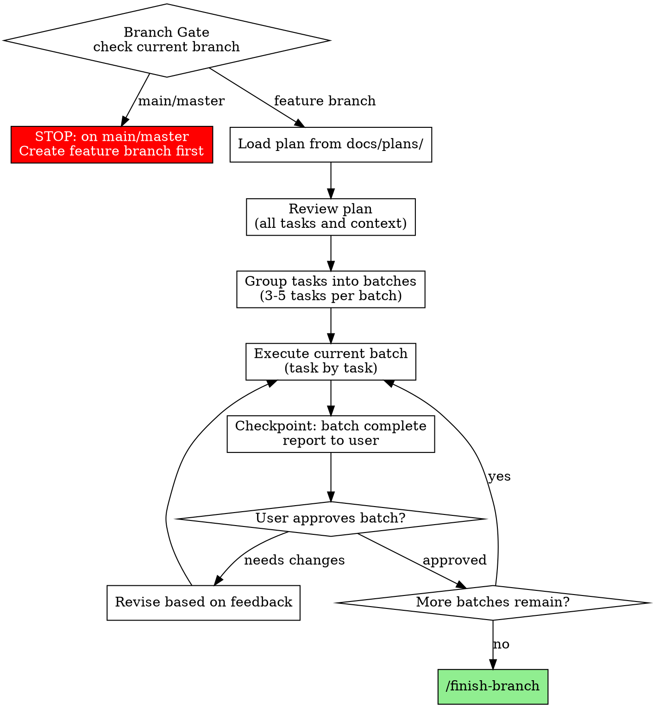

# Executing Plans

## Branch Gate (REQUIRED)

Before doing ANY work, check the current branch and refuse to proceed if on main or master:

```bash
CURRENT_BRANCH=$(git branch --show-current 2>/dev/null)
if [ "$CURRENT_BRANCH" = "main" ] || [ "$CURRENT_BRANCH" = "master" ]; then
  echo "ERROR: Cannot run /execute-plan on branch '$CURRENT_BRANCH'."
  echo "Create a feature branch first:"
  echo "  Option 1: /worktree  (recommended — isolated environment)"
  echo "  Option 2: git checkout -b feature/<name>"
  exit 1
fi
```

**If on main/master:** STOP. Do not execute any plan steps. Tell the user to create a feature branch first, then re-run this command.

**If on a feature branch:** Proceed.

## Process Graph (Authoritative)

> When this graph conflicts with prose, follow the graph.



## Overview

Load plan, review critically, execute tasks in batches, report for review between batches.

**Core principle:** Batch execution with checkpoints for architect review.

**Announce at start:** "I'm using the executing-plans skill to implement this plan."

## The Process

### Step 1: Load and Review Plan
1. Read plan file
2. Review critically - identify any questions or concerns about the plan
3. If concerns: Raise them with your human partner before starting
4. If no concerns: Create TodoWrite and proceed

**Session Naming:** After loading the plan, rename this session:

/rename exec: <plan-name>

Derive the name from the plan filename. Example: `/rename exec: email-forwarding`

If `/rename` is unavailable, skip this step.

### Step 2: Execute Batch
**Default: First 3 tasks**

For each task:
1. Mark as in_progress
2. Follow each step exactly (plan has bite-sized steps)
3. Run verifications as specified
4. Mark as completed

### Step 3: Report
When batch complete:
- Show what was implemented
- Show verification output
- Say: "Ready for feedback."

### Step 4: Continue
Based on feedback:
- Apply changes if needed
- Execute next batch
- Repeat until complete

### Step 5: Complete Development

After all tasks complete and verified:
- Announce: "I'm using /finish-branch to complete this work."
- **REQUIRED:** Use `/finish-branch`
- Follow that skill to verify tests, present options, execute choice

## When to Stop and Ask for Help

**STOP executing immediately when:**
- Hit a blocker mid-batch (missing dependency, test fails, instruction unclear)
- Plan has critical gaps preventing starting
- You don't understand an instruction
- Verification fails repeatedly

**Ask for clarification rather than guessing.**

## When to Revisit Earlier Steps

**Return to Review (Step 1) when:**
- Partner updates the plan based on your feedback
- Fundamental approach needs rethinking

**Don't force through blockers** - stop and ask.

## Remember
- Review plan critically first
- Follow plan steps exactly
- Don't skip verifications
- Reference skills when plan says to
- Between batches: just report and wait
- Stop when blocked, don't guess
- Never start implementation on main/master branch without explicit user consent

## Integration

**Required workflow skills:**
- `/worktree` - REQUIRED: Set up isolated workspace before starting
- `/create-plan` - Creates the plan this command executes
- `/finish-branch` - Complete development after all tasks
- `/verify` - Verification before completion
