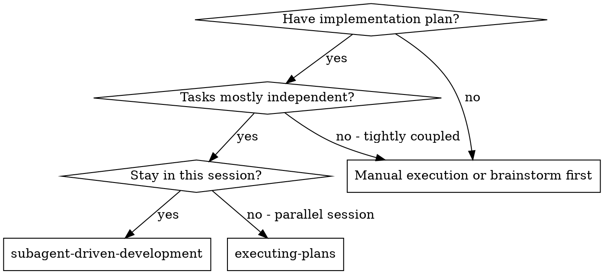
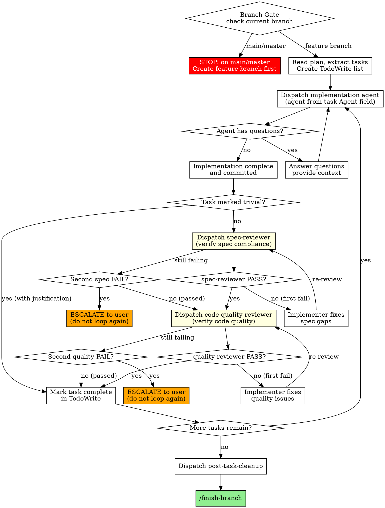

# Subagent-Driven Development

Execute plan by dispatching the Amplifier agent specified in each task, with two-stage review after each: spec compliance review first, then code quality review.

**Core principle:** Dispatch the right Amplifier specialist per task + two-stage review (spec then quality) = high quality, fast iteration

## When to Use



**vs. Executing Plans (parallel session):**
- Same session (no context switch)
- Fresh Amplifier agent per task (specialist knowledge + no context pollution)
- Two-stage review after each task: spec compliance first, then code quality
- Faster iteration (no human-in-loop between tasks)

## Pre-Dispatch Prompt Quality Gate

Before sending any prompt to a subagent, run a silent self-check on the prompt you're about to dispatch:

| Dimension | Question | Target |
|-----------|----------|--------|
| Clarity | Is the task unambiguous? Could the agent misinterpret scope? | >= 7/10 |
| Specificity | Are file paths, function names, and expected behavior concrete? | >= 7/10 |
| Structure | Does it have: goal, context, constraints, success criteria? | >= 7/10 |
| Constraints | Are boundaries explicit (what NOT to do, what's out of scope)? | >= 7/10 |

**Average >= 7:** dispatch as-is.
**Average 5-6:** strengthen the prompt before dispatch — add missing file paths, boundaries, or examples.
**Average < 5:** rewrite the prompt — it will produce poor output and waste a dispatch cycle.

This is a mental checkpoint, not a visible table. Silent unless it triggers a rewrite — then note:
"Strengthened the agent prompt before dispatch (added [missing element])."

---

## Amplifier Agent Dispatch

Each task in the plan has an `Agent:` field. Use it as the `subagent_type` when dispatching:

1. Read the task's `Agent:` field (e.g., `modular-builder`, `bug-hunter`, `database-architect`)
2. **Resolve effort and turns** using the routing matrix (`config/routing-matrix.yaml`):
   - Look up the agent's role → get `model`, `effort`, and `turns: {min, default, max}`
   - **Score task complexity** to adjust effort within the role's range:
     - File count 1 → 0 | 2-4 → +1 | 5+ → +2
     - Keywords in task: "security", "auth", "migration", "refactor", "architecture" → +1
     - Keywords: "rename", "config", "typo", "frontmatter" → -1
     - Previous attempt BLOCKED or NEEDS_CONTEXT → +2
     - TDD steps present → +1
     - Multi-subsystem scope (3+ directories) → +1
   - **Map score to effort:** ≤0 → low (min turns) | 1-2 → medium (default turns) | ≥3 → high (max turns)
   - **Cap by session /effort:** `resolved = min(session_effort, max(role_effort, task_score))`
   - **At effort=max:** use max turns + auto-resume up to 3 cycles
   - Task's explicit **Model:** field overrides routing matrix if present
3. **Dispatch** using Task tool: `Task(subagent_type="modular-builder", model="sonnet", max_turns=25, ...)`
   - **If agent returns incomplete:** Resume with `Task(resume=agent_id, prompt="Continue your work...")` — max 3 resume cycles
3. Pass the full task text + context in the prompt (never make subagent read the plan file)
4. The agent brings domain expertise to the implementation — `modular-builder` builds clean modules, `bug-hunter` does hypothesis-driven debugging, `database-architect` designs schemas

**Review agents (from `.claude/AGENTS_CATALOG.md`):**
- Spec compliance review → `Task(subagent_type="test-coverage", model="haiku", ...)`
- Code quality review → `Task(subagent_type="zen-architect", model="sonnet", ...)` in REVIEW mode
- Security-sensitive tasks → add `Task(subagent_type="security-guardian", model="opus", ...)` as third reviewer
- Parallel review is OK: spec-compliance and security reviews are read-only, they can run concurrently

**After all tasks complete:**
- Dispatch `post-task-cleanup` agent for codebase hygiene
- **Memorize key decisions** made during implementation:
  - Architecture decisions → update DISCOVERIES.md or decision records
  - New patterns established → document in appropriate location
  - Domain terms clarified → update project glossary
- Then use `/finish-branch`

## Review Levels

Not every task needs full two-stage review. Match review depth to task risk:

**Level 1 — Self-review only** (simple, low-risk tasks):
- Task touches 1-2 files with clear spec
- No security implications
- Agent self-reviews, tests pass, commit → done
- Examples: rename, add field, simple CRUD, config change

**Level 2 — Spec compliance review** (standard tasks):
- Task touches multiple files or has integration concerns
- Dispatch `test-coverage` agent for spec compliance after implementation
- Skip separate code quality review
- Examples: new feature module, API endpoint, database migration

**Level 3 — Full two-stage review** (complex or security-sensitive tasks):
- Task involves security, auth, data handling, or architectural decisions
- Dispatch `test-coverage` for spec compliance, THEN `zen-architect` for code quality
- Add `security-guardian` for security-sensitive work
- Examples: auth flow, payment handling, data migration, public API

**How to choose:** Default to Level 2. Upgrade to Level 3 for security/architecture. Downgrade to Level 1 only when the task is trivially simple.

## Two-Stage Review Loop (REQUIRED for non-trivial tasks)

After each implementation agent completes a task, run two sequential review stages before marking the task complete.

### Trivial Task Exemption

A task may skip the review loop ONLY if the orchestrator explicitly marks it as trivial at dispatch time. Trivial means: single-line change or documentation-only update. The orchestrator must include the following in the task dispatch:

```
TRIVIAL EXEMPTION: [specific justification — e.g., "single typo fix in README"]
```

If no TRIVIAL EXEMPTION is logged, both review stages are mandatory.

### Stage 1: Spec Compliance Review

After the implementer completes:

1. Dispatch `test-coverage` with:
   - The original task specification (copy the task's Steps/description from the plan)
   - List of files changed (from the implementer's commit)
   - Summary of changes (from the implementer's report)

2. Read the `VERDICT` from spec-reviewer:
   - **PASS**: Proceed to Stage 2.
   - **FAIL (first time)**: Share FINDINGS with the implementer. Dispatch implementer again to fix the spec gaps. Then dispatch spec-reviewer again for re-review.
   - **FAIL (second time)**: ESCALATE TO USER. Report both the FINDINGS and the implementer's attempted fixes. Do not loop a third time. Wait for user direction.

### Stage 2: Code Quality Review

After spec-reviewer returns PASS:

1. Dispatch `code-quality-reviewer` with:
   - List of files changed
   - Summary of changes
   - Reference to AGENTS.md for project conventions

2. Read the `VERDICT` from code-quality-reviewer:
   - **PASS**: Task is complete. Mark it done in TodoWrite.
   - **FAIL (first time)**: Share FINDINGS with the implementer. Dispatch implementer again to fix the quality issues. Then dispatch code-quality-reviewer again for re-review.
   - **FAIL (second time)**: ESCALATE TO USER. Report both the FINDINGS and the implementer's attempted fixes. Do not loop a third time. Wait for user direction.

### Loop Cap Enforcement

Maximum 2 review cycles per reviewer per task. Track cycle count explicitly. Never dispatch a third review cycle — always escalate after the second consecutive FAIL.

### Dispatch Announcements for Reviews

Use this format for all review dispatches:

```
>> Review [1/2]: spec-reviewer for Task N — spec compliance check
>> Review [2/2]: code-quality-reviewer for Task N — code quality check
```

## Session Naming

After loading the plan and creating the TodoWrite list, rename this session to reflect the work:

/rename dev: <plan-name>

Where `<plan-name>` is a 2-4 word slug derived from the plan filename or its Goal line.
Example: `/rename dev: mailbox-redesign`

If `/rename` is unavailable, skip this step.

## Branch Gate (REQUIRED)

Before doing ANY work, check the current branch and REFUSE if on main or master:

```bash
CURRENT_BRANCH=$(git branch --show-current 2>/dev/null)
if [ "$CURRENT_BRANCH" = "main" ] || [ "$CURRENT_BRANCH" = "master" ]; then
  echo "ERROR: Cannot run /subagent-dev on branch '$CURRENT_BRANCH'."
  echo "Create a feature branch first:"
  echo "  Option 1: /worktree  (recommended — isolated environment)"
  echo "  Option 2: git checkout -b feature/<name>"
  exit 1
fi
```

**HARD BLOCK:** If on main/master, STOP immediately. Do NOT dispatch any agents. Do NOT offer to continue. Tell the user: "Cannot run /subagent-dev on main. Create a feature branch first, then re-run." Offer the two branch creation options above and wait for the user to switch branches before proceeding.

**If on a feature branch:** Proceed to The Process.

## Process Graph (Authoritative)

> When this graph conflicts with prose, follow the graph.



## Wave-Based Parallel Execution

Before executing tasks sequentially, analyze the plan for parallelization opportunities:

1. **Build dependency graph** — which tasks depend on which? A task depends on another if it modifies files the other creates, or explicitly states a dependency.
2. **Assign waves:**
   - **Wave 0**: [TRACER] task runs alone first — proves the architecture
   - **Wave 1**: All independent tasks with no dependencies (parallel)
   - **Wave 2**: Tasks depending only on Wave 1 outputs (parallel)
   - **Wave N**: Tasks depending on previous waves
3. **Execute per wave:**
   - Within each wave, dispatch all tasks in parallel using `/parallel-agents`
   - Wait for all tasks in the wave to complete before starting the next wave
   - If any task in a wave fails, pause and report — don't start the next wave

**When to use waves:**
- Plan has 4+ tasks with some independence → use waves
- Plan has 3 or fewer tasks → sequential is fine
- All tasks modify the same files → sequential only

**Print wave plan before executing:**
```
Wave 0 (solo):     Task 1 [TRACER]
Wave 1 (parallel): Task 2, Task 3 (independent)
Wave 2 (parallel): Task 4, Task 5 (depend on Wave 1)
Wave 3 (sequential): Task 6 (depends on Task 4 + Task 5)
```

## The Process

## Dispatch Announcements

**Before every Task dispatch, output a visible status line:**

For implementation:
```
>> [N/TOTAL] Dispatching [agent] (model: [model]) for Task N: [description]
>>   Review: L[1/2/3] | Files: [count] | isolation: [worktree|none]
```

For reviews:
```
>> [N/TOTAL] Review: [reviewer] (model: [model]) — [type] review for Task N
```

Example:
```
>> [3/8] Dispatching modular-builder (model: haiku) for Task 3: Create mailbox list component
>>   Review: L2 | Files: 3 | isolation: worktree
>> [3/8] Review: test-coverage (model: haiku) — spec compliance for Task 3
```

**Never dispatch silently.**

## Model & Effort Selection

**Source of truth:** `config/routing-matrix.yaml` — defines model, effort tier, and elastic turn ranges per role.

**Quick reference (from routing matrix):**

| Role | Model | Effort | Turns (min/default/max) |
|------|-------|--------|------------------------|
| scout | haiku | low | 8 / 12 / 20 |
| research | sonnet | medium | 10 / 15 / 25 |
| implement | sonnet | medium | 15 / 25 / 40 |
| architect | opus | high | 15 / 20 / 35 |
| review | sonnet | medium | 10 / 15 / 25 |
| security | opus | high | 12 / 15 / 25 |
| fast | haiku | low | 5 / 10 / 15 |

**Effort resolution:** Score the task's complexity signals (see Amplifier Agent Dispatch step 2), map to effort level, pick turns from range. Session `/effort` is the ceiling.

**When to upgrade:** If a `haiku` agent returns BLOCKED or NEEDS_CONTEXT, re-dispatch with `sonnet` and bump to `max` turns. If `sonnet` is blocked, try `opus`.

## Context Assessment

Before dispatching the first implementation agent, assess whether fast mode benefits this session:

**Signals for fast mode:**
- Plan has 8+ tasks
- Files referenced across 15+ paths
- Prior haiku dispatch returned BLOCKED due to context
- Architecture-level work spanning multiple subsystems

**When signals are present, surface to the user:**

> This plan has [N] tasks across [M] files. Fast mode (`/fast`) provides 1M context (vs 200K standard) at 2.5x cost. Enable for this session?

**Wait for explicit user confirmation.** Never auto-enable fast mode.

If confirmed, run `/fast` to enable, then proceed with dispatches.
After all tasks complete, remind user: "Fast mode is still enabled — toggle `/fast` to disable."

## Handling Implementer Status

Implementer subagents report one of four statuses. Handle each appropriately:

**DONE:** Proceed to spec compliance review.

**DONE_WITH_CONCERNS:** The implementer completed the work but flagged doubts. Read the concerns before proceeding. If the concerns are about correctness or scope, address them before review. If they're observations (e.g., "this file is getting large"), note them and proceed to review.

**NEEDS_CONTEXT:** The implementer needs information that wasn't provided. Provide the missing context and re-dispatch.

**BLOCKED:** The implementer cannot complete the task. Assess the blocker:
1. If it's a context problem, provide more context and re-dispatch with the same model
2. If the task requires more reasoning, re-dispatch with a more capable model
3. If the task is too large, break it into smaller pieces
4. If the plan itself is wrong, escalate to the human

**Never** ignore an escalation or force the same model to retry without changes. If the implementer said it's stuck, something needs to change.

## Prompt Templates

### Implementer Prompt Template

Use this template when dispatching an implementation agent. The `subagent_type` parameter comes from the task's `Agent:` field in the plan.

**CRITICAL: Use the Agent: field value as the `subagent_type` parameter.** This dispatches the specialized Amplifier agent, not a generic one.

```
Task tool:
  subagent_type: "general"
  description: "Implement Task N: [task name]"
  prompt: |
    You are the [agent-name from task's Agent: field] agent implementing Task N: [task name]

    ## IMMEDIATE ACTION

    **DO NOT PLAN.** The plan is already provided below.
    **EXECUTE IMMEDIATELY.** Do not waste tokens creating a new plan.

    ## Output Discipline

    When reporting back, keep your response concise to protect the caller's context:
    - List files created/modified with paths (not full contents)
    - Summarize what changed in each file (1-2 lines per file)
    - Include test results: pass/fail counts and command used
    - Include git commit hash from `git log -1 --format="%H %s"`
    - If a file is >200 lines, report the path and summary, not the full content
    - Keep total report under 200 lines

    ## Your Strengths

    [Brief description of what this agent specializes in, from .claude/AGENTS_CATALOG.md.
     Examples:
     - modular-builder: "You build self-contained, regeneratable modules following the bricks-and-studs philosophy."
     - database-architect: "You design clean schemas, optimize queries, and handle migrations."
     - bug-hunter: "You use hypothesis-driven debugging to find root causes systematically."
     - integration-specialist: "You handle external system integration with reliability and simplicity."]

    ## Task Description

    [FULL TEXT of task from plan - paste it here, don't make subagent read file]

    ## Context

    [Scene-setting: where this fits, dependencies, architectural context]

    ## Before You Begin

    1. **Style Check:** Read 1-2 related files to understand the project's style (e.g., naming conventions, event handlers like `OnClick` syntax). Mimic it exactly.
    2. **Clarify:** If you have questions about requirements, ask them now.

    ## Your Job

    1. Implement exactly what the task specifies
    2. Write tests (following TDD if task says to)
    3. Verify implementation works
    4. **Commit your work** (Required)
    5. **Verify Commit:** Run `git log -1` to prove the commit succeeded.
    6. Self-review (see below)
    7. Report back

    Work from: [directory]

    **While you work:** If you encounter something unexpected or unclear, **ask questions**.
    It's always OK to pause and clarify. Don't guess or make assumptions.

    ## Code Organization

    You reason best about code you can hold in context at once, and your edits are more
    reliable when files are focused. Keep this in mind:
    - Follow the file structure defined in the plan
    - Each file should have one clear responsibility with a well-defined interface
    - If a file you're creating is growing beyond the plan's intent, stop and report
      it as DONE_WITH_CONCERNS — don't split files on your own without plan guidance
    - If an existing file you're modifying is already large or tangled, work carefully
      and note it as a concern in your report
    - In existing codebases, follow established patterns. Improve code you're touching
      the way a good developer would, but don't restructure things outside your task.

    ## When You're in Over Your Head

    It is always OK to stop and say "this is too hard for me." Bad work is worse than
    no work. You will not be penalized for escalating.

    **STOP and escalate when:**
    - The task requires architectural decisions with multiple valid approaches
    - You need to understand code beyond what was provided and can't find clarity
    - You feel uncertain about whether your approach is correct
    - The task involves restructuring existing code in ways the plan didn't anticipate
    - You've been reading file after file trying to understand the system without progress

    **How to escalate:** Report back with status BLOCKED or NEEDS_CONTEXT. Describe
    specifically what you're stuck on, what you've tried, and what kind of help you need.
    The controller can provide more context, re-dispatch with a more capable model,
    or break the task into smaller pieces.

    ## Before Reporting Back: Self-Review

    Review your work with fresh eyes. Ask yourself:

    **Completeness:**
    - Did I fully implement everything in the spec?
    - Did I miss any requirements?
    - Are there edge cases I didn't handle?

    **Quality:**
    - Is this my best work?
    - Are names clear and accurate (match what things do, not how they work)?
    - Is the code clean and maintainable?

    **Discipline:**
    - Did I avoid overbuilding (YAGNI)?
    - Did I only build what was requested?
    - Did I follow existing patterns in the codebase?

    **Testing:**
    - Do tests actually verify behavior (not just mock behavior)?
    - Did I follow TDD if required?
    - Are tests comprehensive?

    If you find issues during self-review, fix them now before reporting.

    ## Report Format

    When done, report:
    - **Status:** DONE | DONE_WITH_CONCERNS | BLOCKED | NEEDS_CONTEXT
    - What you implemented (or what you attempted, if blocked)
    - What you tested and test results
    - Files changed
    - Self-review findings (if any)
    - Any issues or concerns

    Use DONE_WITH_CONCERNS if you completed the work but have doubts about correctness.
    Use BLOCKED if you cannot complete the task. Use NEEDS_CONTEXT if you need
    information that wasn't provided. Never silently produce work you're unsure about.
```

### Spec Compliance Reviewer Prompt Template

Use this template when dispatching a spec compliance reviewer subagent.

**Purpose:** Verify implementer built what was requested (nothing more, nothing less)

**Agent:** Dispatch `test-coverage` Amplifier agent (testing specialist with spec verification expertise)

```
Task tool (test-coverage):
  description: "Review spec compliance for Task N"
  prompt: |
    You are the test-coverage agent reviewing whether an implementation matches its specification.

    ## What Was Requested

    [FULL TEXT of task requirements]

    ## What Implementer Claims They Built

    [From implementer's report]

    ## CRITICAL: Do Not Trust the Report

    The implementer finished suspiciously quickly. Their report may be incomplete,
    inaccurate, or optimistic. You MUST verify everything independently.

    ## Output Discipline

    Keep your review concise to protect the caller's context:
    - State PASS or FAIL clearly at the top
    - List specific issues with file:line references
    - Do not reproduce full file contents in the review
    - For passing reviews, keep response under 50 lines
    - For failing reviews, keep response under 100 lines

    **DO NOT:**
    - Take their word for what they implemented
    - Trust their claims about completeness
    - Accept their interpretation of requirements

    **DO:**
    - Read the actual code they wrote
    - **Verify Persistence:** Check `git log -1` to ensure the work was actually committed.
    - Compare actual implementation to requirements line by line
    - Check for missing pieces they claimed to implement
    - Look for extra features they didn't mention

    ## Your Job

    Read the implementation code and verify:

    **Persistence Check:**
    - Did the implementer actually commit the code?
    - If files are modified but not committed, or if `git log` shows an old commit, **FAIL** the review immediately.

    **Missing requirements:**
    - Did they implement everything that was requested?
    - Are there requirements they skipped or missed?
    - Did they claim something works but didn't actually implement it?

    **Extra/unneeded work:**
    - Did they build things that weren't requested?
    - Did they over-engineer or add unnecessary features?
    - Did they add "nice to haves" that weren't in spec?

    **Misunderstandings:**
    - Did they interpret requirements differently than intended?
    - Did they solve the wrong problem?
    - Did they implement the right feature but wrong way?

    **Verify by reading code, not by trusting report.**

    Report:
    - Spec compliant (if everything matches after code inspection)
    - Issues found: [list specifically what's missing or extra, with file:line references]
```

### Code Quality Reviewer Prompt Template

Use this template when dispatching a code quality reviewer subagent.

**Purpose:** Verify implementation is well-built (clean, tested, maintainable)

**Agent:** Dispatch `zen-architect` Amplifier agent in REVIEW mode (architecture and quality specialist)

**Only dispatch after spec compliance review passes.**

```
Task tool (zen-architect):
  description: "Code quality review for Task N"
  prompt: |
    You are the zen-architect agent in REVIEW mode. Review the implementation
    for code quality, architecture alignment, and maintainability.

    WHAT_WAS_IMPLEMENTED: [from implementer's report]
    PLAN_OR_REQUIREMENTS: Task N from [plan-file]
    BASE_SHA: [commit before task]
    HEAD_SHA: [current commit]
    DESCRIPTION: [task summary]

    ## Your Review Focus

    **Architecture:**
    - Does this follow existing patterns in the codebase?
    - Are module boundaries clean?
    - Is the abstraction level appropriate?

    **Quality:**
    - Is the code clean and readable?
    - Are names clear and accurate?
    - Is complexity justified?

    **Simplicity:**
    - Could this be simpler without losing functionality?
    - Is there any unnecessary abstraction?
    - Does it follow YAGNI?

    **Testing:**
    - Do tests verify behavior (not implementation)?
    - Is test coverage adequate for the complexity?
    - Are tests maintainable?

    Report:
    - Strengths: [what's well done]
    - Issues: [Critical/Important/Minor with file:line references]
    - Assessment: Approved / Needs changes
```

**In addition to standard code quality concerns, the reviewer should check:**
- Does each file have one clear responsibility with a well-defined interface?
- Are units decomposed so they can be understood and tested independently?
- Is the implementation following the file structure from the plan?
- Did this implementation create new files that are already large, or significantly grow existing files? (Don't flag pre-existing file sizes — focus on what this change contributed.)

**Code reviewer returns:** Strengths, Issues (Critical/Important/Minor), Assessment

## Example Workflow

```
You: I'm using Subagent-Driven Development to execute this plan.

[Read plan file once: docs/plans/feature-plan.md]
[Extract all 5 tasks with full text, Agent fields, and context]
[Create TodoWrite with all tasks]

Task 1/5: Design auth module schema

>> Dispatching database-architect (model: sonnet) for Task 1: Design auth module schema
>>   Review level: 2 | Files: 3 | Complexity: standard

database-architect: "Should we use separate tables for roles and permissions, or a combined approach?"

You: "Separate tables — we need fine-grained permission assignment."

database-architect: "Got it. Implementing now..."
[Later] database-architect:
  Status: DONE
  - Created migration for users, roles, permissions tables
  - Added indexes for common query patterns
  - Tests: 4/4 passing
  - Committed

>> Dispatching test-coverage (model: haiku) — spec compliance review for Task 1
test-coverage: Spec compliant - schema matches requirements

[Mark Task 1 complete — Level 2 review passed, skipping quality review]

Task 2/5: Implement auth middleware

>> Dispatching modular-builder (model: haiku) for Task 2: Implement auth middleware
>>   Review level: 1 | Files: 1 | Complexity: simple

modular-builder: Status: DONE — implemented middleware with tests passing
[Mark Task 2 complete — Level 1 self-review sufficient]

Task 3/5: Add JWT token validation

>> Dispatching security-guardian (model: opus) for Task 3: Add JWT token validation
>>   Review level: 3 | Files: 4 | Complexity: complex (security-sensitive)

security-guardian: Status: DONE — implemented with OWASP best practices
>> Dispatching test-coverage (model: haiku) — spec compliance review for Task 3
>> Dispatching zen-architect (model: sonnet) — code quality review for Task 3
[Both reviews pass]
[Mark Task 3 complete]

...

>> Dispatching post-task-cleanup (model: haiku) for final hygiene pass
post-task-cleanup: Removed 2 unused imports, no other issues.

[Use /finish-branch]
Done!
```

## Advantages

**vs. Manual execution:**
- Specialist agents bring domain expertise per task
- Fresh context per task (no confusion)
- Parallel-safe (subagents don't interfere)
- Subagent can ask questions (before AND during work)

**vs. Executing Plans:**
- Same session (no handoff)
- Continuous progress (no waiting)
- Review checkpoints automatic

**Efficiency gains:**
- No file reading overhead (controller provides full text)
- Controller curates exactly what context is needed
- Agent brings domain expertise (database-architect knows schema patterns)
- Questions surfaced before work begins (not after)

**Quality gates:**
- Self-review catches issues before handoff
- Spec compliance via test-coverage agent (testing expert verifies completeness)
- Code quality via zen-architect REVIEW mode (architecture expert verifies quality)
- Security review via security-guardian (when applicable)
- Post-task-cleanup ensures hygiene
- Review loops ensure fixes actually work

**Cost:**
- More subagent invocations (implementer + 1-3 reviewers depending on review level)
- Controller does more prep work (extracting all tasks upfront)
- Review loops add iterations
- But catches issues early (cheaper than debugging later)

## Red Flags

**Never:**
- Start implementation on main/master branch without explicit user consent
- Skip reviews entirely (even Level 1 tasks need self-review; Level 2+ need spec compliance)
- Proceed with unfixed issues
- Dispatch multiple implementation subagents touching the SAME files in parallel (use wave analysis to prevent conflicts — see Wave-Based Parallel Execution)
- Make subagent read plan file (provide full text instead)
- Skip scene-setting context (subagent needs to understand where task fits)
- Ignore subagent questions (answer before letting them proceed)
- Accept "close enough" on spec compliance (spec reviewer found issues = not done)
- Skip review loops (reviewer found issues = implementer fixes = review again)
- Let implementer self-review replace actual review on Level 2+ tasks (both are needed)
- Use Level 1 (self-review only) for security-sensitive tasks — always upgrade to Level 3
- **Start code quality review before spec compliance is passed** (wrong order)
- Move to next task while either review has open issues
- Override the plan's Agent field without good reason

**If subagent asks questions:**
- Answer clearly and completely
- Provide additional context if needed
- Don't rush them into implementation

**If reviewer finds issues:**
- Implementer (same subagent) fixes them
- Reviewer reviews again
- Repeat until approved
- Don't skip the re-review

**If subagent fails task:**
- Dispatch fix subagent with specific instructions
- Don't try to fix manually (context pollution)

## Integration

**Required workflow commands:**
- **/worktree** - REQUIRED: Set up isolated workspace before starting
- **/create-plan** - Creates the plan this command executes (with Agent: fields)
- **/request-review** - Code review template for reviewer subagents
- **/finish-branch** - Complete development after all tasks

**Amplifier agents used:**
- **Implementation agents** - Per task's Agent: field (modular-builder, database-architect, etc.)
- **test-coverage** - Spec compliance reviewer
- **zen-architect** - Code quality reviewer (REVIEW mode)
- **security-guardian** - Security reviewer (when applicable)
- **post-task-cleanup** - Final hygiene pass

**Subagents should use:**
- **/tdd** - Subagents follow TDD for each task

**Quality feedback loop:**
- **/evaluate** - Score agent output against rubrics after completion
- **/self-eval subagent-dev** - Evaluate this session's implementation quality

**Alternative workflow:**
- **/create-plan** - Creates the plan this command executes
