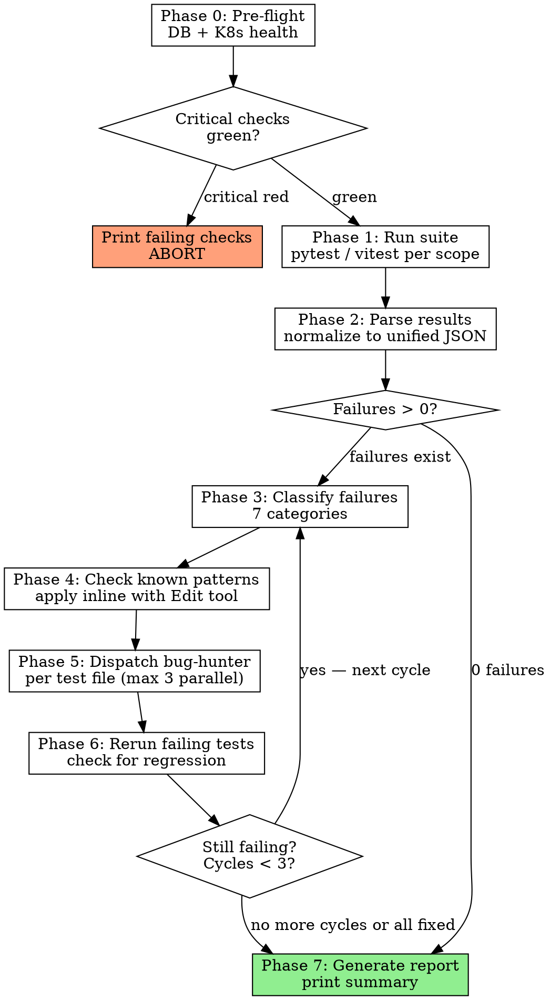

# /test-siem — SIEM Test Auto-Fix Pipeline

## Overview

Runs tests across universal-siem-monorepo services, classifies failures by type, applies known fix patterns instantly, dispatches `bug-hunter` agents for novel failures, reruns, and reports. Persists every learned fix to `.fix-patterns.json` and auto-memory.

**Announce at start:** "Starting SIEM test pipeline..."

## Arguments

```
/test-siem                    # full stack (all services + frontend)
/test-siem backend            # all backend services
/test-siem frontend           # vitest (1712 tests)
/test-siem log-service        # single service
/test-siem auth-service       # single service
/test-siem anomaly-service    # single service
/test-siem snort-service      # single service
/test-siem agents-service     # single service
/test-siem devices-service    # single service
/test-siem m365-service       # single service
/test-siem integration        # integration tests only
/test-siem --health           # pre-flight health check (default: production)
/test-siem --health staging   # pre-flight health check (staging)
/test-siem --report           # generate report from last results.json, no test run
```

## Process Graph (Authoritative)

> When this graph conflicts with prose, follow the graph.



---

## Platform Notes

This runs on **Linux** (mcp server, 172.31.250.2):

- **Working directory:** `/opt/monorepo-workspace/universal-siem-monorepo/`
- **Python:** All pytest commands run from `backend/` directory (shared `pyproject.toml` + `uv.lock`)
- **Node:** Use `npm run test` from `frontend/`
- **K8s staging:** `kubectl get pods -n siem-staging` (local, 172.31.250.2)
- **K8s production:** `ssh -i ~/.ssh/staging_deploy claude@172.31.250.60 "kubectl get pods -n siem-production"`
- **DB:** PostgreSQL on `172.31.250.30:5432` (shared by both environments)

## Configuration

```
SIEM_ROOT=/opt/monorepo-workspace/universal-siem-monorepo
BACKEND_DIR=$SIEM_ROOT/backend
DB_HOST=172.31.250.30
DB_PORT=5432
DB_NAME=siem_timeseries
DB_USER=siem_user
DB_PASS=7oBuuQ1fmKQMjNI0Hro6s9RShMwCDOzc
RESULTS_DIR=$SIEM_ROOT/.test-siem
RESULTS_FILE=$SIEM_ROOT/.test-siem/results.json
PATTERNS_FILE=$SIEM_ROOT/.test-siem/.fix-patterns.json
```

Ensure `.test-siem/` directory exists before first run: `mkdir -p $SIEM_ROOT/.test-siem`

---

## Scope-to-Path Mapping (CRITICAL: all pytest runs from backend/)

All backend pytest commands MUST run from `$SIEM_ROOT/backend/` because all services share one `pyproject.toml` and `uv.lock`. The test path is relative to `backend/`.

| Scope | Pytest Path (relative to backend/) | Runner |
|-------|-----------------------------------|--------|
| `backend` | `tests/` + `services/*/tests/` + `auth-service/tests/` + `m365-service/tests/` | pytest |
| `frontend` | N/A — runs from `$SIEM_ROOT/frontend/` | vitest |
| `log-service` | `services/log-service/tests/` | pytest |
| `anomaly-service` | `services/anomaly-service/tests/` | pytest |
| `snort-service` | `services/snort-service/tests/` | pytest |
| `agents-service` | `services/agents-service/tests/` | pytest |
| `devices-service` | `services/devices-service/tests/` | pytest |
| `auth-service` | `auth-service/tests/` | pytest |
| `m365-service` | `m365-service/tests/` | pytest |
| `integration` | `tests/integration/` | pytest |
| (no arg) | backend then frontend | both |

---

## Phase 0: Pre-flight Health Check

Default environment: **production**. Use `--health staging` for staging.

```bash
# Database check (shared across environments)
PGPASSWORD='7oBuuQ1fmKQMjNI0Hro6s9RShMwCDOzc' psql -U siem_user -h 172.31.250.30 -d siem_timeseries -c "SELECT 1" 2>&1

# K8s pod check — PRODUCTION (default)
ssh -i ~/.ssh/staging_deploy claude@172.31.250.60 "kubectl get pods -n siem-production -o json" | python3 -c "
import sys, json
data = json.load(sys.stdin)
ready = sum(1 for p in data['items'] if any(c.get('status')=='True' for c in p.get('status',{}).get('conditions',[]) if c.get('type')=='Ready'))
total = len(data['items'])
for pod in data['items']:
    name = pod['metadata']['name']
    is_ready = any(c.get('status')=='True' for c in pod.get('status',{}).get('conditions',[]) if c.get('type')=='Ready')
    print(f\"  {'✓' if is_ready else '✗'} {name}\")
print(f'\n  {ready}/{total} pods ready')
"

# K8s pod check — STAGING (when --health staging)
kubectl get pods -n siem-staging -o json | python3 -c "..." # same parser
```

**Decision logic:**
- DB unreachable → abort: "Database unreachable at 172.31.250.30:5432. Aborting."
- Pods not ready → warn for `integration` scope, continue for unit-only scopes
- `--health` flag → print full status table and stop

```
SIEM Health Check (production):
  database     ✓ reachable (172.31.250.30:5432)
  K8s pods     ✓ 14/14 ready (siem-production)
Ready to run tests.
```

---

## Phase 1: Run Suite

**CRITICAL:** All pytest commands run from `$SIEM_ROOT/backend/` directory.

For each pytest scope:
```bash
cd /opt/monorepo-workspace/universal-siem-monorepo/backend
uv run pytest <relative-test-path> -v --tb=short --json-report --json-report-file=../.test-siem/pytest-report.json
```

Examples:
```bash
# Single service
cd /opt/monorepo-workspace/universal-siem-monorepo/backend
uv run pytest auth-service/tests/ -v --tb=short --json-report --json-report-file=../.test-siem/pytest-report.json

# Another service
uv run pytest services/log-service/tests/ -v --tb=short --json-report --json-report-file=../.test-siem/pytest-report.json

# Integration tests
uv run pytest tests/integration/ -v --tb=short --json-report --json-report-file=../.test-siem/pytest-report.json
```

For `backend` scope, run ALL test paths in a single pytest invocation:
```bash
cd /opt/monorepo-workspace/universal-siem-monorepo/backend
uv run pytest tests/ services/log-service/tests/ services/anomaly-service/tests/ services/snort-service/tests/ services/agents-service/tests/ services/devices-service/tests/ auth-service/tests/ m365-service/tests/ -v --tb=short --json-report --json-report-file=../.test-siem/pytest-report.json
```

For frontend:
```bash
cd /opt/monorepo-workspace/universal-siem-monorepo/frontend
npm run test -- --run --reporter=json 2>&1 > ../.test-siem/vitest-report.json
```

Capture exit codes. Initialize cycle counter: `cycle = 1`.

---

## Phase 2: Parse Results

Read runner-specific JSON output and normalize into unified format in `.test-siem/results.json`.

**Pytest JSON report structure** (from `pytest-json-report`):
```json
{
  "summary": { "passed": 10, "failed": 1, "error": 18, "total": 29 },
  "tests": [
    {
      "nodeid": "auth-service/tests/test_forward_auth.py::test_forward_auth_no_token_returns_401",
      "outcome": "passed|failed|error",
      "call": { "longrepr": "error text..." },
      "setup": { "longrepr": "..." }
    }
  ]
}
```

**IMPORTANT:** pytest reports `outcome: "error"` for import/setup failures (not `"failed"`). Both `"failed"` and `"error"` outcomes must be treated as failures. For `"error"` outcomes, the error text is in `setup.longrepr` or `call.longrepr` (check both).

**Vitest JSON report structure:**
```json
{
  "numPassedTests": 1712,
  "numFailedTests": 0,
  "testResults": [
    {
      "name": "/path/to/test.tsx",
      "assertionResults": [
        {
          "fullName": "Component should render",
          "status": "passed|failed",
          "failureMessages": ["..."]
        }
      ]
    }
  ]
}
```

Normalize to unified format:
```json
{
  "timestamp": "2026-03-16T13:00:00Z",
  "scope": "auth-service",
  "cycle": 1,
  "duration_s": 10,
  "summary": { "passed": 10, "failed": 1, "error": 18, "skipped": 0 },
  "failures": [
    {
      "test": "test_forward_auth_no_token_returns_401",
      "file": "auth-service/tests/test_forward_auth.py",
      "service": "auth-service",
      "error": "ImportError: email-validator is not installed",
      "traceback": "...",
      "class": null
    }
  ]
}
```

Print quick tally:
```
Run 1 results: 10 passed, 1 failed, 18 errors, 0 skipped
Failures in: auth-service (19)
```

If `failed + error === 0`: skip to Phase 7.

Group failing tests by file path.

---

## Phase 3: Classify Failures

For each failing test (outcome = `"failed"` or `"error"`), examine `error` + `traceback` and classify using these patterns (evaluated in order, first match wins):

| Class | Regex Patterns |
|-------|---------------|
| `IMPORT_ERROR` | `ModuleNotFoundError`, `ImportError`, `Cannot find module`, `No module named` |
| `DB_SCHEMA` | `relation.*does not exist`, `UndefinedColumn`, `UndefinedTable`, `sqlalchemy.*OperationalError` |
| `AUTH_ERROR` | `status.*40[13]`, `token.*invalid`, `permission denied`, `AuthenticationError` |
| `ASYNC_TIMING` | `asyncio.*TimeoutError`, `Event loop`, `RuntimeError.*event loop`, `TimeoutError` |
| `INFRA_ERROR` | `ConnectionRefusedError`, `ConnectionError.*refused`, `pod.*not ready`, `ECONNREFUSED` |
| `ASSERTION` | `AssertionError`, `assert.*==`, `expect\(` |
| `UNKNOWN` | Anything else |

Classification populates each failure's `class` field in results.json.

Print classification summary:
```
Classifications: IMPORT_ERROR=18, ASSERTION=1
INFRA_ERROR failures (0) will be reported but not auto-fixed.
```

Skip `INFRA_ERROR` failures from fix phases.

**IMPORT_ERROR special handling:** If all failures in a service are IMPORT_ERROR with the same missing module, this is likely a missing dependency — not a test file bug. Report it as: "Missing dependency: {module}. Run: cd backend && uv add {package}" and do NOT dispatch agents for it.

---

## Phase 4: Check Known Fix Patterns

Read `.test-siem/.fix-patterns.json` (create empty `[]` if not exists).

Also search episodic memory for learned patterns:
```
mcp__plugin_episodic-memory_episodic-memory__search(query="siem-test-fix pattern")
```

For each non-INFRA, non-dependency failure:
1. Test each pattern's `errorSignature` (treat as regex) against the failure's error text
2. If match: apply the fix described in `pattern.fix` directly using the Edit tool
3. Mark the test as `pattern-applied` with the pattern `id`

Track:
- `patterns_applied`: count of fixes applied from registry
- `pattern_ids_used`: list of matched pattern IDs

Print after this phase:
```
Pattern matches: 2 fixes applied (missing-cef-import x1, stale-auth-fixture x1)
Remaining for agent dispatch: 5 failures
```

---

## Phase 5: Dispatch Fix Agents

For failures not resolved by patterns, dispatch `bug-hunter` agents.

**Grouping:** one agent per test file. Max 3 parallel agents.

For each agent dispatch, build this context package:

```
FAILING TEST FILE: [read full content of the failing test file]
ERRORS: [paste error messages + tracebacks for all failures in this file]
SERVICE SOURCE: [read relevant source files from the service being tested]
  - log-service failures → backend/services/log-service/
  - auth-service failures → backend/auth-service/
  - anomaly-service failures → backend/services/anomaly-service/
  - frontend failures → frontend/src/ (relevant component)
CONFTEST: [read the service's test conftest.py for fixture context]
KNOWN PATTERNS: [paste .fix-patterns.json content as context]
REFERENCE TESTS: [read 1-2 passing test files from same service as examples]
```

Agent instruction (include verbatim):
> "You are fixing test files in universal-siem-monorepo. The application code is correct — the tests have drifted or have bugs. Fix the test file to match actual behavior. Do NOT modify any file outside of test directories. Only edit test files and test conftest files within the service's tests/ directory. When done, confirm which lines you changed and why."

Agent parameters:
- Agent: `bug-hunter` (role: implement → sonnet)
- `max_turns: 25`
- Include Subagent Resilience Protocol resume handling (see AGENTS.md)

---

## Phase 6: Rerun and Cycle

Rerun only the previously-failing test files:

```bash
cd /opt/monorepo-workspace/universal-siem-monorepo/backend
uv run pytest auth-service/tests/test_forward_auth.py auth-service/tests/test_health.py -v --tb=short --json-report --json-report-file=../.test-siem/pytest-report.json
```

**Regression check:** Compare new results against previous run.
- If any previously-passing test now fails → a fix caused a regression
- Identify which test file was last edited, revert it: `git checkout HEAD -- <file>`
- Log: "Reverted fix to {file} — caused {N} regressions"

**Record successful fixes:**
For each test that went from failing to passing:
1. Find which test file was changed (git diff)
2. Add entry to `.test-siem/.fix-patterns.json`
3. Write memory entry (see Memory Recording section)

**Cycle decision:**
- If `failed + error === 0` or `cycle >= 3`: proceed to Phase 7
- Otherwise: `cycle++`, go to Phase 3 with remaining failures

Print cycle update:
```
Cycle 1 → Cycle 2: 3 failures remain after applying 4 fixes
```

---

## Phase 7: Report

Print terminal summary:
```
━━━━━━━━━━━━━━━━━━━━━━━━━━━━━━━━━━━━━━━━━
SIEM Test Results (/test-siem auth-service)
━━━━━━━━━━━━━━━━━━━━━━━━━━━━━━━━━━━━━━━━━
  Passed: 29   Failed: 0   Errors: 0   Skipped: 0
  Duration: 10s

Fix Summary:
  Cycles run:        1
  Known patterns:    0 applied
  Agents dispatched: 1
  Regressions:       0

Remaining failures: none
━━━━━━━━━━━━━━━━━━━━━━━━━━━━━━━━━━━━━━━━━
```

If failures remain after max cycles:
```
NEEDS ATTENTION — 2 failures after 3 cycles:
  - auth-service/tests/test_redis_cache.py::test_redis_url_without_password → ASSERTION
  - auth-service/tests/test_health.py::test_ready_returns_ready_when_db_ok → IMPORT_ERROR (missing dep)
```

If `--report` flag: read existing `results.json`, print summary, stop (no test run or fixes).

---

## Memory Recording

After each successful agent fix (not pattern fixes), write a memory entry.

Memory file path: `~/.claude/projects/-opt-monorepo-workspace-universal-siem-monorepo/memory/siem-test-fix-{id}.md`

```markdown
---
name: siem-test-fix-{service}-{date}
description: Fix pattern: {one-line root cause}
type: feedback
tags: [siem-test-fix, test, {service-name}]
---
Error signature: {regex used for detection}
Root cause: {what was wrong in the test}
Fix applied: {what lines changed}
Why: {why the test was wrong}
Service: {e.g., log-service}
How to reapply: {step-by-step for future occurrences}
Learned from: {test filename}, cycle {N}, {YYYY-MM-DD}
```

Also append to `.test-siem/.fix-patterns.json`:
```json
{
  "id": "auto-{date}-{test-name-slug}",
  "errorSignature": "derived from error text",
  "service": "service name",
  "rootCause": "one-line description",
  "fix": "what to change",
  "learnedAt": "YYYY-MM-DD"
}
```

---

## Safety Rules (ENFORCED — never skip)

1. **NEVER edit** any file outside test directories:
   - Allowed: `backend/services/*/tests/`, `backend/tests/`, `backend/auth-service/tests/`, `backend/m365-service/tests/`, `frontend/src/__tests__/`, `frontend/src/**/__tests__/`, `tests/integration/`
   - Allowed: `.test-siem/.fix-patterns.json`
   - Allowed: per-service test `conftest.py` files
2. **NEVER edit** application source code (`backend/services/*/src/`, `backend/core/`, `frontend/src/` non-test files)
3. **NEVER edit** CI workflows (`.gitea/workflows/`)
4. **NEVER edit** root `backend/conftest.py`
5. **Max 3 fix cycles** — if failures remain after cycle 3, report and stop with NEEDS ATTENTION
6. **Regression guard** — always compare pass counts before and after each rerun; revert if regressions detected
7. **INFRA_ERROR class** — never attempt to fix these with test changes; report as infrastructure issues
8. **Never modify results.json directly** — it is written only by test runners
9. **Missing dependency errors** — report with install command, do NOT attempt to fix via test edits

---

## Effort Steering

Agent dispatches use the routing matrix:
- **bug-hunter** (test fix): role=implement → sonnet, turns 20–25
- **agentic-search** (source lookup, if needed): role=scout → haiku, turns 8–12

For single-service runs (`/test-siem log-service`), expect 1–2 agents max.
