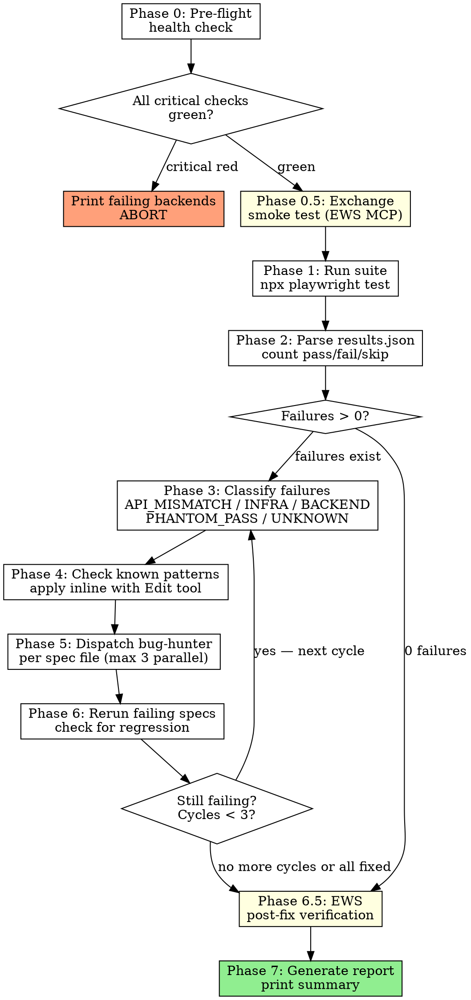

# /test-verified — FuseCP Verified E2E Auto-Fix Pipeline

## Overview

Runs the Backend-Verified E2E suite, classifies failures by contract-mismatch type, applies known fix patterns instantly, dispatches `bug-hunter` agents for novel failures, reruns, and reports. Persists every learned fix to `.fix-patterns.json` and auto-memory.

**Announce at start:** "Starting verified E2E pipeline..."

## Arguments

```
/test-verified              # full suite (all backends)
/test-verified exchange     # only @exchange-tagged specs
/test-verified isolation    # only @isolation-tagged specs
/test-verified ad           # only @ad-tagged specs
/test-verified dns          # only @dns-tagged specs
/test-verified --report     # generate report from last results.json, no test run
/test-verified --health     # pre-flight health check only, no test run
```

## Process Graph (Authoritative)

> When this graph conflicts with prose, follow the graph.



---

## Platform Notes (CRITICAL)

This runs on **Windows Server + Git Bash**:

- **Paths:** Use `C:/claude/fusecp-enterprise/` (forward slashes). Never `/c/` paths in Node/TS.
- **Working dir for Playwright:** Always `cd C:/claude/fusecp-enterprise/tests/FuseCP.E2E` before `npx` commands.
- **Path normalization:** Windows backslashes in file paths from Playwright output must be normalized: `file.replace(/\\\\/g, '/')` before checking `@backend` tags.
- **curl:** Single-line only. Never `\` line continuation.
- **Null output:** `> /dev/null 2>&1`

## Configuration

```
VERIFIER_BASE=http://172.31.251.100:5050
VERIFIER_KEY=verifier-lab-key-2026
E2E_DIR=C:/claude/fusecp-enterprise/tests/FuseCP.E2E
PATTERNS_FILE=C:/claude/fusecp-enterprise/tests/FuseCP.E2E/verified/.fix-patterns.json
RESULTS_FILE=C:/claude/fusecp-enterprise/tests/FuseCP.E2E/verified/results.json
```

---

## Phase 0: Pre-flight Health Check

```bash
curl -s -H "X-Verifier-Key: verifier-lab-key-2026" "http://172.31.251.100:5050/health/ready"
```

Parse the JSON response. Each top-level key is a backend name with a `status` field.

**Decision logic:**
- `status === "green"` or `status === "warn"` → OK to proceed
- `status === "red"` or `status === "down"` → check if it's in the `cert`/`ssl` category
  - cert/ssl issues → warn but do NOT abort
  - all other critical checks → print the failing backend names, abort with message: "Aborting: backends unreachable: [list]. Fix infrastructure before running verified suite."

If `--health` flag: print full health table and stop here.

```
Backend Health:
  exchange  ✓ green
  ad        ✓ green
  dns       ✓ green
  hyperv    ✓ green
  org       ✓ green
  isolation ✓ green
All backends ready.
```

---

## Phase 0.5: Exchange Smoke Test (EWS MCP)

**Only runs when:** scope includes `exchange` (i.e., `/test-verified` or `/test-verified exchange`). Skip for `ad`, `dns`, `isolation` scopes.

**Requires:** `exchange-ews` MCP server running (registered globally via `~/.claude.json`).

Uses the Exchange EWS MCP tools to verify Exchange is actually functional before running the test suite. This catches "Exchange is down but health check says green" scenarios.

**Test accounts:**
- ContosoCorp: `admin@contoso.lab.ergonet.pl` (test tenant, PackageID=101)
- FabrikamInc: `admin@fabrikam.lab.ergonet.pl` (isolation tenant, PackageID=105)

**Steps:**

1. **Mail flow test:** `mcp__exchange-ews__mail_flow_test(from="admin@contoso.lab.ergonet.pl", to="admin@fabrikam.lab.ergonet.pl", timeout=30)`
   - PASS → Exchange transport is functional, proceed
   - FAIL → warn: "Exchange mail flow failed (delivery timeout). Exchange tests may fail due to infrastructure, not spec drift."

2. **Inbox access:** `mcp__exchange-ews__inbox(email="admin@contoso.lab.ergonet.pl", limit=1)`
   - PASS → EWS connectivity confirmed
   - FAIL → warn: "EWS connection failed. Exchange backend may be unreachable."

3. **Folder structure:** `mcp__exchange-ews__folders(email="admin@contoso.lab.ergonet.pl")`
   - Verify Inbox, Sent Items, Deleted Items exist → basic mailbox structure intact

Print smoke test results:
```
Exchange Smoke Test:
  Mail flow (Contoso → Fabrikam):  ✓ delivered in 4.2s
  EWS inbox access:                ✓ connected
  Folder structure:                ✓ 12 folders found
Exchange is functional.
```

If any smoke test fails, continue to Phase 1 but pre-tag exchange failures as likely `INFRA_ERROR` in Phase 3.

---

## Phase 1: Run Suite

```bash
cd C:/claude/fusecp-enterprise/tests/FuseCP.E2E

# Full suite:
npx playwright test --project=verified --reporter=list,./verified/verified-reporter.ts

# With scope filter (e.g., exchange):
npx playwright test --project=verified --reporter=list,./verified/verified-reporter.ts --grep=@exchange
```

Capture exit code. Initialize cycle counter: `cycle = 1`.

---

## Phase 2: Parse Results

Read `C:/claude/fusecp-enterprise/tests/FuseCP.E2E/verified/results.json`.

Count per backend group (derive from spec file path segment: `verified/exchange/`, `verified/ad/`, etc.):
- passed / failed / skipped

Print quick tally:
```
Run 1 results: 47 passed, 12 failed, 3 skipped
Failures in: exchange (7), ad (3), dns (2)
```

If `failed === 0`: skip to Phase 7.

Group failing tests by spec file path (normalize backslashes).

---

## Phase 3: Classify Failures

For each failing test, examine `error.message` and classify:

| Class | Pattern | Meaning |
|-------|---------|---------|
| `API_MISMATCH` | `isSuccess.*false` OR `toBe\(true\)` on an API response | Wrong request body fields, method, or path |
| `INFRA_ERROR` | `Backend verification failed` OR `401` OR `405` from verifier host | Infrastructure / auth problem — NOT fixable by spec changes |
| `BACKEND_MISMATCH` | `toContain` OR `toEqual` on `verify\.` result | Verifier response shape differs from spec expectation |
| `PHANTOM_PASS` | API test passed but EWS verification shows no real Exchange object | API contract matches but Exchange didn't execute the operation |
| `UNKNOWN` | Anything else | Novel — needs agent investigation |

Group by class. Print classification summary:
```
Classifications: API_MISMATCH=8, BACKEND_MISMATCH=2, INFRA_ERROR=1, UNKNOWN=1
INFRA_ERROR failures will be reported but not auto-fixed.
```

Skip `INFRA_ERROR` failures from fix phases — they are infrastructure problems.

---

## Phase 4: Check Known Fix Patterns

Read `C:/claude/fusecp-enterprise/tests/FuseCP.E2E/verified/.fix-patterns.json`.

Also search auto-memory for entries with tag `verified-fix` using:
```
mcp__plugin_episodic-memory_episodic-memory__search(query="verified-fix pattern")
```

For each `API_MISMATCH`, `BACKEND_MISMATCH`, and `UNKNOWN` failure:
1. Test each pattern's `errorSignature` (treat as regex) against the failure's error text
2. If match: apply the fix described in `pattern.fix` directly using the Edit tool
3. Mark the test as `pattern-applied` with the pattern `id`

Track:
- `patterns_applied`: count of fixes applied from registry
- `pattern_ids_used`: list of matched pattern IDs

Print after this phase:
```
Pattern matches: 6 fixes applied (missing-displayname x3, dl-field-names x2, ad-user-ou-path x1)
Remaining for agent dispatch: 4 failures
```

---

## Phase 5: Dispatch Fix Agents

For failures not resolved by patterns (after Phase 4), dispatch `bug-hunter` agents.

**Grouping:** one agent per spec file. Max 3 parallel agents.

For each agent dispatch, build this context package:

```
SPEC FILE: [read full content of failing spec file]
ERRORS: [paste error messages + stack traces for all failures in this spec]
ENDPOINT SOURCE: [read matching file from src/FuseCP.EnterpriseServer/Endpoints/]
  - Exchange failures → ExchangeEndpoints.cs
  - AD failures → AdEndpoints.cs
  - DNS failures → DomainDnsEndpoints.cs
  - Org failures → OrganizationEndpoints.cs
  - Hyper-V failures → HyperVEndpoints.cs
KNOWN PATTERNS: [paste .fix-patterns.json content as context]
REFERENCE SPEC: [read 1-2 passing specs from tests/FuseCP.E2E/specs/ as format examples]
```

Agent instruction (include verbatim):
> "You are fixing E2E test specs that have drifted from the actual API contract. The API has been updated and the tests need to match. Fix the test spec file to match what the actual endpoint source shows. Do NOT modify any API code in src/FuseCP.EnterpriseServer/. Do NOT modify any verifier code in src/FuseCP.BackendVerifier/. Only edit the test spec file. When done, confirm which lines you changed and why."

Agent parameters:
- Agent: `bug-hunter` (role: research → sonnet)
- `max_turns: 25`
- Include Subagent Resilience Protocol resume handling (see AGENTS.md)

---

## Phase 6: Rerun and Cycle

Rerun only the previously-failing spec files:

```bash
cd C:/claude/fusecp-enterprise/tests/FuseCP.E2E
npx playwright test --project=verified --reporter=list,./verified/verified-reporter.ts \
  verified/exchange/exchange-mailboxes.spec.ts \
  verified/ad/ad-users.spec.ts
  # ... (list only files that had failures)
```

**Regression check:** Compare new `results.json` against previous run.
- If any previously-passing test now fails → a fix caused a regression
- Identify which fix file was last edited, revert it using git: `git checkout HEAD -- <file>`
- Log: "Reverted fix to {file} — caused {N} regressions"

**Record successful fixes:**
For each test that went from failing to passing, record the fix:
1. Find which spec file was changed (git diff)
2. Add entry to `.fix-patterns.json` with `errorSignature` derived from the original error
3. Write auto-memory file (see Memory Recording section)

**Cycle decision:**
- If `failed === 0` or `cycle >= 3`: proceed to Phase 7
- Otherwise: `cycle++`, go to Phase 3 with remaining failures

Print cycle update:
```
Cycle 1 → Cycle 2: 4 failures remain after applying 8 fixes
```

---

## Phase 6.5: Exchange EWS Verification (Post-Fix)

**Only runs when:** scope includes `exchange` AND exchange specs were fixed in Phases 4-6. Skip if no exchange specs were modified.

After bug-hunter agents fix exchange specs and the rerun passes, verify the test results match reality in Exchange via EWS MCP.

**Verification checks by operation type:**

1. **Mailbox existence:** If the test created/verified a mailbox, use `mcp__exchange-ews__inbox(email="<test-mailbox>", limit=1)` to confirm the mailbox is accessible via EWS.

2. **Mail flow:** If the test involved sending mail, use `mcp__exchange-ews__search(email="<recipient>", subject="<test-subject>", days_back=1)` to confirm the message actually arrived.

3. **Folder structure:** If the test verified mailbox structure, use `mcp__exchange-ews__folders(email="<test-mailbox>")` to confirm folder state.

4. **Password change:** If the test changed a mailbox password, verify by attempting `mcp__exchange-ews__send_message(from="<changed-user>", to="<test-recipient>", subject="[PasswordVerify] ...")`. If EWS authenticates with the new credentials (Kerberos impersonation), the password change was applied. If auth fails, the password change didn't propagate.

5. **Distribution list / group membership:** If the test modified DL members, use `mcp__exchange-ews__search(email="<dl-address>", ...)` or send to the DL and verify all members received via inbox checks.

6. **Mailbox properties (quota, size, alias):** If the test set mailbox properties, use `mcp__exchange-ews__folders(email="<mailbox>")` to verify folder counts reflect expected state (e.g., quota enforcement blocking new mail).

**Outcome classification:**

- **API test passed + EWS confirms** → genuine pass, high confidence
- **API test passed + EWS shows no object** → `PHANTOM_PASS` — the API contract matches but Exchange didn't execute. Flag as:
  ```
  ⚠ PHANTOM_PASS: exchange-mailboxes.spec.ts#createMailbox
    API returned success but EWS shows no mailbox for user@domain
    Likely cause: backend verifier mock, API stub, or Exchange rollback
  ```
- **EWS unavailable** → skip verification, note: "EWS verification skipped (MCP unavailable)"

Print verification summary:
```
Exchange EWS Verification:
  Verified: 5 operations
  Confirmed: 4 genuine passes
  Phantom:   1 (createMailbox — mailbox not found via EWS)
  Skipped:   0
```

`PHANTOM_PASS` findings are included in the Phase 7 report under "NEEDS ATTENTION" — they indicate the test infrastructure may be masking real failures.

---

## Phase 7: Report

Generate HTML report:
```bash
cd C:/claude/fusecp-enterprise/tests/FuseCP.E2E
npx ts-node verified/generate-report.ts
```

Print terminal summary:
```
━━━━━━━━━━━━━━━━━━━━━━━━━━━━━━━━━━━━━━━━━
Verified E2E Results
━━━━━━━━━━━━━━━━━━━━━━━━━━━━━━━━━━━━━━━━━
  Passed:  47   Failed: 0   Skipped: 3
  Duration: 2m 14s

Fix Summary:
  Cycles run:        2
  Known patterns:    6 applied
  Agents dispatched: 2
  Regressions:       0

Remaining failures: none

Report: tests/FuseCP.E2E/verified/report.html
━━━━━━━━━━━━━━━━━━━━━━━━━━━━━━━━━━━━━━━━━
```

If failures remain after max cycles:
```
NEEDS ATTENTION — 3 failures after 3 cycles:
  - verified/exchange/exchange-resource-mailboxes.spec.ts → UNKNOWN (no pattern match)
  - verified/isolation/tenant-breach.spec.ts → INFRA_ERROR (verifier unreachable)
```

If `--report` flag: read existing `results.json`, generate report, print summary, stop (no test run or fixes).

---

## Memory Recording

After each successful agent fix (not pattern fixes — those are already known), write a memory entry.

Memory file path: `~/.claude/projects/C--claude-fusecp-enterprise/memory/verified-fix-{id}.md`

```markdown
---
name: verified-fix-{category}-{date}
description: Fix pattern: {one-line root cause}
type: feedback
tags: [verified-fix, e2e, {backend-name}]
---
Error signature: {regex used for detection}
Root cause: {what was wrong in the spec}
Fix applied: {what lines changed}
Why: {why the spec was wrong — which API change caused this}
Endpoint file: {e.g., ExchangeEndpoints.cs}
How to reapply: {step-by-step for future occurrences}
Learned from: {spec filename}, cycle {N}, {YYYY-MM-DD}
```

Also append to `.fix-patterns.json`:
```json
{
  "id": "auto-{date}-{test-name-slug}",
  "errorSignature": "derived from error text",
  "endpointFile": "matched endpoint file",
  "rootCause": "one-line description",
  "fix": "what to change",
  "learnedAt": "YYYY-MM-DD"
}
```

---

## Safety Rules (ENFORCED — never skip)

1. **NEVER edit any file under `src/FuseCP.EnterpriseServer/`** — it is read-only context
2. **NEVER edit any file under `src/FuseCP.BackendVerifier/`** — it is read-only context
3. **Only edit files under `tests/FuseCP.E2E/verified/`** (spec files) and `.fix-patterns.json`
4. **Max 3 fix cycles** — if failures remain after cycle 3, report and stop with NEEDS ATTENTION
5. **Regression guard** — always compare pass counts before and after each rerun; revert if regressions detected
6. **INFRA_ERROR class** — never attempt to fix these with spec changes; report them as infrastructure issues
7. **Never modify `results.json` directly** — it is written only by Playwright runner

---

## Effort Steering

Agent dispatches use the routing matrix:
- **bug-hunter** (spec fix): role=research → sonnet, turns 20–25
- **agentic-search** (endpoint lookup, if needed): role=scout → haiku, turns 8–12

For scope-limited runs (`/test-verified exchange`), reduce expected agent count accordingly. Single-backend runs rarely need more than 1–2 agents.
