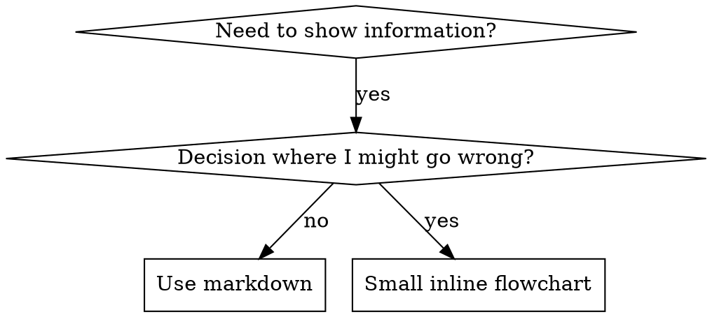

# Writing Commands

## Overview

**Writing commands IS Test-Driven Development applied to process documentation.**

**Commands live in `.claude/commands/` as markdown files.**

You write test cases (pressure scenarios with subagents), watch them fail (baseline behavior), write the command (documentation), watch tests pass (agents comply), and refactor (close loopholes).

**Core principle:** If you didn't watch an agent fail without the command, you don't know if the command teaches the right thing.

**REQUIRED BACKGROUND:** You MUST understand `/tdd` before using this command. That command defines the fundamental RED-GREEN-REFACTOR cycle. This command adapts TDD to documentation.

**Agent dispatch:** Use `modular-builder` for command implementation and `test-coverage` for command testing via the Task tool.

## What is a Command?

A **command** is a reference guide for proven techniques, patterns, or tools. Commands help future Claude instances find and apply effective approaches.

**Commands are:** Reusable techniques, patterns, tools, reference guides

**Commands are NOT:** Narratives about how you solved a problem once

## TDD Mapping for Commands

| TDD Concept | Command Creation |
|-------------|----------------|
| **Test case** | Pressure scenario with subagent |
| **Production code** | Command document (`.claude/commands/<name>.md`) |
| **Test fails (RED)** | Agent violates rule without command (baseline) |
| **Test passes (GREEN)** | Agent complies with command present |
| **Refactor** | Close loopholes while maintaining compliance |
| **Write test first** | Run baseline scenario BEFORE writing command |
| **Watch it fail** | Document exact rationalizations agent uses |
| **Minimal code** | Write command addressing those specific violations |
| **Watch it pass** | Verify agent now complies |
| **Refactor cycle** | Find new rationalizations -> plug -> re-verify |

The entire command creation process follows RED-GREEN-REFACTOR.

## When to Create a Command

**Create when:**
- Technique wasn't intuitively obvious to you
- You'd reference this again across projects
- Pattern applies broadly (not project-specific)
- Others would benefit

**Don't create for:**
- One-off solutions
- Standard practices well-documented elsewhere
- Project-specific conventions (put in CLAUDE.md)
- Mechanical constraints (if it's enforceable with regex/validation, automate it -- save documentation for judgment calls)

## Command Types

### Technique
Concrete method with steps to follow (condition-based-waiting, root-cause-tracing)

### Pattern
Way of thinking about problems (flatten-with-flags, test-invariants)

### Reference
API docs, syntax guides, tool documentation (office docs)

## Directory Structure

```
.claude/commands/
  command-name.md              # Self-contained command file (required)
```

**Flat namespace** - all commands in one searchable namespace

**Keep inline:**
- Principles and concepts
- Code patterns (< 50 lines)
- Everything else

**For heavy reference material (100+ lines):** Consider splitting into a companion file in the same directory or inlining the essential parts.

## Command File Structure

**Frontmatter (YAML):**
- `description`: Third-person, describes ONLY when to use (NOT what it does)
  - Start with "Use when..." to focus on triggering conditions
  - Include specific symptoms, situations, and contexts
  - **NEVER summarize the command's process or workflow** (see CSO section for why)
  - Keep under 500 characters if possible

```markdown
---
description: "Use when [specific triggering conditions and symptoms]"
---

# Command Name

## Overview
What is this? Core principle in 1-2 sentences.

## When to Use
[Small inline flowchart IF decision non-obvious]

Bullet list with SYMPTOMS and use cases
When NOT to use

## Core Pattern (for techniques/patterns)
Before/after code comparison

## Quick Reference
Table or bullets for scanning common operations

## Implementation
Inline code for simple patterns

## Common Mistakes
What goes wrong + fixes

## Real-World Impact (optional)
Concrete results
```


## Claude Search Optimization (CSO)

**Critical for discovery:** Future Claude needs to FIND your command

### 1. Rich Description Field

**Purpose:** Claude reads description to decide which commands to load for a given task. Make it answer: "Should I read this command right now?"

**Format:** Start with "Use when..." to focus on triggering conditions

**CRITICAL: Description = When to Use, NOT What the Command Does**

The description should ONLY describe triggering conditions. Do NOT summarize the command's process or workflow in the description.

**Why this matters:** Testing revealed that when a description summarizes the command's workflow, Claude may follow the description instead of reading the full command content. A description saying "code review between tasks" caused Claude to do ONE review, even though the command's flowchart clearly showed TWO reviews (spec compliance then code quality).

When the description was changed to just "Use when executing implementation plans with independent tasks" (no workflow summary), Claude correctly read the flowchart and followed the two-stage review process.

**The trap:** Descriptions that summarize workflow create a shortcut Claude will take. The command body becomes documentation Claude skips.

```yaml
# BAD: Summarizes workflow - Claude may follow this instead of reading command
description: "Use when executing plans - dispatches subagent per task with code review between tasks"

# BAD: Too much process detail
description: "Use for TDD - write test first, watch it fail, write minimal code, refactor"

# GOOD: Just triggering conditions, no workflow summary
description: "Use when executing implementation plans with independent tasks in the current session"

# GOOD: Triggering conditions only
description: "Use when implementing any feature or bugfix, before writing implementation code"
```

**Content:**
- Use concrete triggers, symptoms, and situations that signal this command applies
- Describe the *problem* (race conditions, inconsistent behavior) not *language-specific symptoms* (setTimeout, sleep)
- Keep triggers technology-agnostic unless the command itself is technology-specific
- If command is technology-specific, make that explicit in the trigger
- Write in third person (injected into system prompt)
- **NEVER summarize the command's process or workflow**

```yaml
# BAD: Too abstract, vague, doesn't include when to use
description: "For async testing"

# BAD: First person
description: "I can help you with async tests when they're flaky"

# BAD: Mentions technology but command isn't specific to it
description: "Use when tests use setTimeout/sleep and are flaky"

# GOOD: Starts with "Use when", describes problem, no workflow
description: "Use when tests have race conditions, timing dependencies, or pass/fail inconsistently"

# GOOD: Technology-specific command with explicit trigger
description: "Use when using React Router and handling authentication redirects"
```

### 2. Keyword Coverage

Use words Claude would search for:
- Error messages: "Hook timed out", "ENOTEMPTY", "race condition"
- Symptoms: "flaky", "hanging", "zombie", "pollution"
- Synonyms: "timeout/hang/freeze", "cleanup/teardown/afterEach"
- Tools: Actual commands, library names, file types

### 3. Descriptive Naming

**Use active voice, verb-first:**
- `creating-commands` not `command-creation`
- `condition-based-waiting` not `async-test-helpers`

### 4. Token Efficiency (Critical)

**Problem:** Frequently-referenced commands load into conversations. Every token counts.

**Target word counts:**
- Getting-started workflows: <150 words each
- Frequently-loaded commands: <200 words total
- Other commands: <500 words (still be concise)

**Techniques:**

**Move details to tool help:**
```bash
# BAD: Document all flags in command file
search-conversations supports --text, --both, --after DATE, --before DATE, --limit N

# GOOD: Reference --help
search-conversations supports multiple modes and filters. Run --help for details.
```

**Use cross-references:**
```markdown
# BAD: Repeat workflow details
When searching, dispatch subagent with template...
[20 lines of repeated instructions]

# GOOD: Reference other command
Always use subagents (50-100x context savings). REQUIRED: Use `/other-command-name` for workflow.
```

**Compress examples:**
```markdown
# BAD: Verbose example (42 words)
your human partner: "How did we handle authentication errors in React Router before?"
You: I'll search past conversations for React Router authentication patterns.
[Dispatch subagent with search query: "React Router authentication error handling 401"]

# GOOD: Minimal example (20 words)
Partner: "How did we handle auth errors in React Router?"
You: Searching...
[Dispatch subagent -> synthesis]
```

**Eliminate redundancy:**
- Don't repeat what's in cross-referenced commands
- Don't explain what's obvious from command
- Don't include multiple examples of same pattern

**Verification:**
```bash
wc -w .claude/commands/command-name.md
# getting-started workflows: aim for <150 each
# Other frequently-loaded: aim for <200 total
```

**Name by what you DO or core insight:**
- `condition-based-waiting` > `async-test-helpers`
- `using-commands` not `command-usage`
- `flatten-with-flags` > `data-structure-refactoring`
- `root-cause-tracing` > `debugging-techniques`

**Gerunds (-ing) work well for processes:**
- `creating-commands`, `testing-commands`, `debugging-with-logs`
- Active, describes the action you're taking

### 5. Cross-Referencing Other Commands

**When writing documentation that references other commands:**

Use command name with slash prefix and explicit requirement markers:
- Good: `**REQUIRED:** Use /tdd`
- Good: `**REQUIRED BACKGROUND:** You MUST understand /debug`
- Bad: `See .claude/commands/tdd.md` (unclear if required)

## Flowchart Usage



**Use flowcharts ONLY for:**
- Non-obvious decision points
- Process loops where you might stop too early
- "When to use A vs B" decisions

**Never use flowcharts for:**
- Reference material -> Tables, lists
- Code examples -> Markdown blocks
- Linear instructions -> Numbered lists
- Labels without semantic meaning (step1, helper2)

## Code Examples

**One excellent example beats many mediocre ones**

Choose most relevant language:
- Testing techniques -> TypeScript/JavaScript
- System debugging -> Shell/Python
- Data processing -> Python

**Good example:**
- Complete and runnable
- Well-commented explaining WHY
- From real scenario
- Shows pattern clearly
- Ready to adapt (not generic template)

**Don't:**
- Implement in 5+ languages
- Create fill-in-the-blank templates
- Write contrived examples

You're good at porting - one great example is enough.

## File Organization

### Self-Contained Command
```
.claude/commands/
  defense-in-depth.md    # Everything inline
```
When: All content fits, no heavy reference needed

### Command with Heavy Reference
```
.claude/commands/
  pptx.md                # Overview + workflows (references companion files)
```
When: Reference material too large for inline -- consider splitting or summarizing

## The Iron Law (Same as TDD)

```
NO COMMAND WITHOUT A FAILING TEST FIRST
```

This applies to NEW commands AND EDITS to existing commands.

Write command before testing? Delete it. Start over.
Edit command without testing? Same violation.

**No exceptions:**
- Not for "simple additions"
- Not for "just adding a section"
- Not for "documentation updates"
- Don't keep untested changes as "reference"
- Don't "adapt" while running tests
- Delete means delete

**REQUIRED BACKGROUND:** The `/tdd` command explains why this matters. Same principles apply to documentation.

## Testing All Command Types

Different command types need different test approaches. Dispatch `test-coverage` agent for systematic test design.

### Discipline-Enforcing Commands (rules/requirements)

**Examples:** TDD, verification-before-completion, designing-before-coding

**Test with:**
- Academic questions: Do they understand the rules?
- Pressure scenarios: Do they comply under stress?
- Multiple pressures combined: time + sunk cost + exhaustion
- Identify rationalizations and add explicit counters

**Success criteria:** Agent follows rule under maximum pressure

### Technique Commands (how-to guides)

**Examples:** condition-based-waiting, root-cause-tracing, defensive-programming

**Test with:**
- Application scenarios: Can they apply the technique correctly?
- Variation scenarios: Do they handle edge cases?
- Missing information tests: Do instructions have gaps?

**Success criteria:** Agent successfully applies technique to new scenario

### Pattern Commands (mental models)

**Examples:** reducing-complexity, information-hiding concepts

**Test with:**
- Recognition scenarios: Do they recognize when pattern applies?
- Application scenarios: Can they use the mental model?
- Counter-examples: Do they know when NOT to apply?

**Success criteria:** Agent correctly identifies when/how to apply pattern

### Reference Commands (documentation/APIs)

**Examples:** API documentation, command references, library guides

**Test with:**
- Retrieval scenarios: Can they find the right information?
- Application scenarios: Can they use what they found correctly?
- Gap testing: Are common use cases covered?

**Success criteria:** Agent finds and correctly applies reference information

## Common Rationalizations for Skipping Testing

| Excuse | Reality |
|--------|---------|
| "Command is obviously clear" | Clear to you != clear to other agents. Test it. |
| "It's just a reference" | References can have gaps, unclear sections. Test retrieval. |
| "Testing is overkill" | Untested commands have issues. Always. 15 min testing saves hours. |
| "I'll test if problems emerge" | Problems = agents can't use command. Test BEFORE deploying. |
| "Too tedious to test" | Testing is less tedious than debugging bad command in production. |
| "I'm confident it's good" | Overconfidence guarantees issues. Test anyway. |
| "Academic review is enough" | Reading != using. Test application scenarios. |
| "No time to test" | Deploying untested command wastes more time fixing it later. |

**All of these mean: Test before deploying. No exceptions.**

## Bulletproofing Commands Against Rationalization

Commands that enforce discipline (like TDD) need to resist rationalization. Agents are smart and will find loopholes when under pressure.

**Psychology note:** Understanding WHY persuasion techniques work helps you apply them systematically. Key principles include authority (established rules carry weight), commitment (once started on a path, agents resist deviating), scarcity (framing rule-following as rare discipline), social proof (showing what good agents do), and unity (shared identity with quality-focused teams).

### Close Every Loophole Explicitly

Don't just state the rule - forbid specific workarounds:

<Bad>
```markdown
Write code before test? Delete it.
```
</Bad>

<Good>
```markdown
Write code before test? Delete it. Start over.

**No exceptions:**
- Don't keep it as "reference"
- Don't "adapt" it while writing tests
- Don't look at it
- Delete means delete
```
</Good>

### Address "Spirit vs Letter" Arguments

Add foundational principle early:

```markdown
**Violating the letter of the rules is violating the spirit of the rules.**
```

This cuts off entire class of "I'm following the spirit" rationalizations.

### Build Rationalization Table

Capture rationalizations from baseline testing (see Testing section below). Every excuse agents make goes in the table:

```markdown
| Excuse | Reality |
|--------|---------|
| "Too simple to test" | Simple code breaks. Test takes 30 seconds. |
| "I'll test after" | Tests passing immediately prove nothing. |
| "Tests after achieve same goals" | Tests-after = "what does this do?" Tests-first = "what should this do?" |
```

### Create Red Flags List

Make it easy for agents to self-check when rationalizing:

```markdown
## Red Flags - STOP and Start Over

- Code before test
- "I already manually tested it"
- "Tests after achieve the same purpose"
- "It's about spirit not ritual"
- "This is different because..."

**All of these mean: Delete code. Start over with TDD.**
```

### Update CSO for Violation Symptoms

Add to description: symptoms of when you're ABOUT to violate the rule:

```yaml
description: "Use when implementing any feature or bugfix, before writing implementation code"
```

## RED-GREEN-REFACTOR for Commands

Follow the TDD cycle:

### RED: Write Failing Test (Baseline)

Run pressure scenario with subagent WITHOUT the command. Document exact behavior:
- What choices did they make?
- What rationalizations did they use (verbatim)?
- Which pressures triggered violations?

This is "watch the test fail" - you must see what agents naturally do before writing the command.

### GREEN: Write Minimal Command

Write command that addresses those specific rationalizations. Don't add extra content for hypothetical cases.

Run same scenarios WITH command. Agent should now comply.

Dispatch `modular-builder` to draft the command content, then `test-coverage` to design pressure scenarios.

### REFACTOR: Close Loopholes

Agent found new rationalization? Add explicit counter. Re-test until bulletproof.

**Testing methodology:**
- How to write pressure scenarios
- Pressure types (time, sunk cost, authority, exhaustion)
- Plugging holes systematically
- Meta-testing techniques

Use subagents via the Task tool for testing: dispatch an agent with the command loaded and a pressure scenario, observe behavior, iterate.

## Anti-Patterns

### Narrative Example
"In session 2025-10-03, we found empty projectDir caused..."
**Why bad:** Too specific, not reusable

### Multi-Language Dilution
example-js.js, example-py.py, example-go.go
**Why bad:** Mediocre quality, maintenance burden

### Code in Flowcharts
```dot
step1 [label="import fs"];
step2 [label="read file"];
```
**Why bad:** Can't copy-paste, hard to read

### Generic Labels
helper1, helper2, step3, pattern4
**Why bad:** Labels should have semantic meaning

## STOP: Before Moving to Next Command

**After writing ANY command, you MUST STOP and complete the deployment process.**

**Do NOT:**
- Create multiple commands in batch without testing each
- Move to next command before current one is verified
- Skip testing because "batching is more efficient"

**The deployment checklist below is MANDATORY for EACH command.**

Deploying untested commands = deploying untested code. It's a violation of quality standards.

## Command Creation Checklist (TDD Adapted)

**IMPORTANT: Use TodoWrite to create todos for EACH checklist item below.**

**RED Phase - Write Failing Test:**
- [ ] Create pressure scenarios (3+ combined pressures for discipline commands)
- [ ] Run scenarios WITHOUT command - document baseline behavior verbatim
- [ ] Identify patterns in rationalizations/failures

**GREEN Phase - Write Minimal Command:**
- [ ] Name uses only letters, numbers, hyphens (no parentheses/special chars)
- [ ] YAML frontmatter with description (trigger-focused, no workflow summary)
- [ ] Description starts with "Use when..." and includes specific triggers/symptoms
- [ ] Description written in third person
- [ ] Keywords throughout for search (errors, symptoms, tools)
- [ ] Clear overview with core principle
- [ ] Address specific baseline failures identified in RED
- [ ] Code inline OR link to separate file
- [ ] One excellent example (not multi-language)
- [ ] Run scenarios WITH command - verify agents now comply

**REFACTOR Phase - Close Loopholes:**
- [ ] Identify NEW rationalizations from testing
- [ ] Add explicit counters (if discipline command)
- [ ] Build rationalization table from all test iterations
- [ ] Create red flags list
- [ ] Re-test until bulletproof

**Quality Checks:**
- [ ] Small flowchart only if decision non-obvious
- [ ] Quick reference table
- [ ] Common mistakes section
- [ ] No narrative storytelling
- [ ] Supporting files only for heavy reference

**Deployment:**
- [ ] Commit command to git and push to your fork (if configured)
- [ ] Consider contributing back via PR (if broadly useful)

## Discovery Workflow

How future Claude finds your command:

1. **Encounters problem** ("tests are flaky")
2. **Finds command** (description matches)
3. **Scans overview** (is this relevant?)
4. **Reads patterns** (quick reference table)
5. **Loads example** (only when implementing)

**Optimize for this flow** - put searchable terms early and often.

## The Bottom Line

**Creating commands IS TDD for process documentation.**

Same Iron Law: No command without failing test first.
Same cycle: RED (baseline) -> GREEN (write command) -> REFACTOR (close loopholes).
Same benefits: Better quality, fewer surprises, bulletproof results.

If you follow TDD for code, follow it for commands. It's the same discipline applied to documentation.
