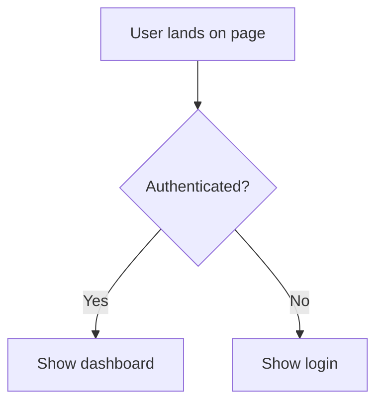
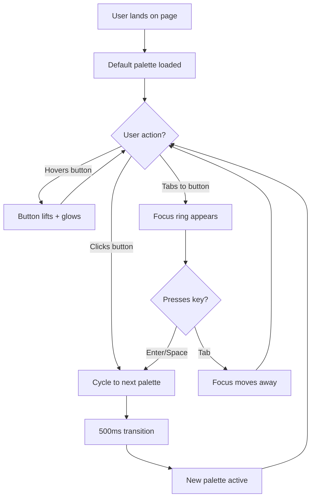

# Agent Integration Analysis
**requirements-architect & ux-wireframe-designer vs. Amplified Design System**

Date: 2025-10-16
Status: Proposal for Review

---

## Executive Summary

Both agents have **significant overlap** with our existing framework but fill **critical gaps** in our workflow. Our system is strong on *philosophy and principles* but lighter on *structured requirements gathering* and *pre-implementation UX design*.

**Recommendation**: Integrate both agents with modifications to align with our aesthetic-first approach.

---

## 1. Overlap Analysis

### requirements-architect Overlaps with Our System

| Their Feature | Our Equivalent | File Location |
|--------------|----------------|---------------|
| Purpose-first thinking | Layer 1: Purpose & Intent | FRAMEWORK.md |
| Completeness checks | Pre-Creation Validation | COMPONENT-CREATION-PROTOCOL.md |
| Testability focus | Pillar 2: Craft Embeds Care | PHILOSOPHY.md |
| Modularity principle | Design System Compliance | CLAUDE.md |
| User-centered approach | "Design for Humans" pillar | PRINCIPLES.md |

### ux-wireframe-designer Overlaps with Our System

| Their Feature | Our Equivalent | File Location |
|--------------|----------------|---------------|
| Nine Dimensions concept | Nine Dimensions of Design | FRAMEWORK.md (Lines 221-417) |
| Accessibility compliance | Touch targets, contrast ratios | COMPONENT-CREATION-PROTOCOL.md |
| Responsive design | Layer 4: Contextual Adaptation | FRAMEWORK.md (Lines 105-219) |
| Component hierarchy | Implicit in implementation | Various |
| Quality checks | Pre-Ship Final Checklist | DESIGN-CHECKLIST.md |

**Key Insight**: Both agents align philosophically with our system but add process structure we're missing.

---

## 2. Gap Analysis: What We're Missing

### From requirements-architect

#### Gap 1: Structured Requirements Documentation ⭐ HIGH PRIORITY

**What they have**:
```markdown
# Feature Requirements

## Feature Overview
- Brief description
- Primary user benefit
- Business value

## User Stories
As a [user type], I want [action] so that [benefit]

## Functional Requirements
1. Numbered capabilities
2. Edge cases
3. Error scenarios

## Acceptance Criteria
Given [context], when [action], then [outcome]

## Data Requirements
- What data to capture/store/display
- Validation rules

## Non-Functional Requirements
- Performance expectations
- Security considerations

## Out of Scope
- Explicitly what's NOT included
```

**What we have**: Purpose validation questions (FRAMEWORK.md Layer 1) but no standardized document format

**The Gap**: We jump from "why?" questions directly to implementation without creating a structured requirements artifact that can be referenced throughout development.

**Impact**:
- Hard to validate completeness
- No single source of truth for feature scope
- Difficult to onboard new contributors
- Scope creep risk

---

#### Gap 2: Acceptance Criteria (Given/When/Then) ⭐ HIGH PRIORITY

**What they have**: Explicit testable conditions
```
Given a user is on the login page
When they enter valid credentials and click "Log In"
Then they should be redirected to the dashboard within 2 seconds
```

**What we have**: Design quality checks and Five Pillars verification, but no formal acceptance criteria format

**The Gap**: We validate against principles but don't write explicit "done" criteria that can guide testing

**Impact**:
- Ambiguity about what "complete" means
- Harder to write tests
- Difficult to validate implementation matches intent

---

#### Gap 3: Out of Scope Declarations ⭐ MEDIUM PRIORITY

**What they have**: Explicit section stating what's NOT included

**What we have**: Not systematically documented

**The Gap**: No formal mechanism to prevent scope creep

**Impact**:
- Features expand beyond original intent
- "Just one more thing" syndrome
- Timeline slippage

---

### From ux-wireframe-designer

#### Gap 4: Pre-Implementation Design Artifacts ⭐ HIGH PRIORITY

**What they have**: Creates wireframes, user flows (Mermaid diagrams), component specs BEFORE coding

**What we have**: Aesthetic-first thinking and design briefs, but we jump from thinking to code

**The Gap**: No structured visual planning stage

**Current workflow**:
```
Aesthetic Thinking → Design Brief → CODE
```

**Missing stage**:
```
Aesthetic Thinking → Design Brief → WIREFRAMES/FLOWS → CODE
```

**Impact**:
- Architectural issues discovered during implementation
- More refactoring needed
- Harder to get feedback on structure before building
- Team alignment harder without visual artifacts

---

#### Gap 5: Component Props Specification ⭐ MEDIUM PRIORITY

**What they have**: Defines TypeScript interfaces for component props before implementation

**What we have**: Props emerge organically during implementation

**The Gap**: No pre-defined component API contracts

**Impact**:
- More refactoring as API evolves
- Inconsistent prop naming
- Harder to plan composition patterns upfront

---

#### Gap 6: Interaction State Specifications ⭐ MEDIUM PRIORITY

**What they have**: Documents hover/click/tap/loading/error states BEFORE coding

**What we have**: PROACTIVE-DESIGN-PROTOCOL.md covers this philosophically, but not as structured pre-implementation specs

**The Gap**: Interactions designed during implementation rather than specified upfront

**Impact**:
- Missing states discovered late
- Inconsistent interaction patterns
- Polish added as refinement rather than built-in

---

#### Gap 7: Mermaid Diagrams for Flows ⭐ LOW-MEDIUM PRIORITY

**What they have**: Visual representation using Mermaid syntax


**What we have**: Text-based descriptions

**The Gap**: No standardized way to visualize user flows and component hierarchies

**Impact**:
- Harder to communicate complex flows
- Team alignment requires more explanation
- Missing paths harder to spot without visual

---

## 3. Integration Recommendations

### Recommended Integration Strategy

**Principle**: Add structure without losing our aesthetic-first approach

### Phase 1: Essential Additions (Immediate Value)

#### 1. Create `.design/REQUIREMENTS-TEMPLATE.md` ⭐ DO THIS

Merge our aesthetic-first approach with their structured requirements:

```markdown
# [Feature Name] Requirements

## 1. Purpose & Intent (Layer 1 - Our Framework)
### Should this exist?
- [ ] Problem clearly defined
- [ ] Simplest solution validated
- [ ] Alternatives considered

### For whom?
- Target users: [description]
- User needs: [list]
- Context of use: [description]

### Values embodied
- [ ] Aligns with Five Pillars
- [ ] Respects user agency
- [ ] Accessible by default

## 2. User Stories (Their Format)
**Format**: As a [user type], I want [action] so that [benefit]

1. [Story 1]
2. [Story 2]
3. [Story 3]

## 3. Aesthetic Requirements (Our Nine Dimensions)

### Style
- Visual language: [description]
- Reference aesthetic: [Swedish design studio / German car facility]

### Motion
- Timing targets: [<100ms instant / 100-300ms responsive / 300-1000ms deliberate]
- Easing: [spring / smooth]
- Key transitions: [list]

### Voice
- Personality: [description]
- Tone adaptations: [context-specific]

### Space
- Layout approach: [generous / efficient]
- Hierarchy strategy: [description]

### Color
- Palette: [reference to theme]
- Contrast validation: [ ] 4.5:1 minimum achieved

### Typography
- Type scale: [reference]
- Hierarchy: [H1/H2/Body specs]

### Proportion
- Scale system: [8px grid / golden ratio]

### Texture
- Materiality: [description]
- Purpose: [why texture is used]

### Body (Ergonomics)
- Touch targets: [ ] 44x44px minimum
- Thumb zones: [ ] Optimized for mobile
- Keyboard nav: [ ] Fully accessible

## 4. Functional Requirements (Their Format)

### Core Capabilities
1. [Requirement 1]
2. [Requirement 2]
3. [Requirement 3]

### Edge Cases
- [Edge case 1]
- [Edge case 2]

### Error Scenarios
- [Error 1] → [Handling approach]
- [Error 2] → [Handling approach]

## 5. Acceptance Criteria (Their Format - NEW FOR US)

### Functional Acceptance
```
Given [context]
When [action]
Then [expected outcome]
```

### Aesthetic Acceptance
```
Given [context]
When [interaction]
Then [aesthetic outcome]
- Timing: [specific duration]
- Feel: [specific quality]
```

### Accessibility Acceptance
```
Given [assistive technology]
When [user performs action]
Then [accessible outcome]
```

## 6. Component Specifications (If Applicable)

### Component Hierarchy
```
<FeatureContainer>
  <FeatureHeader />
  <FeatureContent>
    <ComponentA />
    <ComponentB />
  </FeatureContent>
  <FeatureFooter />
</FeatureContainer>
```

### Props Interfaces
```typescript
interface FeatureProps {
  variant: 'default' | 'compact'
  onAction: () => void
  // ...
}
```

### State Management
- Approach: [Zustand global / local useState / context]
- State shape: [description]

## 7. Non-Functional Requirements

### Performance
- Load time: [target]
- Interaction response: [target]

### Security
- Data handling: [approach]
- Authentication: [requirements]

### Scalability
- Expected load: [description]
- Growth considerations: [description]

## 8. Out of Scope (Their Addition - NEW FOR US)

**Explicitly NOT included in this feature:**
- [Out of scope item 1]
- [Out of scope item 2]
- [Out of scope item 3]

**Rationale**: [Why these are excluded]

## 9. Design Artifacts

- [ ] Wireframes created (link: [URL])
- [ ] User flow diagram (link: [URL])
- [ ] Interaction specifications (link: [URL])
- [ ] Component API defined

## 10. Validation Checklist

- [ ] All CSS variables defined in globals.css
- [ ] All Nine Dimensions addressed
- [ ] All Five Pillars embodied
- [ ] Acceptance criteria testable
- [ ] Out of scope documented
```

**Usage**: Create this document BEFORE implementation begins. Reference throughout development.

---

#### 2. Create `.design/WIREFRAME-STANDARDS.md` ⭐ DO THIS

Document how to create design artifacts before coding:

**Contents**:
1. When to create wireframes (complexity threshold)
2. Mermaid syntax for user flows
3. Component hierarchy diagram standards
4. Interaction specification format
5. Examples of each artifact type

**Purpose**: Standardize pre-implementation design artifacts

---

#### 3. Update `.design/PROACTIVE-DESIGN-PROTOCOL.md` ⭐ DO THIS

Add "Pre-Implementation Design Phase" section:

**Before implementing ANY interface:**

```markdown
### Current Workflow (2024-10-15)
1. Establish Emotional Tone ✓
2. Reference Aesthetic Guide ✓
3. Design Brief ✓
4. First-Pass Quality Checklist ✓
5. → IMPLEMENT

### Enhanced Workflow (Proposed)
1. Establish Emotional Tone ✓
2. Reference Aesthetic Guide ✓
3. Design Brief ✓
4. **Create Requirements Document** ← NEW (using template)
5. **Create Wireframes/Flow Diagrams** ← NEW (for complex features)
6. **Define Component Props** ← NEW (TypeScript interfaces)
7. **Specify Interactions** ← NEW (all states documented)
8. First-Pass Quality Checklist ✓
9. → IMPLEMENT

### Complexity Thresholds

**Simple Feature** (skip wireframes):
- Single component
- <3 states
- No complex flows
→ Use Design Brief only

**Medium Feature** (lightweight wireframes):
- Multiple components
- 3-5 states
- Linear flow
→ Create simple Mermaid flow + component hierarchy

**Complex Feature** (full wireframes):
- Component composition
- 5+ states
- Branching flows
→ Create detailed wireframes, flows, interaction specs
```

---

#### 4. Update `.design/COMPONENT-CREATION-PROTOCOL.md` ⭐ DO THIS

Add acceptance criteria step after Nine Dimensions:

```markdown
### Nine Dimensions Check
[existing content]

### Acceptance Criteria Definition (NEW)
Before proceeding to implementation, define testable acceptance criteria:

**Functional Criteria**:
- [ ] Given/When/Then scenarios written
- [ ] Edge cases have defined outcomes
- [ ] Error states have expected behaviors

**Aesthetic Criteria**:
- [ ] Interaction timing specified
- [ ] Visual feedback described
- [ ] State transitions documented

**Accessibility Criteria**:
- [ ] Keyboard navigation flow defined
- [ ] Screen reader announcements specified
- [ ] Color contrast validated

**Example**:
```
Given a user hovers over a button
When the cursor enters the button bounds
Then the button lifts 2px (translateY -2px) over 150ms with ease-out easing
And a colored shadow appears (0 8px 16px [accent]40)
And the transition feels responsive but not jarring
```
```

---

### Phase 2: Agent Files (After Template Testing)

#### 5. Create `agents/requirements-architect-studio.md`

Modified version that:
- References our aesthetic-first approach
- Uses our Nine Dimensions framework
- Outputs to our requirements template
- Emphasizes visual quality alongside function

**Key modifications**:
- Replace generic software engineering examples with design system examples
- Add Nine Dimensions to requirements structure
- Reference FRAMEWORK.md methodology
- Tone: Collaborative (not "push back"), sensibility-focused

---

#### 6. Create `agents/ux-wireframe-designer-studio.md`

Modified version that:
- Integrates our Nine Dimensions explicitly
- References our aesthetic guidelines
- Uses our component patterns
- Outputs to standardized locations

**Key modifications**:
- Remove shadcn/ui references (we have our own system)
- Add reference to PROACTIVE-DESIGN-PROTOCOL.md aesthetic standards
- Emphasize aesthetic-first approach (not function-first)
- Include our interaction timing standards

---

### Phase 3: Documentation Updates

#### 7. Update `CLAUDE.md`

Add section on requirements and wireframe workflow:

```markdown
## Requirements & Design Workflow

### Before Implementation

1. **Requirements Definition** (for features)
   - Use `.design/REQUIREMENTS-TEMPLATE.md`
   - Complete all sections before coding
   - Get user approval on requirements document

2. **Design Artifacts** (for complex features)
   - Create wireframes using `.design/WIREFRAME-STANDARDS.md`
   - Create user flow diagrams (Mermaid)
   - Define component props (TypeScript interfaces)
   - Specify all interaction states

3. **Aesthetic Validation**
   - Reference `.design/AESTHETIC-GUIDE.md` (if exists, or PROACTIVE-DESIGN-PROTOCOL.md)
   - Ensure Nine Dimensions addressed
   - Validate against Five Pillars

4. **Implementation**
   - Follow COMPONENT-CREATION-PROTOCOL.md
   - Build with polish from first pass
   - Validate against acceptance criteria
```

---

## 4. What NOT to Integrate

### ❌ From requirements-architect

**Don't adopt**:
1. **"When to Push Back" section** - Too confrontational for our collaborative tone
2. **Generic software examples** - Replace with design-specific examples
3. **Overly formal tone** - Soften to match our studio vibe

**Why**: Our system emphasizes collaboration and sensibility development, not gatekeeping or confrontation.

---

### ❌ From ux-wireframe-designer

**Don't adopt**:
1. **Shadcn/ui references** - We have our own component system
2. **Function-first workflow** - We're aesthetic-first
3. **Generic accessibility checklists** - We already have comprehensive accessibility requirements
4. **"When to Ask for Clarification" section** - Redundant with our collaborative approach

**Why**: These elements either conflict with our approach or duplicate existing comprehensive coverage.

---

## 5. Implementation Plan

### Step 1: Create Core Templates (Week 1)
- [ ] Create `.design/REQUIREMENTS-TEMPLATE.md`
- [ ] Create `.design/WIREFRAME-STANDARDS.md`
- [ ] Test templates with 1-2 example features
- [ ] Gather feedback and refine

### Step 2: Update Existing Protocols (Week 2)
- [ ] Update `.design/PROACTIVE-DESIGN-PROTOCOL.md`
- [ ] Update `.design/COMPONENT-CREATION-PROTOCOL.md`
- [ ] Update `CLAUDE.md` with new workflow
- [ ] Test updated workflow on real features

### Step 3: Create Agent Files (Week 3)
- [ ] Create `agents/requirements-architect-studio.md`
- [ ] Create `agents/ux-wireframe-designer-studio.md`
- [ ] Test agents with example requests
- [ ] Validate output quality

### Step 4: Documentation & Training (Week 4)
- [ ] Add examples to all templates
- [ ] Create sample requirements docs for reference
- [ ] Create sample wireframes for reference
- [ ] Update contribution guidelines

---

## 6. Success Metrics

### We'll know this integration works when:

**Short-term** (1-2 weeks):
1. ✅ Requirements docs created BEFORE implementation starts
2. ✅ Wireframes/flows exist for complex features (complexity >3 components)
3. ✅ Acceptance criteria guide testing
4. ✅ "Out of Scope" prevents at least one instance of scope creep

**Medium-term** (1 month):
1. ✅ Component APIs specified upfront (reduces refactoring by 30%+)
2. ✅ All states documented before implementation
3. ✅ Fewer "what about [edge case]?" questions during development
4. ✅ New contributors can understand feature scope from requirements doc

**Long-term** (3 months):
1. ✅ Requirements docs become single source of truth
2. ✅ Design artifacts enable better collaboration
3. ✅ Acceptance criteria enable automated testing
4. ✅ Polish is built-in from first pass (not added later)

---

### We'll need to adjust if:

**Red flags**:
1. ❌ Feels like bureaucracy (too much process for simple changes)
2. ❌ Slows down development without adding value
3. ❌ Templates aren't being used (resistance indicates mismatch)
4. ❌ Wireframes add friction without improving outcomes
5. ❌ Requirements docs become stale (not referenced during development)

**Response**: Simplify templates, make optional for simple features, gather feedback on pain points

---

## 7. Questions for Discussion

### Before Implementation:

1. **Complexity Thresholds**: What defines "simple" vs "complex" features for wireframe requirements?
   - Proposed: Simple (<3 components), Medium (3-5 components), Complex (5+ components)

2. **Template Location**: Should requirements live in `.design/` or per-feature folders?
   - Proposed: `.design/requirements/[feature-name].md` for central visibility

3. **Wireframe Tools**: Mermaid only, or also support Figma/Excalidraw embeds?
   - Proposed: Start with Mermaid (text-based, version control friendly), expand later if needed

4. **Acceptance Criteria Rigor**: How formal? Every edge case or just critical paths?
   - Proposed: Critical paths + high-risk edge cases only (avoid over-documentation)

5. **Agent Invocation**: When should these agents run automatically vs on-demand?
   - Proposed: On-demand initially, automate after proving value

---

## 8. Example: Requirements Doc for Real Feature

### Hypothetical: "Palette Switcher" Feature

Using the proposed template:

```markdown
# Palette Switcher Requirements

## 1. Purpose & Intent
### Should this exist?
- Problem: Users want to change the visual theme without manual CSS
- Simplest solution: Interactive button that cycles through predefined palettes
- Alternatives considered: Color picker (too complex), theme toggle (too limited)

### For whom?
- Target users: Designers exploring Studio's aesthetic system
- User needs: Quick visual feedback, playful discovery
- Context of use: Homepage exploration, onboarding

### Values embodied
- ✓ Purpose: Makes aesthetic exploration accessible
- ✓ Craft: Smooth transitions show attention to detail
- ✓ Constraints: Predefined palettes maintain quality
- ✓ Incompleteness: User chooses timing and frequency
- ✓ Humans: Fully keyboard accessible, reduced motion support

## 2. User Stories
1. As a designer, I want to see different color palettes quickly, so that I can understand Studio's aesthetic range
2. As a user, I want smooth transitions between palettes, so that changes feel intentional not jarring
3. As a keyboard user, I want to trigger palette changes without a mouse, so that I have equal access

## 3. Aesthetic Requirements

### Style
- Visual language: Swedish design studio (playful, refined)
- Button feels tactile (lift on hover, colored shadow)

### Motion
- Timing: 500ms palette transition (deliberate feel)
- Easing: cubic-bezier(0.4, 0, 0.2, 1) (smooth ease-out)
- Sequence: Background → Text → Button (staggered by 50ms)

### Voice
- Button label: "Change Palette" (clear, not clever)
- Hover state: Lift + glow (no text change needed)

### Space
- Positioning: Top-right corner (discoverable but not intrusive)
- Padding: 16px (generous, inviting)

### Color
- Button uses current palette's accent color
- Transitions affect: background, text, all buttons
- Contrast: ✓ 4.5:1 maintained across all palettes

### Typography
- Uses system font (Geist Sans)
- Size: 16px (readable, not prominent)

### Proportion
- Button: 140px × 44px (comfortable tap target)
- Icon + text balanced

### Texture
- Colored shadow on hover: 0 8px 16px [accent]40
- Subtle depth, not flat

### Body
- ✓ Touch target: 44x44px minimum
- ✓ Keyboard: Spacebar/Enter to activate
- ✓ Focus ring: 2px accent color outline

## 4. Functional Requirements

### Core Capabilities
1. Clicking button cycles through 5 predefined palettes
2. All themed elements transition colors simultaneously
3. Palette persists in session (not across page reloads)
4. Works on all pages (global state)

### Edge Cases
- Rapid clicking: Debounce to prevent transition stacking
- Mid-transition click: Cancel current, start new
- Keyboard focus during transition: Maintain focus state

### Error Scenarios
- Palette load failure → Fall back to default palette
- CSS variable undefined → Log error, use fallback color

## 5. Acceptance Criteria

### Functional Acceptance
```
Given a user is on any Studio page
When they click the "Change Palette" button
Then the page transitions to the next palette in 500ms
And all colors update simultaneously
And the transition feels smooth and intentional
```

```
Given a user is navigating with keyboard
When they tab to the palette button and press Enter
Then the palette changes exactly as it does with mouse click
And focus remains on the button
```

### Aesthetic Acceptance
```
Given a palette transition is triggered
When colors begin changing
Then background transitions first (0ms)
And text colors transition 50ms later
And button colors transition 100ms later
And the stagger creates a ripple effect
And total duration is 500ms with ease-out easing
```

### Accessibility Acceptance
```
Given a user has prefers-reduced-motion enabled
When they trigger a palette change
Then colors update instantly (<50ms)
And no motion animations occur
```

## 6. Component Specifications

### Component Hierarchy
```tsx
<PaletteSwitcher>
  <button onClick={handlePaletteChange}>
    <PaletteIcon />
    <span>Change Palette</span>
  </button>
</PaletteSwitcher>
```

### Props Interface
```typescript
interface PaletteSwitcherProps {
  // No props needed - reads from global palette store
}
```

### State Management
- Approach: Zustand global store
- State shape:
  ```typescript
  interface PaletteState {
    currentIndex: number
    palettes: Palette[]
    nextPalette: () => void
  }
  ```

## 7. Non-Functional Requirements

### Performance
- Transition must maintain 60fps (GPU accelerated)
- Button hover response: <100ms

### Security
- No user input, no security concerns

### Scalability
- Support 5-10 palettes without performance degradation

## 8. Out of Scope

**Explicitly NOT included:**
- Custom palette creation by users (future feature)
- Palette persistence across sessions (requires backend)
- Per-component color customization (too complex for v1)
- Animation customization (timing/easing locked for quality)

**Rationale**: These features require infrastructure (backend, color picker UI, validation) that would delay launch. Current scope provides core value (palette exploration) without complexity.

## 9. Design Artifacts

- [x] Wireframe: See [palette-switcher-wireframe.md]
- [x] User flow: See Mermaid diagram below
- [x] Interaction spec: See section 5 (Acceptance Criteria)
- [x] Component API: See section 6 (Props Interface)

### User Flow (Mermaid)


## 10. Validation Checklist

- [x] All CSS variables defined: `--palette-*` in globals.css
- [x] All Nine Dimensions addressed: See section 3
- [x] All Five Pillars embodied: See section 1 (Values)
- [x] Acceptance criteria testable: See section 5
- [x] Out of scope documented: See section 8
- [x] Design artifacts created: See section 9
```

---

## 9. Conclusion

### Summary

**What to Integrate**:
1. ✅ Structured requirements template (HIGH PRIORITY)
2. ✅ Acceptance criteria format (HIGH PRIORITY)
3. ✅ Pre-implementation wireframes (HIGH PRIORITY)
4. ✅ Out of scope documentation (MEDIUM PRIORITY)
5. ✅ Component props specification (MEDIUM PRIORITY)
6. ✅ Mermaid flow diagrams (LOW-MEDIUM PRIORITY)

**What NOT to Integrate**:
1. ❌ Confrontational "push back" language
2. ❌ Generic software engineering examples
3. ❌ Shadcn/ui specific references
4. ❌ Duplicate accessibility checklists

**Expected Outcome**:
- More structured workflow without losing aesthetic-first approach
- Better documentation without bureaucracy
- Clearer acceptance criteria without rigidity
- Visual planning without slowing down simple changes

### Next Steps

1. **Review this analysis** with team
2. **Decide on Phase 1 priorities** (which templates to create first?)
3. **Test templates** with 1-2 real features
4. **Iterate based on feedback**
5. **Proceed to Phase 2** only if Phase 1 proves valuable

---

**Note**: This analysis is a living document. As we test and learn, we should update our approach based on what actually works in practice, not just what looks good in theory. Our goal is better outcomes, not more process.
