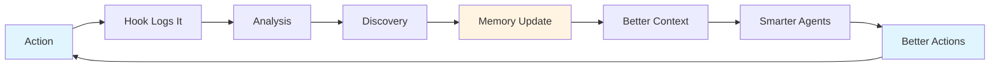

# Amplifier: Your AI Development Amplified

Amplifier is a coordinated and accelerated development system that provides specialized AI agents, persistent knowledge that compounds over time, and workflows that execute complex methodologies.

## 🚀 QuickStart 

### Prerequisites

```bash
python3 --version  # Need 3.11+
uv --version       # Need any version
node --version     # Need any version
pnpm --version     # Need any version
git --version      # Need any version
claude --version   # For now. To be removed in the future.
```

Missing something? [→ Quick Install Guide](#quick-install-guide)


### Setup

```bash
git clone https://github.com/microsoft/amplifier.git
cd amplifier
make configure
make install
make check
make test
source .venv/bin/activate # Linux/Mac/WSL 
# source .venv\Scripts\Activate.ps1 # Windows PowerShell 
```

### Use Amplifier via Claude Code

**Option 1** - 
Work on a new (or existing) project
```bash
mkdir ai_working/<project-name>
# ln -s ../<path-to-my-existing-project> ai_working/<project-name>
claude
```

> *Claude Code:*
> ```
> I'm working in ai_working/<project-name>, and using the capabilities from 
> amplifier.
>```

**Option 2** - Work on the Amplifier project itself
```bash
claude
```

---

## 🎯 How is Amplifier Different from Claude Code?

Claude Code is powerful on its own—but Amplifier transforms it from a coding assistant into a coordinated and accelerated development system. Amplifier offers a pre-built suite of advanced capabilities for immediate use.

### Persistent Memory & Learning

Every session with vanilla Claude Code starts from zero. Amplifier builds institutional knowledge that compounds over time.

| Vanilla Claude Code               | Amplifier                                                         |
|-----------------------------------|-------------------------------------------------------------------|
| ❌ Fresh start every session       | ✅ Auto-loaded memory files |
| ❌ Repeatedly explain your project | ✅ Context persists across sessions                                |
| ❌ Repeat past mistakes            | ✅ System learns & prevents recurrence                             |

<details>
<summary>💡<i>Click to view a real impact example</i> </summary>
<br>

> You solve a tricky OneDrive file sync issue in WSL2. With vanilla Claude Code, you'd
> need to re-explain this solution every new session—and you might forget the details
> yourself.
> 
> With Amplifier: The solution is documented in DISCOVERIES.md. Three months later, a
> similar file I/O error appears. Amplifier recognizes the pattern instantly: "This looks
> like a cloud sync delay issue. Based on past experience, try enabling 'Always keep on
> this device' for the data folder."
> 
> You never re-explained anything. The system learned from experience and
> applied that knowledge automatically.

</details>

### Specialized Agent Intelligence
One generalist trying to do everything versus an expert team working in parallel. Amplifier orchestrates 25+ specialized agents, each with focused expertise.

| Vanilla Claude Code                       | Amplifier                                       |
|-------------------------------------------|-------------------------------------------------|
| ❌ One generalist AI for everything        | ✅ 25+ specialized agents with focused expertise |
| ❌ Serial processing (one thing at a time) | ✅ Parallel execution across multiple agents     |
| ❌ Single context window gets confused     | ✅ Separate context per agent stays focused      |


<details>
<summary>💡<i>Click to view a real impact example</i> </summary>
<br>

> You're building a new authentication feature. With vanilla Claude Code, you'd prompt
> sequentially:
> - "Design the authentication system" (10 messages back and forth)
> - "Check for security vulnerabilities" (8 more messages)
> - "Suggest test cases" (5 more messages)
> - "Now implement it" (12+ messages)
> 
> Result: 35+ messages, 45+ minutes, context getting muddied.
> 
> With Amplifier: You run one command. Behind the scenes, four specialist agents work
> simultaneously:
> - `zen-architect` designs the approach (clean, simple, philosophy-aligned)
> - `security-guardian` identifies vulnerabilities (OAuth flows, token storage, session
> management)
> - `test-coverage` develops test strategy (auth flows, edge cases, security tests)
> - `modular-builder` implements based on the design
> 
> They all work in parallel with fresh, focused context. Results synthesized in 15
> minutes. No confusion, no repeated context.

</details>

### Executable Methodologies
Manual multi-step prompting vs. one-command workflows. Amplifier transforms complex methodologies into executable slash commands.

| Vanilla Claude Code                | Amplifier                                        |
|------------------------------------|--------------------------------------------------|
| ❌ Manual workflow orchestration    | ✅ Custom slash commands execute entire processes |
| ❌ Repeated prompting for each step | ✅ One command = complete workflow                |
| ❌ Lose place if interrupted        | ✅ TodoWrite tracking + state preservation        |

<details>
<summary>💡<i>Click to view a real impact example</i> </summary>
<br>

> You need to implement a payment processing feature. With vanilla Claude Code:
>
> You: "Break down this task for me"
> Claude: [provides breakdown]
> You: "Now create a detailed plan"
> Claude: [creates plan]
> You: "Check for potential issues"
> Claude: [identifies issues]
> You: "What are the dependencies?"
> Claude: [lists dependencies]
> You: "Now start implementing step 1"
> [30+ messages later, you get interrupted for a meeting...]
> You: "Wait, where were we?"
> 
> With Amplifier: You run `/ultrathink-task implement payment processing with Stripe.` It
> automatically:
> 1. Creates a todo list with TodoWrite (visible progress tracking)
> 2. Spawns zen-architect for design (runs in parallel)
> 3. Spawns security-guardian for payment security review (parallel)
> 4. Spawns api-contract-designer for API design (parallel)
> 5. Synthesizes their insights into implementation plan
> 6. Executes with modular-builder
> 7. Validates with architecture review cycle
> 
> Get interrupted? The todo list shows exactly where you are. Resume anytime—the command
> continues from the last checkpoint.
> 
> 30+ messages → 1 command. Manual orchestration → automated workflow.

</details>

### Knowledge Synthesis Pipeline
Conversation-limited context vs. unlimited knowledge processing. Amplifier extracts, connects, and makes searchable insights from your entire content library.

| Vanilla Claude Code               | Amplifier                                         |
|-----------------------------------|---------------------------------------------------|
| ❌ Limited to conversation context | ✅ Process unlimited content at scale              |
| ❌ Can't analyze 100+ documents    | ✅ Knowledge graphs connect concepts automatically |
| ❌ Lost insights between sessions  | ✅ Semantic search your entire knowledge base      |

<details>
<summary>💡<i>Click to view a real impact example</i> </summary>
<br>

> You have 200 articles about distributed systems scattered across folders—AWS docs,
> Martin Kleppmann's writings, your own notes, team wiki pages, conference talks. You need
> to understand CAP theorem trade-offs for your current project.
> 
> With vanilla Claude Code: You can't process them all—context limits force you to
> manually:
> - Read and summarize each article yourself
> - Try to remember connections between concepts
> - Paste summaries into chat (but that's still only ~10-15 articles max)
> - Lose all this work when the session ends
> 
> With Amplifier:
> ```
> make knowledge-update                               # Processes all 200 articles
> # Extracts: concepts, relationships, contradictions, patterns
> # Builds: knowledge graph connecting everything
> 
> make knowledge-query Q="CAP theorem tradeoffs"     # Query instantly
> ```
> 
> Returns:
> - "MongoDB: chose AP (availability + partition tolerance), eventual consistency for C"
> - "PostgreSQL: chose CP (consistency + partition tolerance), sacrifices A during splits"
> 
> - "Cassandra: tunable—you pick the tradeoff per query"
> - Shows you the 12 articles that discuss this with conflicting opinions preserved
> - Visual graph showing how these concepts connect to your "data replication" notes
> 
> This isn't summarization—it's building a queryable, evolving knowledge structure that
> finds patterns and connections you didn't know existed. Three months later, query for
> "eventual consistency patterns" and it connects back to these CAP discussions
> automatically.

</details>

### Automated Quality & Intelligence Layer

Vanilla Claude Code requires manual quality checks. Amplifier enforces
excellence through an automation layer.

| Vanilla Claude Code | Amplifier |
|---------------------|-----------|
| ❌ Manual quality checks | ✅ Automatic checks after every code change |
| ❌ No session tracking | ✅ Comprehensive logging of all interactions |
| ❌ Easy to miss errors | ✅ Desktop notifications for important events |

<details>
<summary>💡<i>Click to view a real impact example</i> </summary>
<br>

> You're modifying authentication code—updating password hashing. With vanilla Claude
> Code, you must remember to:
> - Manually run tests: "Run the auth tests"
> - Manually check types: "Run type checking"
> - Manually review security: "Check this for vulnerabilities"
> - Manually verify formatting: "Make sure the code is formatted properly"
> 
> You forget to run type checking. Deploy. Production breaks because of a type error you
> missed.
> 
> With Amplifier: You save the authentication file. Instantly and automatically:
> 
> 1. Hook triggers - on_code_change_hook.sh detects the save
> 2. Quality checks run - make check executes automatically:
> - Ruff formats the code
> - Pyright runs type checking → Finds the type error!
> - Security linting runs
> 3. Results logged - Change recorded in .data/code-changes.log
> 4. Desktop notification appears:
> ⚠️ Code Check Failed
> Type error in auth.py line 47
> 5. Detailed report in terminal:
> ERROR: Incompatible types in assignment
> Expected: Optional[str]
> Got: int
> 
> You caught the error before committing. No broken deployment. No manual effort.
> 
> Quality is now invisible and guaranteed—you never had to ask for it. The system watches
> and enforces excellence automatically.

</details>

## Why Amplifier Works

The magic isn't any single feature—it's how they compound each other:

> Base Claude Code × Memory × Agents × Commands × Hooks × Integration
= 10,000x+ Capability Multiplication

### The Feedback Loop



Each component amplifies the others:
- **Memory** provides context for **Agents**
- **Agents** execute through **Commands**
- **Commands** trigger **Hooks** for quality
- **Hooks** capture insights for **Memory**
- **Memory** makes everything smarter next time

This creates a self-improving system that gets better with every use.


---

## ✨ Amplifier in Action: Quick Wins to Try

### 1. Quick Tool Creation (5-10 minutes)

#### Suggested Pattern
> *Claude Code:* 
> ```
> /ultrathink-task make me a tool like @scenarios/blog_writer but that [your need]
> ```

#### Example: Report Builder from Data Files

> *Claude Code:*
> ```
> /ultrathink-task make me a tool like @scenarios/blog_writer but that creates
> executive reports from CSV data. It should:
> 
> • Read CSV files from ./data/ directory
> • Analyze trends and patterns with AI
> • Generate visualizations (charts/graphs)
> • Create narrative explanations of insights
> • Output as formatted PDF report
> ```

Browse `scenarios/` to find a tool close to your need, then adapt it with `/ultrathink-task`. The closer the template matches your use case, the faster you'll have a working tool.

> [!TIP]
> Even if no scenario matches perfectly, use the one with the most similar thinking process (e.g., "read files → analyze → generate output") rather than similar domain (e.g., both about writing).


### 2. Knowledge Processing (10-20 minutes)
> *Claude Code:*
> ```
> Analyze all markdown files in [your directory] and build a knowledge graph
> showing concept relationships. Use @scenarios/blog_writer pattern for
> file processing.
> ```

### 3. Automated Code Review (Instant)
> *Claude Code:*
> ```
> /review-code-at-path src/auth/
> ```

Spawns `security-guardian` + `zen-architect` + `test-coverage` specialist agents in parallel.


### 4. More Power Commands

Beyond `/ultrathink-task`, Amplifier includes:

- `/prime` - Load philosophical context before major work
- `/commit` - Generate context-aware commit messages
- `/review-code-at-path <path>` - Deep code review with philosophy check
- `/modular-build` - Build following modular design principles
- `/transcripts` - Manage conversation history and compaction

Commands can call other commands and spawn agents—workflows that orchestrate workflows.

**[See how it can benefit you →](https://microsoft.github.io/amplifier)**

---

## Quick Install Guide

<details>
<summary>Click to expand installation instructions</summary>

### Mac

```bash
brew install python3 node git pnpm uv
npm install -g @anthropic-ai/claude-cli
```

### Ubuntu/Debian/WSL

```bash
# System packages
sudo apt update && sudo apt install -y python3 python3-pip nodejs npm git

# pnpm
npm install -g pnpm
pnpm setup && source ~/.bashrc

# uv (Python package manager)
curl -LsSf https://astral.sh/uv/install.sh | sh

# Claude Code CLI
npm install -g @anthropic-ai/claude-cli
```

### Windows

1. Install [WSL2](https://learn.microsoft.com/windows/wsl/install)
2. Run Ubuntu commands above inside WSL

### Manual Downloads

- [Python](https://python.org/downloads) (3.11 or newer)
- [Node.js](https://nodejs.org) (any recent version)
- [pnpm](https://pnpm.io/installation) (package manager)
- [Git](https://git-scm.com) (any version)
- [uv](https://docs.astral.sh/uv/getting-started/installation/) (Python package manager)
- [Claude Code CLI](https://github.com/anthropics/claude-code) (AI assistant)

</details>

---

*Experience the interactive documentation at [microsoft.github.io/amplifier](https://microsoft.github.io/amplifier)*
