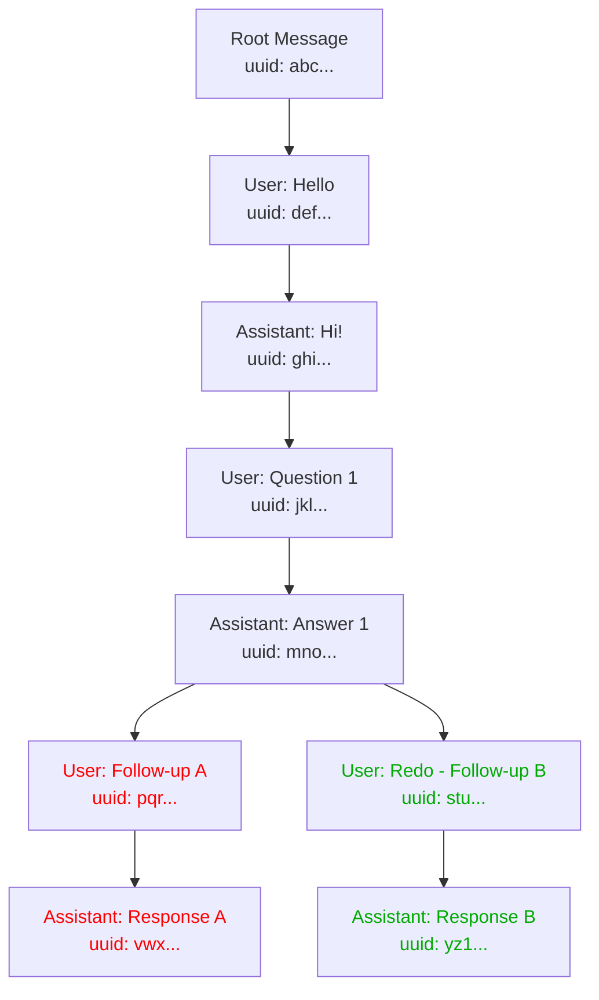
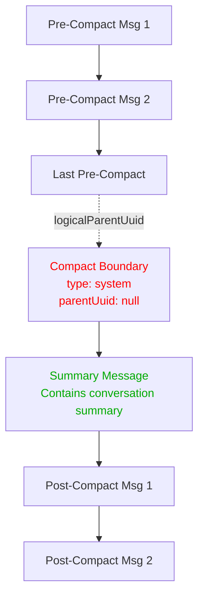
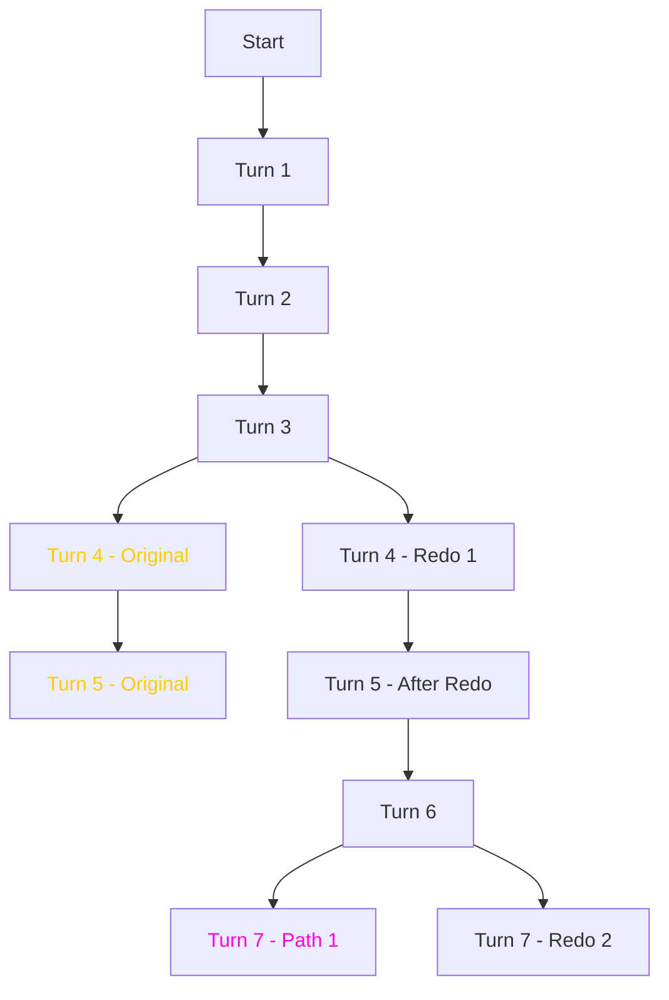

# Claude Code Session Management System - Technical Analysis

## 1. Log File Format and Structure

### File Format

- **Location**: `~/.claude/projects/{project-identifier}/{session-uuid}.jsonl`
- **Format**: JSONL (JSON Lines) - each line is a valid JSON object
- **Naming**: UUID v4 format for session identifiers

### Line Structure

Each line represents either:

1. A message entry (user/assistant interaction)
2. A summary entry (session metadata)
3. A meta entry (system-level information)

## 2. Core Message Schema

Each message object contains these key fields:

```javascript
{
  "parentUuid": string | null,      // UUID of parent message (null for root)
  "uuid": string,                    // Unique message identifier
  "sessionId": string,               // Session UUID this message belongs to
  "timestamp": ISO8601,              // When message was created
  "type": "user" | "assistant",     // Message origin
  "isSidechain": boolean,            // Whether message is on main chain
  "userType": "external",            // User type classifier
  "cwd": string,                     // Current working directory
  "version": string,                 // Claude Code version (e.g., "1.0.113")
  "gitBranch": string,               // Git branch (if applicable)
  "message": {                       // Actual message content
    "role": "user" | "assistant",
    "content": string | array,        // Message text or structured content
    // Additional fields for assistant messages:
    "id": string,                     // API message ID
    "model": string,                   // Model used
    "usage": object,                   // Token usage statistics
    "stop_reason": string,
    "requestId": string
  },
  "isMeta": boolean                   // Whether this is metadata (optional)
}
```

## 3. Message Graph Structure

### Messages Form a DAG (Directed Acyclic Graph)

Within each session file, messages are linked by `parentUuid` relationships, forming a DAG structure. This enables branching conversations within a single session.



### Fork Points and Branches

- **Fork Point**: A message with multiple children
- **Abandoned Branch**: Earlier branch at a fork point (shown in red above)
- **Active Branch**: Later branch at a fork point (shown in green above)
- **Terminal Messages**: Messages with no children

## 4. Session Behaviors

### Initial Session Creation

- Creates a new `.jsonl` file with UUID filename
- Messages are written sequentially with their session ID

### Session Forking (Cross-File)

When certain operations occur (like `--continue` or `--restore`), a new session file is created that:

- Copies message history from parent session(s)
- Preserves original `sessionId` values in copied messages
- Adds new messages with the new session ID
- May make the parent session a complete subset

### "Redo from Here" (Within-File Branching)

- Creates a fork point in the message DAG
- Original branch remains but is abandoned
- New branch continues from the fork point
- Both branches exist in the same file
- File order: Original branch → Redo branch

### Compact Operation (Context Management)

When a conversation reaches context limits or when manually triggered via `/compact`, Claude Code performs a compact operation:

**Key Characteristics:**
- **Single File Continuation**: Stays in the same session file (no new file created)
- **Compact Boundary**: Inserts a special system message as a new root
- **Clean Break**: Creates a new DAG starting point while preserving history

**Compact Boundary Message Structure:**
```javascript
{
  "parentUuid": null,                 // New root (no parent)
  "uuid": "boundary-uuid",
  "type": "system",
  "subtype": "compact_boundary",
  "logicalParentUuid": "last-msg-uuid", // Points to last pre-compact message
  "compactMetadata": {
    "trigger": "manual" | "automatic",
    "preTokens": number                // Token count before compact
  },
  "content": "Conversation compacted"
}
```

**Message Flow:**


**Behavior:**
1. All messages before compact remain in file but become "orphaned" from the active conversation
2. Compact boundary has no parent (new root) but maintains `logicalParentUuid` for reference
3. First message after boundary (child of boundary) contains the conversation summary
4. New conversation continues from this point with full context reset
5. The single session file now contains two separate DAGs connected only by `logicalParentUuid`

## 5. Message Types and Patterns

### User Messages

- Regular chat messages
- Command messages (wrapped in XML-like tags):
  - `<command-name>`: The command being executed
  - `<command-message>`: Display version of command
  - `<command-args>`: Command arguments
  - `<local-command-stdout>`: Command output

### Assistant Messages

- Regular responses with full API metadata
- Synthetic messages (e.g., "No response requested")
- Include token usage, cache statistics, model information

### Meta Messages

- Marked with `"isMeta": true`
- System-level information
- Not part of the conversational flow

### Summary Entries and Summary Files

#### Summary Entries
- Special entries with `"type": "summary"`
- Contains descriptive text of a conversation branch
- References a `leafUuid` pointing to a specific message in another session

#### Summary Files (Checkpoint Snapshots)
- Separate `.jsonl` files containing only summary entries
- Created during session operations (likely "compact" or session switching)
- **Key Purpose**: Index and catalog conversation branches for search and navigation
- **Multiple Entries**: When a session has internal branches, each branch gets its own summary
- **LeafUuid References**: Point to specific messages in the branched session, marking important points in each branch

## 6. Path Extraction Strategy

### Core Principle: Extract ALL Conversation Paths

Since messages form a DAG, we need to:

1. Build the complete message graph for each session
2. Find all complete paths from root to leaf nodes
3. Handle compact boundaries as special path separators
4. Generate a transcript for each unique path
5. Eliminate paths that are subsets of others across sessions

### Algorithm

```python
def extract_all_paths(session):
    """Extract all conversation paths from a session DAG."""
    # Build parent->children mapping
    children_map = build_children_map(session['messages'])

    # Find roots (messages with no parent)
    roots = [msg for msg in messages if not msg['parentUuid']]

    # Recursively trace all paths
    all_paths = []
    for root in roots:
        paths = trace_paths_from(root, children_map)
        all_paths.extend(paths)

    return all_paths

def trace_paths_from(node, children_map):
    """Recursively trace all paths from a node."""
    children = children_map.get(node, [])

    if not children:
        # Leaf node - return path ending here
        return [[node]]

    # Get all paths from children
    all_paths = []
    for child in children:
        child_paths = trace_paths_from(child, children_map)
        for path in child_paths:
            all_paths.append([node] + path)

    return all_paths
```

### Handling Compact Boundaries

Compact operations create a special case in path extraction. The recommended approach is to create unified conversation paths that include compact operations inline:

```python
def handle_compact_sessions(messages):
    """Extract complete conversation paths including compact boundaries inline."""
    # Build complete DAG including boundaries
    children_map, message_by_uuid, roots = build_message_dag(messages)

    # Find compact boundaries
    boundaries = [msg for msg in messages if msg.get('subtype') == 'compact_boundary']

    # Create logical connections from boundaries to their parents
    for boundary in boundaries:
        boundary_uuid = boundary.get("uuid")
        logical_parent_uuid = boundary.get("logicalParentUuid")

        if logical_parent_uuid and logical_parent_uuid in message_by_uuid:
            # Connect boundary as child of its logical parent
            children_map[logical_parent_uuid].append(boundary_uuid)

    # Extract complete paths from roots to leaves
    all_paths = []
    for root in roots:
        paths = trace_all_paths(root, children_map, message_by_uuid)
        all_paths.extend(paths)

    return all_paths
```

**Unified Transcript Approach:**
- Creates single continuous conversation transcripts
- Compact boundary messages appear inline at their natural position
- Full conversation context preserved from start to finish
- Users see complete conversation flow without artificial breaks
- Compact operations noted in transcript headers and boundary messages

## 7. Abandoned Branch Detection

Within a session file, when multiple paths exist:

- **Abandoned branches**: Earlier branches at fork points (by file position)
- **Active branches**: Later branches at fork points
- Detection: Compare line numbers of first messages after fork

## 8. Output Strategy

### Transcript Naming

For sessions with single path:

```
transcript_{session_id}.md
```

For sessions with multiple paths:

```
transcript_{session_id}_path1_abandoned.md
transcript_{session_id}_path2.md
```

### Transcript Header

```markdown
# CLAUDE CODE SESSION TRANSCRIPT

Session ID: {session_id}
Path: {path_number} of {total_paths}
Status: {ACTIVE|ABANDONED}
Fork Point: {parent_uuid if abandoned}
**Contains Compact Operation(s)** - Full conversation including compacted segments
Total Messages: {count}
```

Note: The "Contains Compact Operation(s)" line only appears for sessions that include compact boundaries.

## 9. Cross-Session Deduplication

After extracting all paths from all sessions:

1. Compare paths by their message UUIDs
2. If path A's UUIDs are a subset of path B's UUIDs, exclude path A
3. Keep only paths with unique content

## 10. Complex Scenario Handling

### Example: Multiple Redos



This would generate 3 paths:

1. Start → T3 → T4A → T5A (abandoned)
2. Start → T3 → T4B → T5B → T6B → T7B1 (abandoned)
3. Start → T3 → T4B → T5B → T6B → T7B2 (active)

### Result Summary

- **Input**: Variable number of session files, some with internal DAGs
- **Output**: Exactly as many transcripts as unique conversation paths
- **Abandoned paths**: Preserved and marked for forensic value
- **Active paths**: The current/final version of each conversation branch

## 11. Implementation Benefits

1. **Data-Driven**: No need to detect specific commands or mechanisms
2. **Complete Coverage**: Captures all conversation branches
3. **Forensic Value**: Preserves abandoned paths for comparison
4. **Handles Complexity**: Works with arbitrary DAG structures
5. **Deduplication**: Eliminates redundant content across sessions

This approach ensures we generate exactly the right number of transcripts - one for each unique conversation ending, regardless of how the branches were created.
