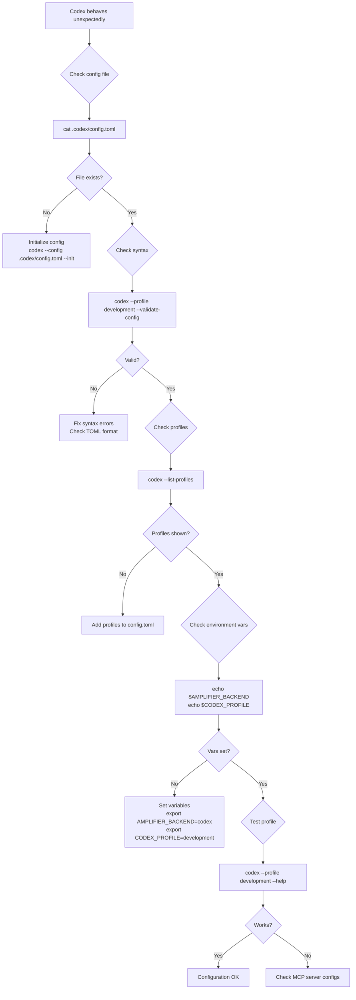
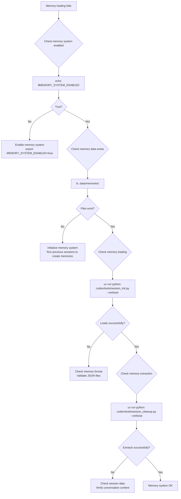
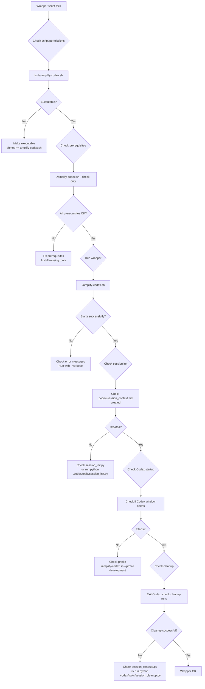

./amplify-codex.sh --check-only
```

### Interpreting Results

The diagnostic check will output:
- ✅ **PASS**: Component is working correctly
- ❌ **FAIL**: Component has issues (see details below)
- ⚠️ **WARN**: Component has potential issues or is misconfigured

### Common Quick Fixes

**If multiple components fail:**
```bash
# Reinstall dependencies
make install

# Reset Codex configuration
rm -rf .codex/
codex --config .codex/config.toml --init
```

**If wrapper script fails:**
```bash
# Make script executable
chmod +x amplify-codex.sh

# Check prerequisites
codex --version && uv --version && python --version
```

## Problem Categories

Select the category that best matches your issue:

- [Installation Issues](#installation-issues)
- [Configuration Issues](#configuration-issues)
- [MCP Server Issues](#mcp-server-issues)
- [Memory System Issues](#memory-system-issues)
- [Quality Check Issues](#quality-check-issues)
- [Transcript Issues](#transcript-issues)
- [Agent Issues](#agent-issues)
- [Wrapper Script Issues](#wrapper-script-issues)

## Installation Issues

```mermaid
flowchart TD
    A[Codex won't start] --> B{Check Codex CLI}
    B --> C[codex --version]
    C --> D{Version shown?}
    D -->|Yes| E[Check uv]
    D -->|No| F[Install Codex CLI<br/>Follow: https://docs.anthropic.com/codex/installation]
    E --> G[uv --version]
    G --> H{Version shown?}
    H -->|Yes| I[Check Python]
    H -->|No| J[Install uv<br/>curl -LsSf https://astral.sh/uv/install.sh | sh]
    I --> K[python --version]
    K --> L{3.11+ shown?}
    L -->|Yes| M[Check project setup]
    L -->|No| N[Upgrade Python to 3.11+]
    M --> O[make install]
    O --> P{No errors?}
    P -->|Yes| Q[Try starting Codex]
    P -->|No| R[Fix dependency issues]
    Q --> S{Starts successfully?}
    S -->|Yes| T[Installation OK]
    S -->|No| U[Check PATH<br/>export PATH="$HOME/.codex/bin:$PATH"]
```

### Detailed Steps

**Codex CLI not found:**
```bash
# Check if installed
which codex

# Add to PATH (if installed but not in PATH)
export PATH="$HOME/.codex/bin:$PATH"

# Verify installation
codex --version
# Expected: codex 0.x.x
```

**uv not available:**
```bash
# Install uv
curl -LsSf https://astral.sh/uv/install.sh | sh

# Restart shell or source profile
source ~/.bashrc  # or ~/.zshrc

# Verify
uv --version
# Expected: uv 0.x.x
```

**Python version issues:**
```bash
# Check version
python --version
# Should show: Python 3.11.x or higher

# If wrong version, use uv python
uv run --python 3.11 python --version
```

**Project setup fails:**
```bash
# Clean and reinstall
rm -rf .venv/
make install

# Check for errors in output
# Common issues: network problems, disk space, permissions
```

## Configuration Issues



### Detailed Steps

**Config file missing:**
```bash
# Create directory
mkdir -p .codex

# Initialize config
codex --config .codex/config.toml --init

# Verify creation
ls -la .codex/config.toml
```

**Config syntax errors:**
```bash
# Validate syntax
python -c "import tomllib; tomllib.load(open('.codex/config.toml', 'rb'))"
# Should not show errors

# Check for common issues:
# - Missing quotes around strings
# - Incorrect indentation
# - Invalid section names
```

**Profile issues:**
```bash
# List available profiles
codex --list-profiles

# Check profile syntax
codex --profile development --validate-config

# View profile details
codex --profile development --show-config
```

**Environment variables:**
```bash
# Check current values
echo "AMPLIFIER_BACKEND: $AMPLIFIER_BACKEND"
echo "CODEX_PROFILE: $CODEX_PROFILE"
echo "MEMORY_SYSTEM_ENABLED: $MEMORY_SYSTEM_ENABLED"

# Set for current session
export AMPLIFIER_BACKEND=codex
export CODEX_PROFILE=development
export MEMORY_SYSTEM_ENABLED=true
```

## MCP Server Issues

```mermaid
flowchart TD
    A[MCP tools not available] --> B{Check server startup}
    B --> C[View server logs<br/>tail -f .codex/logs/*.log]
    C --> D{See errors?}
    D -->|Yes| E[Fix server errors<br/>Check imports, paths, permissions]
    D -->|No| F{Check server registration}
    F --> G[codex --profile development --list-tools]
    G --> H{Tools listed?}
    H -->|No| I[Check config server sections<br/>Verify command paths]
    H -->|Yes| J{Test tool invocation}
    J --> K[codex exec "health_check"]
    K --> L{Response received?}
    L -->|No| M[Check MCP protocol<br/>Test stdio communication]
    L -->|Yes| N[Test specific tools]
    N --> O[codex exec "initialize_session with prompt 'test'"]
    O --> P{Works?}
    P -->|Yes| Q[MCP servers OK]
    P -->|No| R[Check tool-specific issues<br/>Memory system, quality checks, etc.]
```

### Detailed Steps

**Server startup failures:**
```bash
# Check server logs
tail -f .codex/logs/session_manager.log
tail -f .codex/logs/quality_checker.log
tail -f .codex/logs/transcript_saver.log

# Test server directly
uv run python .codex/mcp_servers/session_manager/server.py --help

# Check for import errors
python -c "from amplifier.memory import MemoryStore"
```

**Server registration issues:**
```bash
# List registered tools
codex --profile development --list-tools

# Check config sections
grep -A 10 "\[mcp_servers" .codex/config.toml

# Verify command paths exist
ls .codex/mcp_servers/session_manager/server.py
```

**Tool invocation problems:**
```bash
# Test basic tool
codex exec "health_check"

# Test with parameters
codex exec "initialize_session with prompt 'test'"

# Check for timeout errors
codex exec --timeout 30 "check_code_quality with file_paths ['README.md']"
```

**Protocol communication issues:**
```bash
# Test stdio directly
echo '{"jsonrpc": "2.0", "id": 1, "method": "tools/list"}' | \
uv run python .codex/mcp_servers/session_manager/server.py

# Check JSON parsing
python -c "import json; print('JSON OK')"
```

## Memory System Issues



### Detailed Steps

**Memory system disabled:**
```bash
# Check setting
echo $MEMORY_SYSTEM_ENABLED

# Enable for session
export MEMORY_SYSTEM_ENABLED=true

# Enable permanently in shell profile
echo 'export MEMORY_SYSTEM_ENABLED=true' >> ~/.bashrc
```

**Memory data missing:**
```bash
# Check memory directory
ls -la .data/memories/

# Count memories
find .data/memories/ -name "*.json" | wc -l

# Initialize with sample data if needed
# Run a test session to generate memories
```

**Memory loading failures:**
```bash
# Test loading manually
uv run python .codex/tools/session_init.py --verbose

# Check logs
cat .codex/logs/session_init.log

# Validate memory files
python -c "import json; [json.load(open(f)) for f in ['.data/memories/file1.json', '.data/memories/file2.json']]"
```

**Memory extraction issues:**
```bash
# Test extraction
uv run python .codex/tools/session_cleanup.py --verbose

# Check for timeout (60s limit)
uv run python .codex/tools/session_cleanup.py --no-timeout

# Validate session data
ls ~/.codex/sessions/
cat ~/.codex/sessions/*/history.jsonl | head -10
```

## Quality Check Issues

```mermaid
flowchart TD
    A[Quality checks fail] --> B{Check Makefile exists}
    B --> C[ls Makefile]
    C --> D{Exists?}
    D -->|No| E[Create Makefile<br/>Copy from template or create basic]
    D -->|Yes| F{Check make check target}
    F --> G[make check]
    G --> H{No errors?}
    H -->|No| I[Fix Makefile<br/>Check tool installations]
    H -->|Yes| J{Check virtual environment}
    J --> K[echo $VIRTUAL_ENV]
    K --> L{Set?}
    L -->|No| M[Activate venv<br/>source .venv/bin/activate]
    L -->|Yes| N{Check tool installations}
    N --> O[uv pip list | grep -E "(ruff|pyright|pytest)"]
    O --> P{All installed?}
    P -->|No| Q[Install missing tools<br/>uv add --dev ruff pyright pytest]
    P -->|Yes| R{Test tools individually}
    R --> S[uv run ruff check .]
    S --> T{Ruff works?}
    T -->|No| U[Fix ruff config<br/>Check .ruff.toml]
    T -->|Yes| V[uv run pyright]
    V --> W{Pyright works?}
    W -->|No| X[Fix pyright config<br/>Check pyproject.toml]
    W -->|Yes| Y[uv run pytest]
    Y --> Z{Pytest works?}
    Z -->|No| AA[Fix pytest config<br/>Check pytest.ini or pyproject.toml]
    Z -->|Yes| BB[Quality checks OK]
```

### Detailed Steps

**Makefile missing:**
```bash
# Check for Makefile
ls Makefile

# Create basic Makefile
cat > Makefile << 'EOF'
.PHONY: check install test

check:
	uv run ruff check .
	uv run pyright
	uv run pytest

install:
	uv sync

test:
	uv run pytest
EOF
```

**make check fails:**
```bash
# Run make check
make check

# Check exit code
echo $?

# Run individual tools
make check 2>&1 | head -20
```

**Virtual environment issues:**
```bash
# Check if activated
echo $VIRTUAL_ENV

# Activate if needed
source .venv/bin/activate

# Verify uv uses venv
uv run which python
# Should show .venv/bin/python
```

**Tool installation issues:**
```bash
# Check installed tools
uv pip list | grep -E "(ruff|pyright|pytest)"

# Install missing tools
uv add --dev ruff pyright pytest

# Verify versions
uv run ruff --version
uv run pyright --version
uv run pytest --version
```

**Individual tool failures:**
```bash
# Test ruff
uv run ruff check .
# Fix: Check .ruff.toml configuration

# Test pyright
uv run pyright
# Fix: Check pyproject.toml [tool.pyright] section

# Test pytest
uv run pytest
# Fix: Check pytest configuration files
```

## Transcript Issues

```mermaid
flowchart TD
    A[Transcript problems] --> B{What type of issue?}
    B -->|Can't export| C{Check session exists}
    B -->|Wrong format| D{Check format options}
    B -->|Missing data| E{Check session content}
    B -->|Large file| F{Check size limits}
    C --> G[ls ~/.codex/sessions/]
    G --> H{Session directory exists?}
    H -->|No| I[Start new session first<br/>./amplify-codex.sh]
    H -->|Yes| J{codex exec "list_available_sessions"}
    J --> K{Session listed?}
    K -->|No| L[Check session permissions<br/>ls -la ~/.codex/sessions/]
    K -->|Yes| M{codex exec "save_current_transcript"}
    M --> N{Exports successfully?}
    N -->|No| O[Check write permissions<br/>touch .codex/transcripts/test.txt]
    N -->|Yes| P[Export OK]
    D --> Q{codex exec "save_current_transcript with format 'extended'"}
    Q --> R{Format correct?}
    R -->|No| S[Check format parameter<br/>Try 'standard', 'extended', 'both', 'compact']
    R -->|Yes| T[Format OK]
    E --> U[cat ~/.codex/sessions/*/history.jsonl | wc -l]
    U --> V{Has content?}
    V -->|No| W[Session too short<br/>Add more conversation]
    V -->|Yes| X[Check export tool<br/>python tools/transcript_manager.py export --current]
    F --> Y[ls -lh .codex/transcripts/]
    Y --> Z{File too large?}
    Z -->|Yes| AA[Use compact format<br/>codex exec "save_current_transcript with format 'compact'"]
    Z -->|No| BB[Size OK]
```

### Detailed Steps

**Session not found:**
```bash
# List available sessions
codex exec "list_available_sessions"

# Check session directories
ls ~/.codex/sessions/

# Find recent sessions
ls -lt ~/.codex/sessions/ | head -5
```

**Export failures:**
```bash
# Try manual export
codex exec "save_current_transcript with format 'both'"

# Check permissions
mkdir -p .codex/transcripts
touch .codex/transcripts/test.txt

# Use transcript manager
python tools/transcript_manager.py export --current
```

**Format issues:**
```bash
# Test different formats
codex exec "save_current_transcript with format 'standard'"
codex exec "save_current_transcript with format 'extended'"
codex exec "save_current_transcript with format 'compact'"

# Check output files
ls -la .codex/transcripts/
```

**Missing content:**
```bash
# Check session data
ls ~/.codex/sessions/*/history.jsonl
wc -l ~/.codex/sessions/*/history.jsonl

# Validate JSON
python -c "import json; [json.loads(line) for line in open('~/.codex/sessions/session_id/history.jsonl')]"
```

## Agent Issues

```mermaid
flowchart TD
    A[Agent execution fails] --> B{Check agent files exist}
    B --> C[ls .codex/agents/]
    C --> D{Files exist?}
    D -->|No| E[Convert agents<br/>python tools/convert_agents.py]
    D -->|Yes| F{Check agent format}
    F --> G[head .codex/agents/bug-hunter.md]
    G --> H{Has frontmatter?}
    H -->|No| I[Fix agent format<br/>Add YAML frontmatter]
    H -->|Yes| J{Test agent execution}
    J --> K[codex exec --agent bug-hunter "test task"]
    K --> L{Executes?}
    L -->|No| M[Check codex exec syntax<br/>codex exec --help]
    L -->|Yes| N{Check agent output}
    N --> O[Check output format<br/>Should be structured response]
    O --> P{Output correct?}
    P -->|No| Q[Check agent definition<br/>Validate tool access]
    P -->|Yes| R[Agent OK]
```

### Detailed Steps

**Agent files missing:**
```bash
# Check agent directory
ls .codex/agents/

# Convert from Claude Code
python tools/convert_agents.py

# Verify conversion
ls .codex/agents/
```

**Agent format issues:**
```bash
# Check agent file structure
head -20 .codex/agents/bug-hunter.md

# Should have YAML frontmatter:
# ---
# name: bug-hunter
# description: Bug investigation and fixing
# tools: [read, grep, run_terminal_cmd]
# ---

# Validate YAML
python -c "import yaml; yaml.safe_load(open('.codex/agents/bug-hunter.md'))"
```

**Execution failures:**
```bash
# Test basic execution
codex exec --agent bug-hunter "Find and fix a bug"

# Check help
codex exec --help

# Test with timeout
codex exec --timeout 60 --agent bug-hunter "test"
```

**Output issues:**
```bash
# Check output format
codex exec --agent bug-hunter "test" --output-format json

# Validate response structure
# Should have: success, output, metadata fields
```

## Wrapper Script Issues



### Detailed Steps

**Script permissions:**
```bash
# Check permissions
ls -la amplify-codex.sh

# Make executable
chmod +x amplify-codex.sh

# Verify
./amplify-codex.sh --help
```

**Prerequisites check:**
```bash
# Run diagnostic
./amplify-codex.sh --check-only

# Check individual components
codex --version
uv --version
python --version
ls .venv/
```

**Session initialization issues:**
```bash
# Test init manually
uv run python .codex/tools/session_init.py --verbose

# Check output files
ls .codex/session_context.md
ls .codex/session_init_metadata.json

# Check logs
cat .codex/logs/session_init.log
```

**Codex startup problems:**
```bash
# Test with different profile
./amplify-codex.sh --profile ci

# Check profile exists
codex --list-profiles

# Test Codex directly
codex --profile development
```

**Cleanup issues:**
```bash
# Test cleanup manually
uv run python .codex/tools/session_cleanup.py --verbose

# Check output
ls .codex/transcripts/
ls .codex/session_cleanup_metadata.json

# Check logs
cat .codex/logs/session_cleanup.log
```

## Common Error Messages

### Installation Errors

**"codex: command not found"**
- **Cause**: Codex CLI not installed or not in PATH
- **Solution**: Install Codex CLI and add to PATH
```bash
# Install Codex
# Follow: https://docs.anthropic.com/codex/installation

# Add to PATH
export PATH="$HOME/.codex/bin:$PATH"
```

**"uv: command not found"**
- **Cause**: uv package manager not installed
- **Solution**: Install uv
```bash
curl -LsSf https://astral.sh/uv/install.sh | sh
source ~/.bashrc
```

### Configuration Errors

**"Error parsing config file"**
- **Cause**: Invalid TOML syntax in `.codex/config.toml`
- **Solution**: Fix syntax errors
```bash
# Validate syntax
python -c "import tomllib; tomllib.load(open('.codex/config.toml', 'rb'))"

# Check for common issues:
# - Unclosed quotes
# - Invalid indentation
# - Missing brackets
```

**"Profile 'development' not found"**
- **Cause**: Profile not defined in config
- **Solution**: Add profile to config.toml
```toml
[profiles.development]
mcp_servers = ["amplifier_session", "amplifier_quality", "amplifier_transcripts"]
```

### MCP Server Errors

**"Module 'amplifier.memory' not found"**
- **Cause**: Amplifier modules not installed or not in Python path
- **Solution**: Install dependencies and check imports
```bash
make install
python -c "from amplifier.memory import MemoryStore"
```

**"MCP server connection timeout"**
- **Cause**: Server taking too long to start or respond
- **Solution**: Check server logs and increase timeout
```bash
# Check logs
tail -f .codex/logs/*.log

# Increase timeout in config
[mcp_servers.amplifier_session]
timeout = 60
```

### Memory System Errors

**"Memory system disabled"**
- **Cause**: MEMORY_SYSTEM_ENABLED not set
- **Solution**: Enable memory system
```bash
export MEMORY_SYSTEM_ENABLED=true
```

**"No memories found for context"**
- **Cause**: No previous sessions or memory extraction failed
- **Solution**: Run sessions to build memory base
```bash
# Check existing memories
ls .data/memories/

# Run test session
./amplify-codex.sh
# Work and exit to create memories
```

### Quality Check Errors

**"make: *** No rule to make target 'check'"**
- **Cause**: Makefile missing check target
- **Solution**: Add check target to Makefile
```makefile
check:
	uv run ruff check .
	uv run pyright
	uv run pytest
```

**"ruff: command not found"**
- **Cause**: Linting tools not installed
- **Solution**: Install development dependencies
```bash
uv add --dev ruff pyright pytest
```

### Transcript Errors

**"Session not found"**
- **Cause**: Session ID incorrect or session doesn't exist
- **Solution**: List available sessions and use correct ID
```bash
codex exec "list_available_sessions"
ls ~/.codex/sessions/
```

**"Permission denied"**
- **Cause**: Cannot write to transcript directory
- **Solution**: Fix permissions
```bash
mkdir -p .codex/transcripts
chmod 755 .codex/transcripts
```

### Agent Errors

**"Agent 'bug-hunter' not found"**
- **Cause**: Agent file missing or incorrect name
- **Solution**: Check agent files and names
```bash
ls .codex/agents/
codex exec --list-agents
```

**"Agent execution timeout"**
- **Cause**: Agent taking too long to complete
- **Solution**: Increase timeout or simplify task
```bash
codex exec --timeout 120 --agent bug-hunter "task"
```

### Wrapper Script Errors

**"Permission denied"**
- **Cause**: Script not executable
- **Solution**: Make script executable
```bash
chmod +x amplify-codex.sh
```

**"Prerequisites check failed"**
- **Cause**: Missing required tools or environment
- **Solution**: Install missing prerequisites
```bash
# Check what failed
./amplify-codex.sh --check-only

# Install missing tools based on output
```

## Advanced Debugging

### Reading MCP Server Logs

**Server logs location:**
```bash
# All server logs
ls .codex/logs/

# View recent activity
tail -f .codex/logs/*.log

# Search for errors
grep -r "ERROR" .codex/logs/
```

**Log levels:**
- **INFO**: Normal operation
- **WARNING**: Potential issues
- **ERROR**: Failures that need attention
- **DEBUG**: Detailed diagnostic information

**Enabling debug logging:**
```bash
# Set log level
export MCP_LOG_LEVEL=DEBUG

# Restart servers
./amplify-codex.sh
```

### Testing Servers Individually

**Session Manager:**
```bash
# Test server startup
uv run python .codex/mcp_servers/session_manager/server.py

# Test health check
echo '{"jsonrpc": "2.0", "id": 1, "method": "tools/call", "params": {"name": "health_check", "arguments": {}}}' | \
uv run python .codex/mcp_servers/session_manager/server.py
```

**Quality Checker:**
```bash
# Test server
uv run python .codex/mcp_servers/quality_checker/server.py

# Test tool call
echo '{"jsonrpc": "2.0", "id": 1, "method": "tools/call", "params": {"name": "validate_environment", "arguments": {}}}' | \
uv run python .codex/mcp_servers/quality_checker/server.py
```

**Transcript Saver:**
```bash
# Test server
uv run python .codex/mcp_servers/transcript_saver/server.py

# Test tool call
echo '{"jsonrpc": "2.0", "id": 1, "method": "tools/call", "params": {"name": "list_available_sessions", "arguments": {}}}' | \
uv run python .codex/mcp_servers/transcript_saver/server.py
```

### Enabling Debug Mode

**Codex debug mode:**
```bash
# Enable debug logging
codex --log-level debug

# Start with debug
CODEX_LOG_LEVEL=debug ./amplify-codex.sh
```

**MCP server debug:**
```bash
# Set environment variable
export MCP_DEBUG=true

# Check server logs
tail -f .codex/logs/*.log
```

**Memory system debug:**
```bash
# Enable verbose memory logging
export MEMORY_DEBUG=true

# Run session init with debug
uv run python .codex/tools/session_init.py --verbose
```

### Finding All Logs

**Log locations:**
```bash
# MCP server logs
.codex/logs/
├── session_manager.log
├── quality_checker.log
└── transcript_saver.log

# Session management logs
.codex/logs/
├── session_init.log
└── session_cleanup.log

# Wrapper script logs
.codex/logs/
└── wrapper.log

# Codex system logs
~/.codex/logs/
└── codex.log
```

**Log rotation:**
- Logs are rotated daily
- Old logs have date suffixes: `session_manager.log.2024-01-01`
- Maximum 7 days of logs kept

**Collecting logs for support:**
```bash
# Create log archive
tar -czf codex-debug-logs.tar.gz .codex/logs/ ~/.codex/logs/

# Include system info
echo "=== System Info ===" > debug-info.txt
codex --version >> debug-info.txt
uv --version >> debug-info.txt
python --version >> debug-info.txt
echo "MEMORY_SYSTEM_ENABLED: $MEMORY_SYSTEM_ENABLED" >> debug-info.txt
```

## Getting Help

### What Information to Collect

**For bug reports:**
```bash
# System information
echo "=== System Info ===" > debug-info.txt
uname -a >> debug-info.txt
codex --version >> debug-info.txt
uv --version >> debug-info.txt
python --version >> debug-info.txt

# Configuration
echo "=== Configuration ===" >> debug-info.txt
cat .codex/config.toml >> debug-info.txt
echo "AMPLIFIER_BACKEND: $AMPLIFIER_BACKEND" >> debug-info.txt
echo "CODEX_PROFILE: $CODEX_PROFILE" >> debug-info.txt

# Environment
echo "=== Environment ===" >> debug-info.txt
echo "PATH: $PATH" >> debug-info.txt
echo "VIRTUAL_ENV: $VIRTUAL_ENV" >> debug-info.txt
which codex >> debug-info.txt
which uv >> debug-info.txt
```

**For performance issues:**
```bash
# Timing information
time ./amplify-codex.sh --check-only

# Resource usage
ps aux | grep -E "(codex|mcp)" | head -10

# Disk space
df -h .codex/
du -sh .codex/
```

### Creating Minimal Reproduction

**Steps to create minimal reproduction:**
1. **Isolate the issue:**
   ```bash
   # Create clean test directory
   mkdir test-codex
   cd test-codex
   
   # Copy minimal setup
   cp -r ../.codex ./
   cp ../amplify-codex.sh ./
   cp ../Makefile ./
   cp ../pyproject.toml ./
   ```

2. **Simplify configuration:**
   ```bash
   # Create minimal config
   cat > .codex/config.toml << 'EOF'
   model = "claude-3-5-sonnet-20241022"
   
   [mcp_servers.amplifier_session]
   command = "uv"
   args = ["run", "python", ".codex/mcp_servers/session_manager/server.py"]
   env = { "AMPLIFIER_ROOT" = "." }
   EOF
   ```

3. **Test with minimal setup:**
   ```bash
   # Test basic functionality
   ./amplify-codex.sh --check-only
   
   # Test specific failing component
   codex --profile development --list-tools
   ```

4. **Document reproduction steps:**
   - What command you ran
   - What you expected to happen
   - What actually happened
   - Any error messages

### Where to Report Issues

**GitHub Issues:**
- **Repository**: [amplifier-project/issues](https://github.com/your-org/amplifier-project/issues)
- **Template**: Use "Codex Integration Bug" template
- **Labels**: `codex`, `mcp-server`, `bug`

**Issue content:**
```markdown
## Description
Brief description of the issue

## Steps to Reproduce
1. Run `./amplify-codex.sh`
2. Try to use MCP tool X
3. See error Y

## Expected Behavior
What should happen

## Actual Behavior
What actually happens

## Environment
- Codex version: x.x.x
- uv version: x.x.x
- Python version: 3.x.x
- OS: [Linux/macOS/Windows]

## Logs
[Attach debug-info.txt and log files]

## Additional Context
Any other relevant information