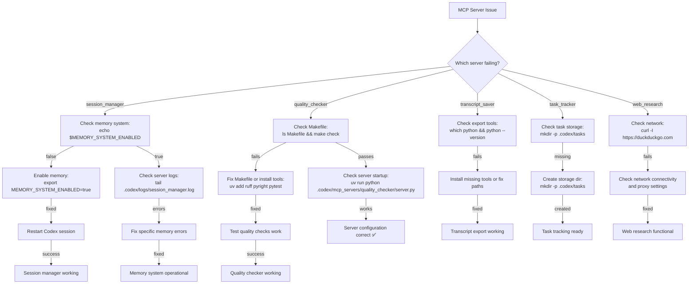
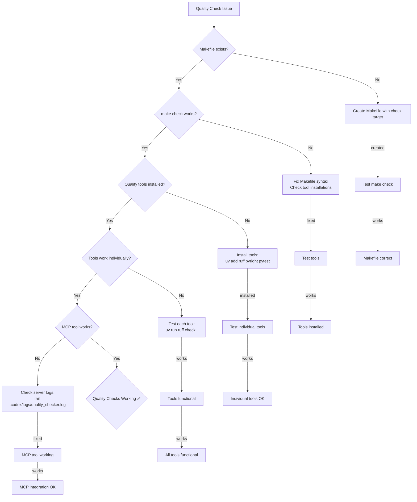
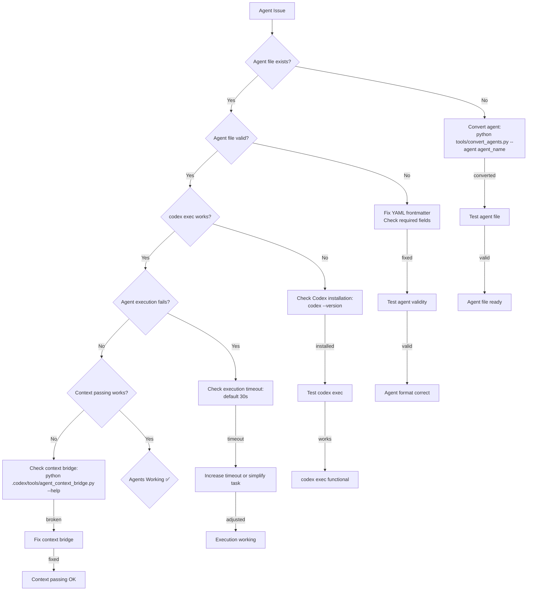
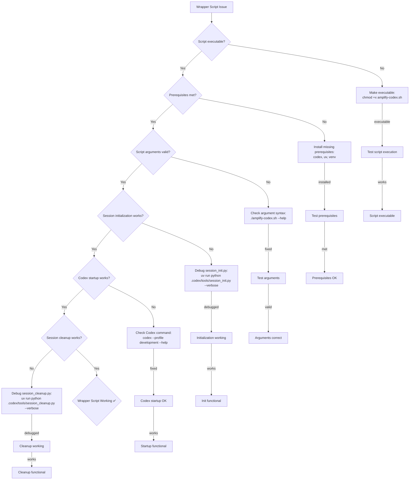

./amplify-codex.sh --check-only
```

### Interpreting Results

The diagnostic check will output:
- ✅ **PASS**: Component is working correctly
- ❌ **FAIL**: Component has issues (see details below)
- ⚠️ **WARN**: Component has potential issues or missing optional features

### Common Quick Fixes

| Issue | Quick Fix |
|-------|-----------|
| **Codex CLI not found** | Install Codex CLI from Anthropic |
| **uv not available** | `curl -LsSf https://astral.sh/uv/install.sh \| sh` |
| **Virtual environment missing** | `make install` |
| **Config file missing** | `codex --config .codex/config.toml --init` |
| **MCP servers failing** | Check `.codex/logs/` for server-specific errors |

## Problem Categories

Select the category that best matches your issue:

- [**Installation Issues**](#installation-issues) - Problems with setup and prerequisites
- [**Configuration Issues**](#configuration-issues) - Config file and profile problems
- [**MCP Server Issues**](#mcp-server-issues) - Server startup and tool execution problems
- [**Memory System Issues**](#memory-system-issues) - Context loading and extraction problems
- [**Quality Check Issues**](#quality-check-issues) - Code validation and linting problems
- [**Transcript Issues**](#transcript-issues) - Session export and format problems
- [**Agent Issues**](#agent-issues) - Agent spawning and execution problems
- [**Wrapper Script Issues**](#wrapper-script-issues) - Automation and orchestration problems

## Installation Issues

```mermaid
flowchart TD
    A[Installation Issue] --> B{Codex CLI installed?}
    B -->|No| C[Install Codex CLI<br/>from Anthropic docs]
    B -->|Yes| D{uv package manager available?}
    D -->|No| E[Install uv:<br/>curl -LsSf https://astral.sh/uv/install.sh | sh]
    D -->|Yes| F{Python 3.11+ available?}
    F -->|No| G[Install Python 3.11+<br/>or use pyenv]
    F -->|Yes| H{Virtual environment exists?}
    H -->|No| I[Run: make install]
    H -->|Yes| J{Project dependencies installed?}
    J -->|No| K[Activate venv and run:<br/>uv pip install -e .]
    J -->|Yes| L[Test basic functionality:<br/>./amplify-codex.sh --help]
    L -->|Works| M[Installation Complete ✅]
    L -->|Fails| N[Check error messages<br/>and retry diagnostics]
```

### Diagnostic Questions

1. **What error do you see when running `./amplify-codex.sh`?**
   - "codex: command not found" → Install Codex CLI
   - "uv: command not found" → Install uv package manager
   - "Python version 3.11 required" → Upgrade Python or use pyenv

2. **Are you on the correct platform?**
   - **macOS/Linux**: Use standard installation
   - **Windows**: Use WSL or ensure PATH includes Codex CLI

3. **Do you have network access?**
   - Some installations require downloading dependencies

### Specific Solutions

#### Codex CLI Installation
```bash
# macOS with Homebrew
brew install anthropic/tap/codex

# Linux/Windows (direct download)
# Follow: https://docs.anthropic.com/codex/installation

# Verify installation
codex --version
```

#### uv Installation
```bash
# Install uv
curl -LsSf https://astral.sh/uv/install.sh | sh

# Add to PATH (add to ~/.bashrc or ~/.zshrc)
export PATH="$HOME/.cargo/bin:$PATH"

# Verify installation
uv --version
```

#### Python Version Check
```bash
# Check current version
python --version

# If using pyenv
pyenv install 3.11.6
pyenv global 3.11.6

# Verify
python --version
```

#### Virtual Environment Setup
```bash
# Create and activate venv
make install

# Or manually
uv venv .venv
source .venv/bin/activate  # Linux/Mac
# .venv\Scripts\activate   # Windows

# Install dependencies
uv pip install -e .
```

## Configuration Issues

```mermaid
flowchart TD
    A[Configuration Issue] --> B{Config file exists?}
    B -->|No| C[Create config:<br/>codex --config .codex/config.toml --init]
    B -->|Yes| D{Config file valid TOML?}
    D -->|No| E[Fix TOML syntax errors<br/>Use online TOML validator]
    D -->|Yes| F{Profiles defined?}
    F -->|No| G[Add profile sections:<br/>[profiles.development]]
    F -->|Yes| H{MCP servers configured?}
    H -->|No| I[Add server configs:<br/>[mcp_servers.amplifier_session]]
    H -->|Yes| J{Environment variables set?}
    J -->|No| K[Set required vars:<br/>export AMPLIFIER_ROOT=.]
    J -->|Yes| L{Profile loads correctly?}
    L -->|No| M[Check profile syntax<br/>Validate server references]
    L -->|Yes| N[Configuration Valid ✅]
```

### Diagnostic Questions

1. **What error message do you see?**
   - "config file not found" → Create config file
   - "invalid TOML" → Fix syntax errors
   - "profile not found" → Add profile definition

2. **Are you using the correct config path?**
   - Default: `.codex/config.toml`
   - Custom: Check `--config` parameter

3. **Have you modified the config recently?**
   - Recent changes may have introduced syntax errors

### Specific Solutions

#### Creating Config File
```bash
# Initialize default config
codex --config .codex/config.toml --init

# Or create manually
cat > .codex/config.toml << 'EOF'
model = "claude-3-5-sonnet-20241022"
approval_policy = "on-request"

[mcp_servers.amplifier_session]
command = "uv"
args = ["run", "python", ".codex/mcp_servers/session_manager/server.py"]
env = { AMPLIFIER_ROOT = "." }

[profiles.development]
mcp_servers = ["amplifier_session"]
EOF
```

#### Validating Config Syntax
```bash
# Use Python to validate TOML
python -c "import tomllib; tomllib.load(open('.codex/config.toml', 'rb'))"

# Or use online validator: https://www.toml-lint.com/
```

#### Environment Variables
```bash
# Required variables
export AMPLIFIER_ROOT="."
export AMPLIFIER_BACKEND="codex"

# Optional variables
export CODEX_PROFILE="development"
export MEMORY_SYSTEM_ENABLED="true"
```

#### Profile Configuration
```toml
# Example development profile
[profiles.development]
mcp_servers = ["amplifier_session", "amplifier_quality", "amplifier_transcripts"]

# Example CI profile
[profiles.ci]
mcp_servers = ["amplifier_quality"]
```

## MCP Server Issues



### Diagnostic Questions

1. **Which MCP server is failing?**
   - Check error messages for server name
   - Look at logs in `.codex/logs/`

2. **When does the failure occur?**
   - **Server startup**: Configuration or import issues
   - **Tool execution**: Runtime errors during use
   - **Server communication**: MCP protocol issues

3. **Are other servers working?**
   - Test individual servers to isolate issues

### Specific Solutions

#### Testing Individual Servers
```bash
# Test session manager
uv run python .codex/mcp_servers/session_manager/server.py

# Test quality checker
uv run python .codex/mcp_servers/quality_checker/server.py

# Test transcript saver
uv run python .codex/mcp_servers/transcript_saver/server.py

# Test task tracker
uv run python .codex/mcp_servers/task_tracker/server.py

# Test web research
uv run python .codex/mcp_servers/web_research/server.py
```

#### Server Logs Location
```bash
# View all server logs
ls .codex/logs/
tail -f .codex/logs/*.log

# View specific server log
tail -f .codex/logs/session_manager.log
tail -f .codex/logs/quality_checker.log
```

#### Common Server Fixes

**Memory System Issues:**
```bash
# Enable memory system
export MEMORY_SYSTEM_ENABLED=true

# Check memory data exists
ls .data/memories/

# Test memory loading
python -c "from amplifier.memory import MemoryStore; print('OK')"
```

**Quality Check Issues:**
```bash
# Install required tools
uv add ruff pyright pytest

# Test tools individually
uv run ruff check .
uv run pyright
uv run pytest

# Check Makefile
make check
```

**Task Storage Issues:**
```bash
# Create storage directory
mkdir -p .codex/tasks

# Check permissions
ls -la .codex/tasks/
```

**Web Research Issues:**
```bash
# Test network connectivity
curl -I https://duckduckgo.com

# Check proxy settings if behind corporate proxy
echo $http_proxy $https_proxy
```

## Memory System Issues

```mermaid
flowchart TD
    A[Memory Issue] --> B{Memory system enabled?}
    B -->|No| C[Enable memory:<br/>export MEMORY_SYSTEM_ENABLED=true]
    B -->|Yes| D{Memory data exists?}
    D -->|No| E[Initialize memory store:<br/>python -c "from amplifier.memory import MemoryStore; MemoryStore()"]
    D -->|Yes| F{Memory loading works?}
    F -->|No| G[Check memory format:<br/>ls .data/memories/ | head -5]
    F -->|Yes| H{Memory extraction works?}
    H -->|No| I[Check extraction timeout:<br/>60 second limit]
    H -->|Yes| J{Memory search works?}
    J -->|No| K[Check search indexing:<br/>rebuild memory index]
    J -->|Yes| L[Memory System Working ✅]
    C -->|enabled| M[Test memory loading]
    E -->|initialized| N[Test memory operations]
    G -->|invalid| O[Fix memory data format]
    I -->|timeout| P[Reduce session size or increase timeout]
    K -->|rebuilt| Q[Test memory search]
    M -->|works| R[Loading functional]
    N -->|works| S[Memory operations OK]
    O -->|fixed| T[Data format corrected]
    P -->|adjusted| U[Extraction working]
    Q -->|works| V[Search functional]
```

### Diagnostic Questions

1. **What specific memory operation is failing?**
   - **Loading memories**: At session start
   - **Extracting memories**: At session end
   - **Searching memories**: During context retrieval

2. **Are there any error messages in logs?**
   - Check `.codex/logs/session_manager.log`
   - Look for memory-related errors

3. **How large is your memory store?**
   - Large memory stores may cause performance issues

### Specific Solutions

#### Memory System Status Check
```bash
# Check if memory system is enabled
echo $MEMORY_SYSTEM_ENABLED

# Enable if disabled
export MEMORY_SYSTEM_ENABLED=true
```

#### Memory Data Inspection
```bash
# Check memory directory exists
ls -la .data/memories/

# Count memory files
find .data/memories/ -name "*.json" | wc -l

# Check recent memory files
ls -lt .data/memories/ | head -10
```

#### Memory Loading Test
```bash
# Test memory loading manually
python -c "
from amplifier.memory import MemoryStore
store = MemoryStore()
memories = store.search('test query', limit=5)
print(f'Found {len(memories)} memories')
"
```

#### Memory Extraction Test
```bash
# Test memory extraction
python -c "
from amplifier.extraction import MemoryExtractor
extractor = MemoryExtractor()
# Test with sample conversation
result = extractor.extract([{'role': 'user', 'content': 'Test message'}])
print(f'Extracted {len(result)} memories')
"
```

#### Memory Store Reset
```bash
# Backup existing memories
cp -r .data/memories .data/memories.backup

# Reset memory store (CAUTION: destroys data)
rm -rf .data/memories/
python -c "from amplifier.memory import MemoryStore; MemoryStore()"
```

## Quality Check Issues



### Diagnostic Questions

1. **What quality check is failing?**
   - **make check**: Makefile or tool issues
   - **Individual tools**: ruff, pyright, pytest
   - **MCP tool**: Server communication issues

2. **Are you in the correct directory?**
   - Quality checks must run from project root

3. **Do you have the right Python environment?**
   - Virtual environment must be activated

### Specific Solutions

#### Makefile Creation/Validation
```bash
# Check if Makefile exists
ls Makefile

# Create basic Makefile if missing
cat > Makefile << 'EOF'
.PHONY: check install test lint type

check: lint type test

lint:
	uv run ruff check .

type:
	uv run pyright

test:
	uv run pytest

install:
	uv venv .venv
	uv pip install -e .
EOF

# Test Makefile
make check
```

#### Tool Installation
```bash
# Install quality tools
uv add ruff pyright pytest

# Verify installations
uv run ruff --version
uv run pyright --version
uv run pytest --version
```

#### Individual Tool Testing
```bash
# Test ruff (linting)
uv run ruff check .

# Test pyright (type checking)
uv run pyright

# Test pytest (testing)
uv run pytest

# Test with specific files
uv run ruff check src/main.py
uv run pyright src/main.py
uv run pytest tests/test_main.py
```

#### MCP Tool Testing
```bash
# Test MCP tool directly
codex exec "check_code_quality with file_paths ['src/main.py']"

# Check server logs for errors
tail -f .codex/logs/quality_checker.log
```

## Transcript Issues

```mermaid
flowchart TD
    A[Transcript Issue] --> B{Transcript export failing?}
    B -->|Yes| C[Check export tools:<br/>python tools/transcript_manager.py --help]
    B -->|No| D{Format conversion failing?}
    D -->|Yes| E[Check source format:<br/>ls ~/.codex/sessions/]
    D -->|No| F{Transcript not found?}
    F -->|Yes| G[Check session exists:<br/>ls ~/.codex/sessions/ | grep session_id]
    F -->|No| H{Transcript corrupted?}
    H -->|Yes| I[Check file integrity:<br/>file ~/.codex/transcripts/*/transcript.md]
    H -->|No| J{Transcript too large?}
    J -->|Yes| K[Use compact format:<br/>--format compact]
    J -->|No| L{Transcripts Working ✅}
    C -->|missing| M[Install transcript tools]
    E -->|wrong| N[Convert format properly]
    G -->|missing| O[Find correct session ID]
    I -->|corrupted| P[Recover from backup]
    K -->|large| Q[Use compact format]
    M -->|installed| R[Export tools ready]
    N -->|converted| S[Format conversion OK]
    O -->|found| T[Session located]
    P -->|recovered| U[Transcript restored]
    Q -->|working| V[Large transcripts handled]
```

### Diagnostic Questions

1. **What transcript operation is failing?**
   - **Export**: Creating transcript files
   - **Format conversion**: Changing between formats
   - **Loading**: Reading existing transcripts

2. **Which backend are you using?**
   - **Codex**: `~/.codex/transcripts/`
   - **Claude Code**: `.data/transcripts/`

3. **Do you have the correct session ID?**
   - Session IDs are UUIDs or short IDs

### Specific Solutions

#### Transcript Export Testing
```bash
# Test transcript export
python tools/transcript_manager.py export --current

# Export specific session
python tools/transcript_manager.py export --session-id a1b2c3d4

# Export with specific format
python tools/transcript_manager.py export --format extended
```

#### Format Conversion
```bash
# Convert Codex to Claude format
python tools/transcript_manager.py convert session-id --from codex --to claude

# Convert Claude to Codex format
python tools/transcript_manager.py convert session-id --from claude --to codex
```

#### Finding Session IDs
```bash
# List all available sessions
python tools/transcript_manager.py list

# Search for sessions by content
python tools/transcript_manager.py search "specific text"

# Check Codex session directories
ls ~/.codex/sessions/
ls ~/.codex/transcripts/
```

#### Transcript Integrity Check
```bash
# Check file types
file ~/.codex/transcripts/*/transcript.md

# Validate JSON files
python -c "import json; json.load(open('meta.json'))"

# Check for corruption
grep -c "error\|exception" ~/.codex/transcripts/*/transcript.md
```

## Agent Issues



### Diagnostic Questions

1. **What agent operation is failing?**
   - **Agent spawning**: Starting the agent
   - **Agent execution**: Running the agent task
   - **Context passing**: Providing conversation context

2. **Which agent are you trying to use?**
   - Different agents have different requirements

3. **Are you using the correct command?**
   - `codex exec --agent agent_name "task"`
   - Manual execution vs wrapper script

### Specific Solutions

#### Agent Conversion
```bash
# Convert all agents
python tools/convert_agents.py

# Convert specific agent
python tools/convert_agents.py --agent bug-hunter

# Check converted agents
ls .codex/agents/
```

#### Agent File Validation
```bash
# Check agent file format
head -20 .codex/agents/bug-hunter.md

# Validate YAML frontmatter
python -c "
import yaml
with open('.codex/agents/bug-hunter.md') as f:
    content = f.read()
    frontmatter = content.split('---')[1]
    data = yaml.safe_load(frontmatter)
    print('Valid agent:', data.get('name'))
"
```

#### Agent Execution Testing
```bash
# Test basic agent execution
codex exec --agent bug-hunter "test task"

# Test with timeout
codex exec --agent bug-hunter --timeout 60 "complex task"

# Check execution logs
codex --log-level debug exec --agent bug-hunter "test"
```

#### Context Bridge Testing
```bash
# Test context serialization
python .codex/tools/agent_context_bridge.py serialize --messages '[{"role": "user", "content": "test"}]'

# Test context injection
python .codex/tools/agent_context_bridge.py inject --agent bug-hunter --task "test task"

# Check context files
ls .codex/agent_context/
```

## Wrapper Script Issues



### Diagnostic Questions

1. **At what point does the wrapper fail?**
   - **Script startup**: Permission or syntax issues
   - **Prerequisite checks**: Missing tools
   - **Session initialization**: Memory loading issues
   - **Codex startup**: Profile or config issues
   - **Session cleanup**: Memory extraction issues

2. **What error message do you see?**
   - Check the exact error output

3. **Are you running from the correct directory?**
   - Wrapper script expects to be run from project root

### Specific Solutions

#### Script Permissions
```bash
# Make script executable
chmod +x amplify-codex.sh

# Check permissions
ls -la amplify-codex.sh
```

#### Prerequisite Validation
```bash
# Check all prerequisites
./amplify-codex.sh --check-only

# Individual checks
codex --version
uv --version
python --version
ls .venv/
make check
```

#### Script Arguments
```bash
# Show help
./amplify-codex.sh --help

# Test different profiles
./amplify-codex.sh --profile development
./amplify-codex.sh --profile ci

# Test with flags
./amplify-codex.sh --no-init
./amplify-codex.sh --no-cleanup
```

#### Debugging Components
```bash
# Debug session initialization
uv run python .codex/tools/session_init.py --verbose --prompt "test"

# Debug session cleanup
uv run python .codex/tools/session_cleanup.py --verbose

# Debug Codex startup
codex --profile development --log-level debug
```

## Common Error Messages

### Installation Errors

| Error Message | Cause | Solution |
|---------------|-------|----------|
| `codex: command not found` | Codex CLI not installed | Install from https://docs.anthropic.com/codex/installation |
| `uv: command not found` | uv package manager missing | `curl -LsSf https://astral.sh/uv/install.sh \| sh` |
| `Python 3.11+ required` | Wrong Python version | Upgrade Python or use `pyenv install 3.11.6` |
| `make: command not found` | make utility missing | Install build tools: `apt install build-essential` (Ubuntu) |

### Configuration Errors

| Error Message | Cause | Solution |
|---------------|-------|----------|
| `config file not found` | Missing config file | `codex --config .codex/config.toml --init` |
| `invalid TOML syntax` | Config file syntax error | Validate with online TOML validator |
| `profile not found` | Profile not defined | Add `[profiles.development]` section to config |
| `server not configured` | MCP server missing | Add `[mcp_servers.amplifier_session]` section |

### MCP Server Errors

| Error Message | Cause | Solution |
|---------------|-------|----------|
| `ModuleNotFoundError: amplifier.memory` | Missing dependencies | `uv pip install -e .` |
| `Permission denied: .codex/tasks` | Directory permissions | `mkdir -p .codex/tasks && chmod 755 .codex/tasks` |
| `Connection refused: MCP server` | Server startup failure | Check `.codex/logs/server_name.log` |
| `Tool execution timeout` | Long-running tool | Increase timeout in config or optimize tool |

### Memory System Errors

| Error Message | Cause | Solution |
|---------------|-------|----------|
| `Memory system disabled` | Environment variable | `export MEMORY_SYSTEM_ENABLED=true` |
| `No memories found` | Empty memory store | Initialize with sample data or continue without |
| `Memory extraction timeout` | Large session | Reduce session size or increase timeout |
| `Memory search failed` | Index corruption | Rebuild memory index or reset store |

### Quality Check Errors

| Error Message | Cause | Solution |
|---------------|-------|----------|
| `make: *** No rule to make target 'check'` | Missing Makefile target | Add `check: lint type test` to Makefile |
| `ruff: command not found` | Tool not installed | `uv add ruff` |
| `pyright: command not found` | Tool not installed | `uv add pyright` |
| `pytest: command not found` | Tool not installed | `uv add pytest` |

### Transcript Errors

| Error Message | Cause | Solution |
|---------------|-------|----------|
| `Session not found` | Invalid session ID | Use `python tools/transcript_manager.py list` to find valid IDs |
| `Format conversion failed` | Unsupported format | Check source transcript format and conversion options |
| `Transcript export timeout` | Large session | Use compact format or split export |
| `Permission denied` | File permissions | Check write permissions on transcript directories |

### Agent Errors

| Error Message | Cause | Solution |
|---------------|-------|----------|
| `Agent not found` | Agent file missing | `python tools/convert_agents.py --agent agent_name` |
| `Invalid agent format` | YAML syntax error | Fix frontmatter in `.codex/agents/agent_name.md` |
| `Agent execution timeout` | Complex task | Simplify task or increase timeout |
| `Context serialization failed` | Large context | Reduce context size or use compression |

### Wrapper Script Errors

| Error Message | Cause | Solution |
|---------------|-------|----------|
| `Permission denied` | Script not executable | `chmod +x amplify-codex.sh` |
| `Prerequisites not met` | Missing tools | Run `./amplify-codex.sh --check-only` and fix issues |
| `Session initialization failed` | Memory system issues | Debug with `uv run python .codex/tools/session_init.py --verbose` |
| `Session cleanup failed` | Memory extraction issues | Debug with `uv run python .codex/tools/session_cleanup.py --verbose` |

## Advanced Debugging

### Reading MCP Server Logs

MCP servers write detailed logs to `.codex/logs/`:

```bash
# View all server logs
ls .codex/logs/
tail -f .codex/logs/*.log

# View specific server logs
tail -f .codex/logs/session_manager.log
tail -f .codex/logs/quality_checker.log
tail -f .codex/logs/transcript_saver.log
tail -f .codex/logs/task_tracker.log
tail -f .codex/logs/web_research.log
```

**Log Levels:**
- **INFO**: Normal operations
- **WARNING**: Potential issues
- **ERROR**: Failures requiring attention
- **DEBUG**: Detailed debugging information

### Testing Servers Individually

Test each MCP server in isolation:

```bash
# Test session manager
timeout 10 uv run python .codex/mcp_servers/session_manager/server.py 2>&1 | head -20

# Test quality checker
timeout 10 uv run python .codex/mcp_servers/quality_checker/server.py 2>&1 | head -20

# Test transcript saver
timeout 10 uv run python .codex/mcp_servers/transcript_saver/server.py 2>&1 | head -20

# Test task tracker
timeout 10 uv run python .codex/mcp_servers/task_tracker/server.py 2>&1 | head -20

# Test web research
timeout 10 uv run python .codex/mcp_servers/web_research/server.py 2>&1 | head -20
```

### Enabling Debug Mode

Enable detailed logging for debugging:

```bash
# Codex debug logging
codex --log-level debug --profile development

# Environment variable debug
export CODEX_DEBUG=true
export MCP_DEBUG=true

# Memory system debug
export MEMORY_SYSTEM_DEBUG=true

# Wrapper script debug
./amplify-codex.sh --verbose
```

### Log Locations Summary

| Component | Log Location | Purpose |
|-----------|--------------|---------|
| **Codex CLI** | `~/.codex/logs/codex.log` | Main Codex operations |
| **MCP Servers** | `.codex/logs/*.log` | Individual server logs |
| **Session Manager** | `.codex/logs/session_manager.log` | Memory operations |
| **Quality Checker** | `.codex/logs/quality_checker.log` | Code quality operations |
| **Transcript Saver** | `.codex/logs/transcript_saver.log` | Export operations |
| **Task Tracker** | `.codex/logs/task_tracker.log` | Task operations |
| **Web Research** | `.codex/logs/web_research.log` | Web operations |
| **Wrapper Script** | `.codex/logs/wrapper.log` | Automation operations |
| **Agent Bridge** | `.codex/logs/agent_bridge.log` | Context operations |

### Log Rotation

Logs are automatically rotated when they reach 10MB. Old logs are compressed:

```bash
# View log rotation
ls -la .codex/logs/*.gz

# Search across all logs
zgrep "error" .codex/logs/*.log.gz
```

## Getting Help

### Information to Collect

When reporting issues, include:

1. **System Information:**
   ```bash
   uname -a
   codex --version
   uv --version
   python --version
   ```

2. **Configuration:**
   ```bash
   cat .codex/config.toml
   echo "AMPLIFIER_BACKEND=$AMPLIFIER_BACKEND"
   echo "MEMORY_SYSTEM_ENABLED=$MEMORY_SYSTEM_ENABLED"
   ```

3. **Error Logs:**
   ```bash
   # Recent errors from all logs
   find .codex/logs/ -name "*.log" -exec tail -20 {} \;
   ```

4. **Reproduction Steps:**
   - Exact commands run
   - Expected vs actual behavior
   - Environment conditions

### Creating Minimal Reproduction

1. **Isolate the Issue:**
   - Create a minimal test case
   - Remove unrelated components
   - Test with default configuration

2. **Test Commands:**
   ```bash
   # Create minimal config
   cat > .codex/config.toml << 'EOF'
   model = "claude-3-5-sonnet-20241022"
   [mcp_servers.amplifier_session]
   command = "uv"
   args = ["run", "python", ".codex/mcp_servers/session_manager/server.py"]
   [profiles.minimal]
   mcp_servers = ["amplifier_session"]
   EOF

   # Test minimal setup
   codex --profile minimal exec "health_check"
   ```

3. **Document Results:**
   - What works vs what fails
   - Exact error messages
   - Log excerpts

### Where to Report Issues

1. **GitHub Issues:** Create issue in project repository
2. **Documentation:** Check existing issues for similar problems
3. **Community:** Join Discord/Slack if available
4. **Anthropic Support:** For Codex CLI specific issues

### Issue Template

Use this template when reporting issues:

```
**Title:** [Category] Brief description of issue

**Environment:**
- OS: [Linux/macOS/Windows]
- Codex CLI version: [version]
- Python version: [version]
- uv version: [version]

**Steps to Reproduce:**
1. [Step 1]
2. [Step 2]
3. [Step 3]

**Expected Behavior:**
[What should happen]

**Actual Behavior:**
[What actually happens]

**Error Messages:**
```
[Error output]
```

**Configuration:**
[Relevant config sections]

**Logs:**
[Log excerpts]

**Additional Context:**
[Any other relevant information]