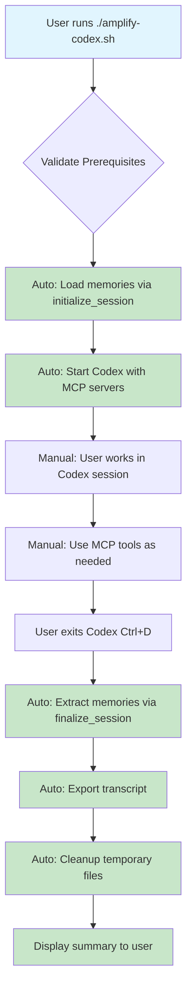
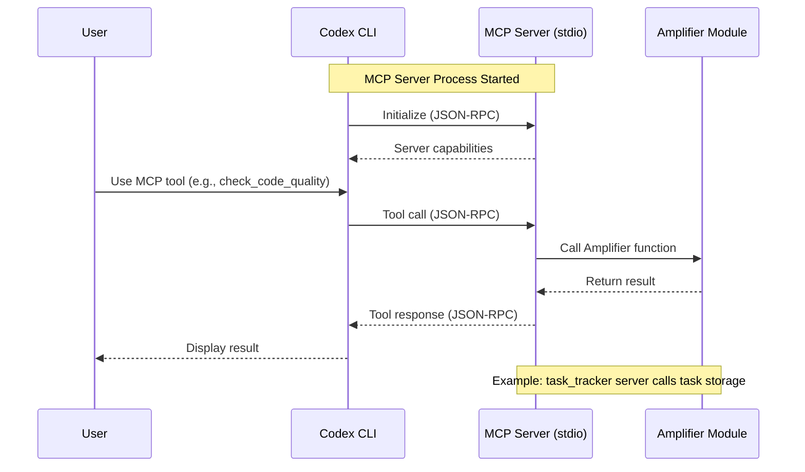
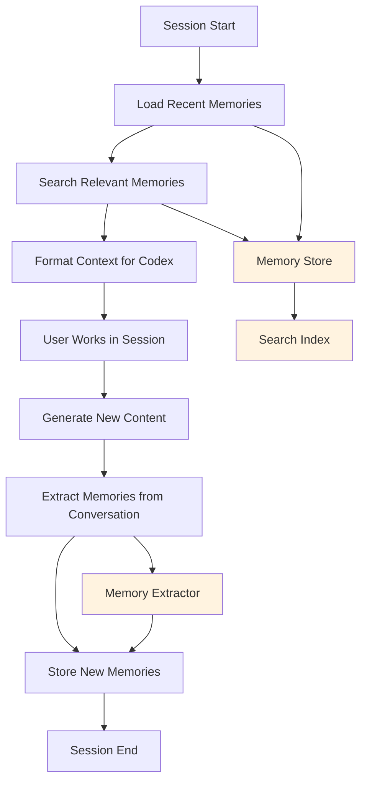
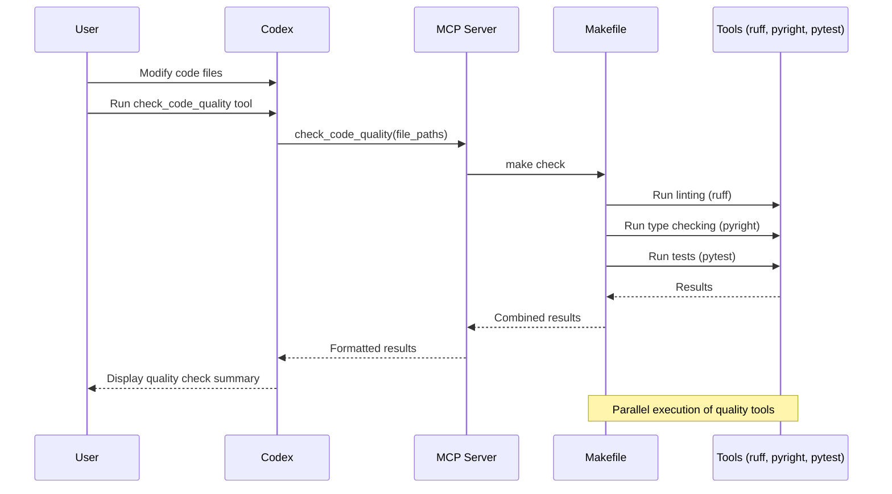
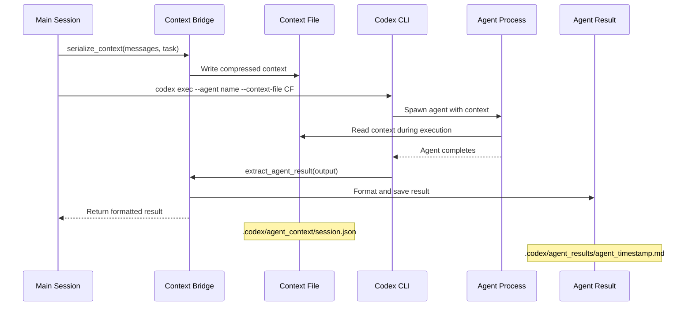
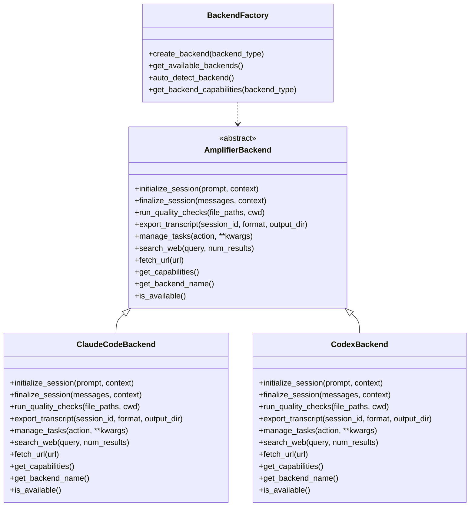

# Workflow Diagrams

This document provides visual workflow diagrams for the Codex integration, illustrating key processes and architectures. All diagrams use Mermaid syntax and can be viewed live in the [Mermaid Live Editor](https://mermaid.live/).

## 1. Session Lifecycle

This flowchart shows the complete session lifecycle when using the wrapper script, highlighting automatic vs manual steps.

**Key Points:**
- **Blue nodes**: User-triggered actions
- **Green nodes**: Automatic wrapper script actions
- Memory loading and extraction happen automatically
- MCP servers run in background during session

## 2. MCP Server Architecture

This sequence diagram illustrates how Codex communicates with MCP servers and how they integrate with Amplifier modules.

**Communication Flow:**
- Codex spawns MCP server subprocess
- Communication via stdio using JSON-RPC protocol
- Servers call into Amplifier modules for business logic
- Results flow back through the same channel

## 3. Memory System Flow

This flowchart shows how the memory system operates throughout a session, from loading to extraction.

**Memory Paths:**
- **Loading**: Recent + relevant memories from search
- **Storage**: Extracted memories stored in JSON files
- **Search**: Uses vector similarity for relevance
- **Extraction**: Analyzes conversation for memorable content

## 4. Quality Check Workflow

This sequence diagram shows the quality check process from code changes to result display.

**Integration Points:**
- MCP server calls `make check` target
- Makefile orchestrates individual tools
- Results aggregated and formatted for display
- Supports partial failures (some tools may fail while others succeed)

## 5. Agent Context Bridge

This sequence diagram illustrates the agent context bridge mechanism for seamless context handoff.

**Context Handoff:**
- Main session context serialized to file
- Agent execution includes context file
- Results extracted and integrated back
- Supports token limits and compression

## 6. Backend Abstraction

This class diagram shows the backend abstraction architecture providing unified API across different backends.

**Abstraction Benefits:**
- Unified API regardless of backend
- Easy switching via environment variables
- Backend-specific implementations hidden
- Extensible for future backends

---

**Viewing Diagrams Live:**
All diagrams can be copied and pasted into the [Mermaid Live Editor](https://mermaid.live/) for interactive viewing and editing. The live editor provides real-time rendering and allows you to experiment with diagram modifications.

**Diagram Legend:**
- **Flowcharts**: Show process flows and decision points
- **Sequence Diagrams**: Illustrate interactions between components over time
- **Class Diagrams**: Show object-oriented relationships and interfaces

These diagrams provide a comprehensive visual overview of the Codex integration architecture and workflows.