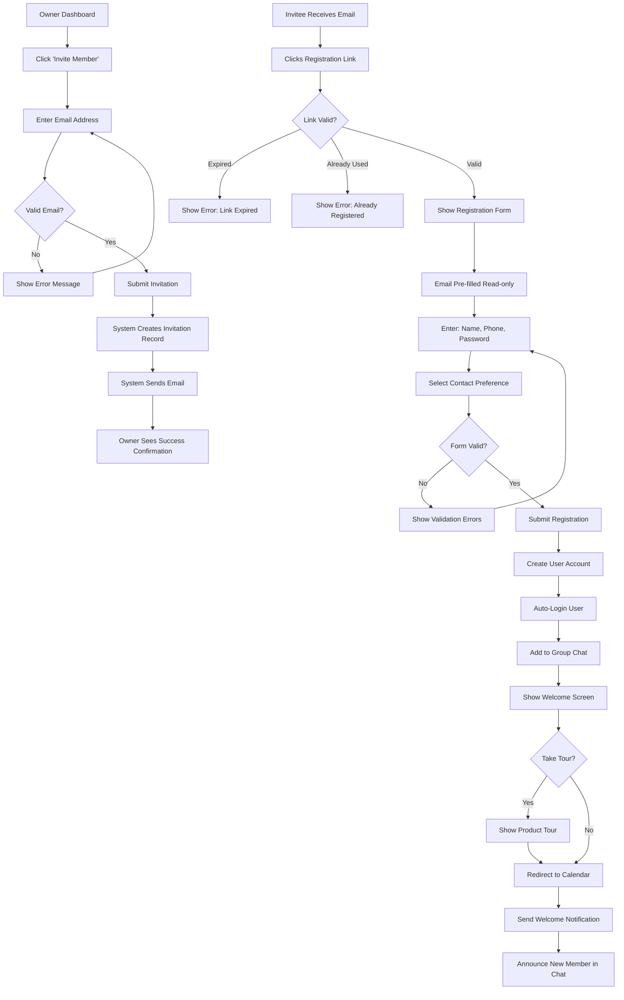
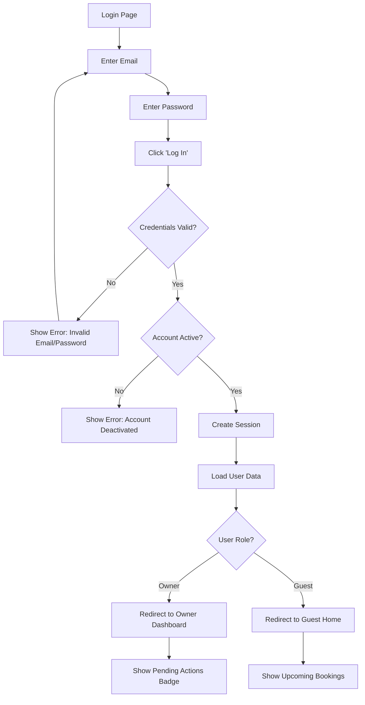
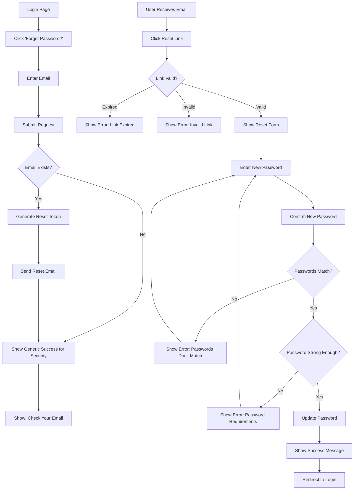

# Authentication & Access - UX Specification

**Module**: 01_AUTH_UX
**Version**: 1.0
**Last Updated**: 2025-10-21
**Status**: Modularized from monolithic files

---

## Overview

This document specifies the UX for authentication & access features including user flows and component specifications.

## Related Documents

- **Requirements**: [../requirements/01_AUTH_AND_ACCESS.md](../requirements/01_AUTH_AND_ACCESS.md)
- **UX Overview**: [00_UX_OVERVIEW.md](./00_UX_OVERVIEW.md)
- **Core Components**: [10_CORE_COMPONENTS.md](./10_CORE_COMPONENTS.md)
- **Layout Components**: [11_LAYOUT_COMPONENTS.md](./11_LAYOUT_COMPONENTS.md)

---

## User Flows

## Authentication Flows

### 1. Invitation and Registration Flow

### 2. Login Flow

### 3. Password Reset Flow

---

---

## Components

_Component specifications for authentication & access will be added here based on component library extraction._

---

## Mobile Responsive Patterns

_Mobile-specific patterns for authentication & access features will be documented here._

---

## Accessibility Requirements

_Accessibility specifications for authentication & access features will be documented here._

---

## Cross-References

- All authentication & access related flows and components are contained in this file
- For shared UI primitives, see [10_CORE_COMPONENTS.md](./10_CORE_COMPONENTS.md)
- For layout patterns, see [11_LAYOUT_COMPONENTS.md](./11_LAYOUT_COMPONENTS.md)

---

## Revision History

- **v1.0** (2025-10-21): Modularized from monolithic UX files
  - Extracted auth flows from 01_USER_FLOWS.md
  - Created feature-aligned structure matching requirements docs
