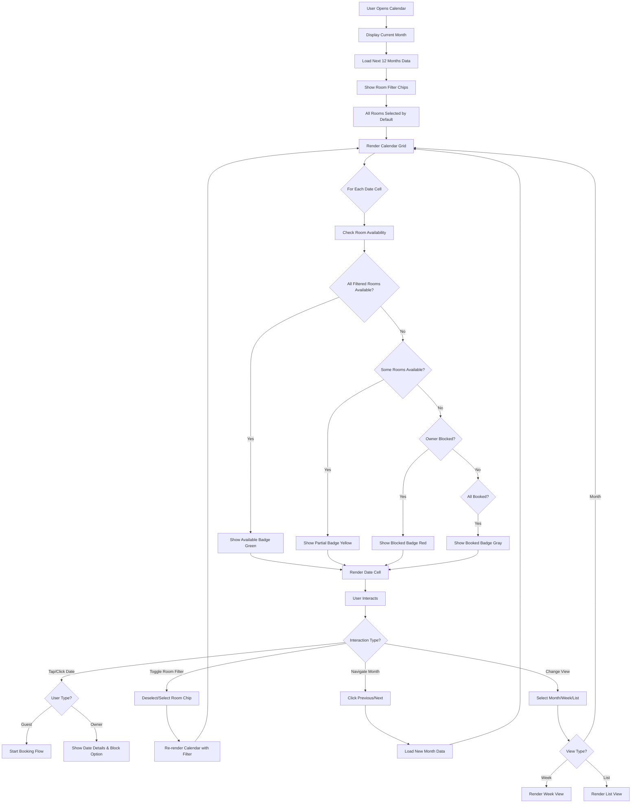
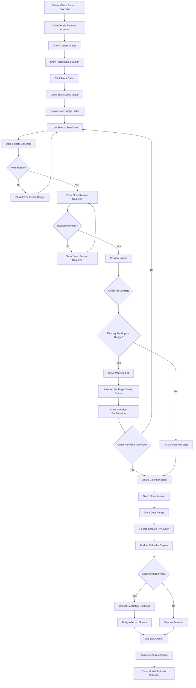
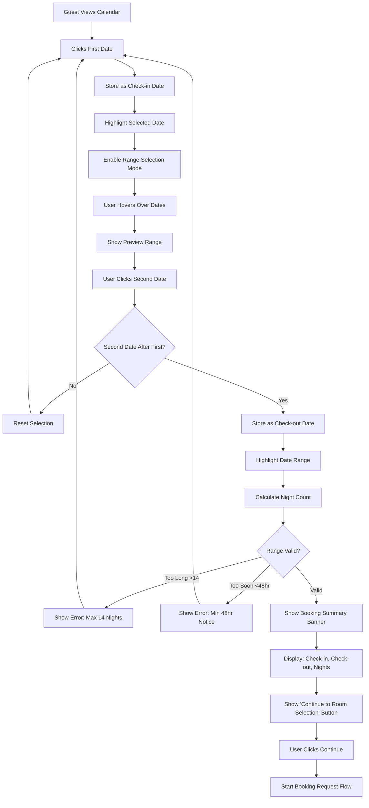

# Calendar & Availability - UX Specification

**Module**: 05_CALENDAR_UX
**Version**: 1.0
**Last Updated**: 2025-10-21
**Status**: Modularized from monolithic files

---

## Overview

This document specifies the UX for calendar & availability features including user flows and component specifications.

## Related Documents

- **Requirements**: [../requirements/05_CALENDAR_AVAILABILITY.md](../requirements/05_CALENDAR_AVAILABILITY.md)
- **UX Overview**: [00_UX_OVERVIEW.md](./00_UX_OVERVIEW.md)
- **Core Components**: [10_CORE_COMPONENTS.md](./10_CORE_COMPONENTS.md)
- **Layout Components**: [11_LAYOUT_COMPONENTS.md](./11_LAYOUT_COMPONENTS.md)

---

## User Flows

## Calendar Flows

### 1. Calendar Viewing and Navigation

### 2. Owner Date Blocking Flow

### 3. Calendar Date Selection for Booking

---

---

## Components

_Component specifications for calendar & availability will be added here based on component library extraction._

---

## Mobile Responsive Patterns

_Mobile-specific patterns for calendar & availability features will be documented here._

---

## Accessibility Requirements

_Accessibility specifications for calendar & availability features will be documented here._

---

## Cross-References

- All calendar & availability related flows and components are contained in this file
- For shared UI primitives, see [10_CORE_COMPONENTS.md](./10_CORE_COMPONENTS.md)
- For layout patterns, see [11_LAYOUT_COMPONENTS.md](./11_LAYOUT_COMPONENTS.md)

---

## Revision History

- **v1.0** (2025-10-21): Modularized from monolithic UX files
  - Extracted calendar flows from 01_USER_FLOWS.md
  - Created feature-aligned structure matching requirements docs
