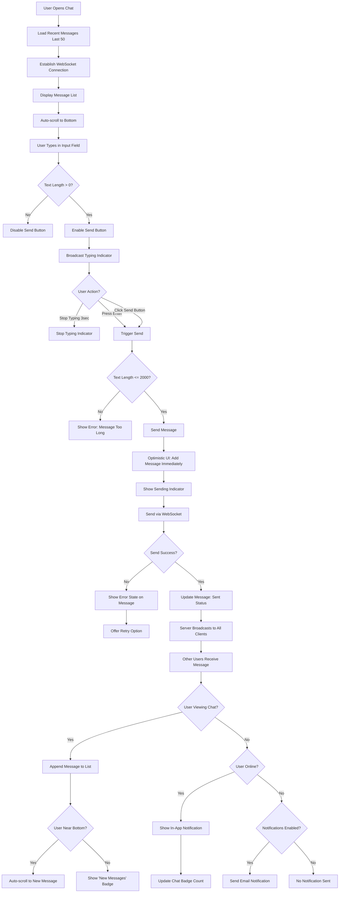
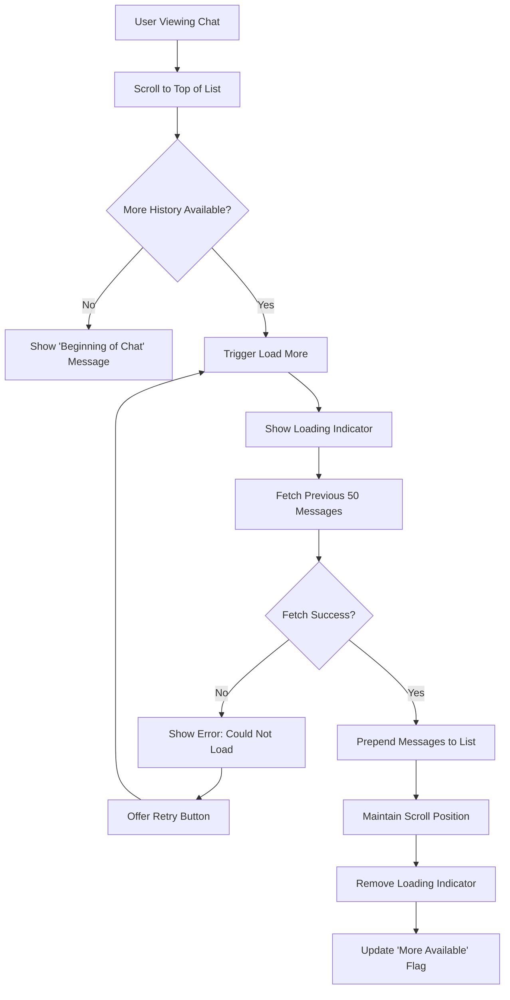
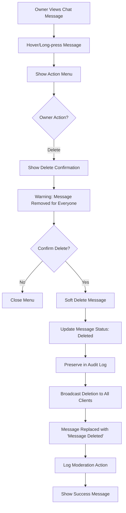
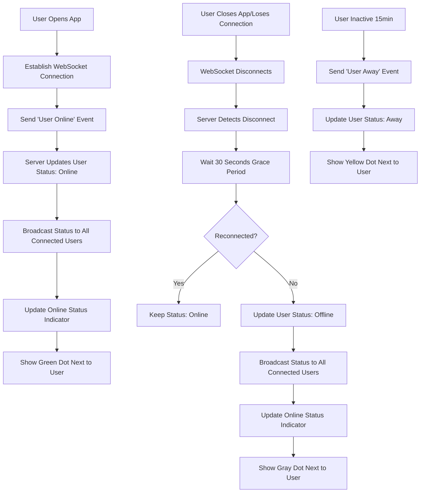

# Chat System - UX Specification

**Module**: 06_CHAT_UX
**Version**: 1.0
**Last Updated**: 2025-10-21
**Status**: Modularized from monolithic files

---

## Overview

This document specifies the UX for chat system features including user flows and component specifications.

## Related Documents

- **Requirements**: [../requirements/06_CHAT_SYSTEM.md](../requirements/06_CHAT_SYSTEM.md)
- **UX Overview**: [00_UX_OVERVIEW.md](./00_UX_OVERVIEW.md)
- **Core Components**: [10_CORE_COMPONENTS.md](./10_CORE_COMPONENTS.md)
- **Layout Components**: [11_LAYOUT_COMPONENTS.md](./11_LAYOUT_COMPONENTS.md)

---

## User Flows

## Chat Flows

### 1. Sending and Receiving Messages

### 2. Loading Chat History

### 3. Chat Moderation (Owner)

### 4. Online Status Updates

---

---

## Components

_Component specifications for chat system will be added here based on component library extraction._

---

## Mobile Responsive Patterns

_Mobile-specific patterns for chat system features will be documented here._

---

## Accessibility Requirements

_Accessibility specifications for chat system features will be documented here._

---

## Cross-References

- All chat system related flows and components are contained in this file
- For shared UI primitives, see [10_CORE_COMPONENTS.md](./10_CORE_COMPONENTS.md)
- For layout patterns, see [11_LAYOUT_COMPONENTS.md](./11_LAYOUT_COMPONENTS.md)

---

## Revision History

- **v1.0** (2025-10-21): Modularized from monolithic UX files
  - Extracted chat flows from 01_USER_FLOWS.md
  - Created feature-aligned structure matching requirements docs
