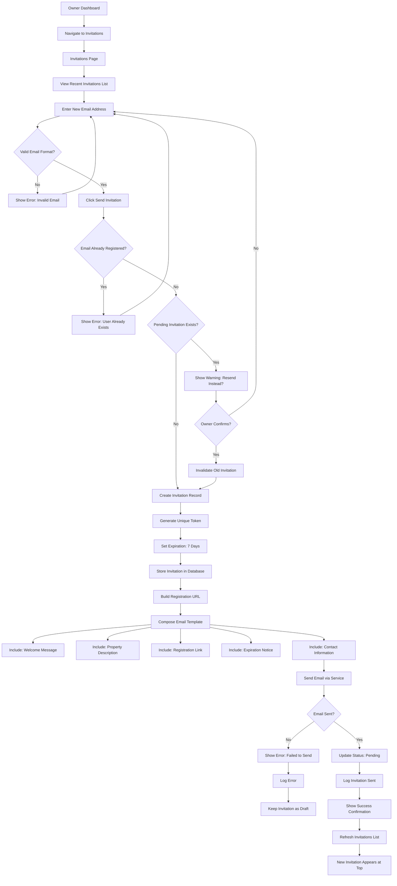
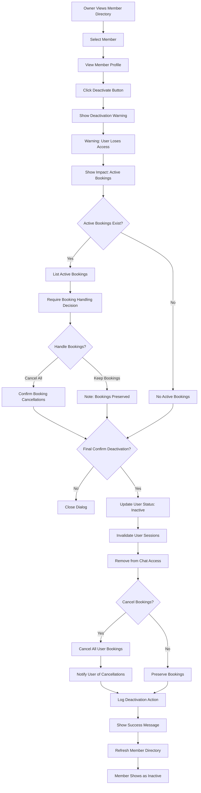
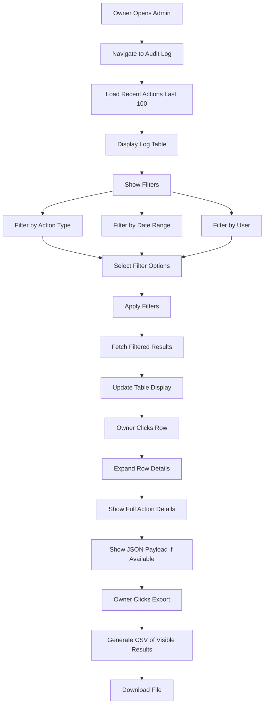

# Admin Dashboard - UX Specification

**Module**: 09_ADMIN_UX
**Version**: 1.0
**Last Updated**: 2025-10-21
**Status**: Modularized from monolithic files

---

## Overview

This document specifies the UX for admin dashboard features including user flows and component specifications.

## Related Documents

- **Requirements**: [../requirements/09_ADMIN_DASHBOARD.md](../requirements/09_ADMIN_DASHBOARD.md)
- **UX Overview**: [00_UX_OVERVIEW.md](./00_UX_OVERVIEW.md)
- **Core Components**: [10_CORE_COMPONENTS.md](./10_CORE_COMPONENTS.md)
- **Layout Components**: [11_LAYOUT_COMPONENTS.md](./11_LAYOUT_COMPONENTS.md)

---

## User Flows

## Admin Flows

### 1. Member Invitation Flow (Detailed)

### 2. Member Deactivation Flow

### 3. Audit Log Viewing Flow

---

---

## Components

_Component specifications for admin dashboard will be added here based on component library extraction._

---

## Mobile Responsive Patterns

_Mobile-specific patterns for admin dashboard features will be documented here._

---

## Accessibility Requirements

_Accessibility specifications for admin dashboard features will be documented here._

---

## Cross-References

- All admin dashboard related flows and components are contained in this file
- For shared UI primitives, see [10_CORE_COMPONENTS.md](./10_CORE_COMPONENTS.md)
- For layout patterns, see [11_LAYOUT_COMPONENTS.md](./11_LAYOUT_COMPONENTS.md)

---

## Revision History

- **v1.0** (2025-10-21): Modularized from monolithic UX files
  - Extracted admin flows from 01_USER_FLOWS.md
  - Created feature-aligned structure matching requirements docs
